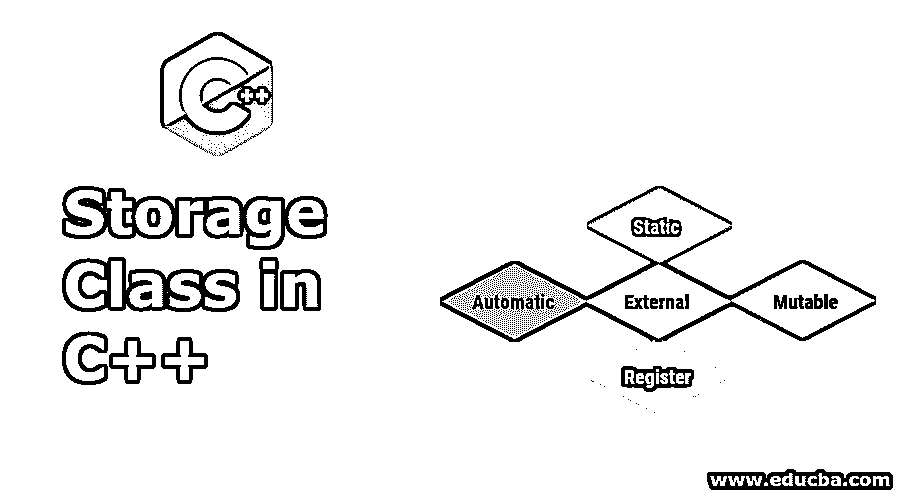
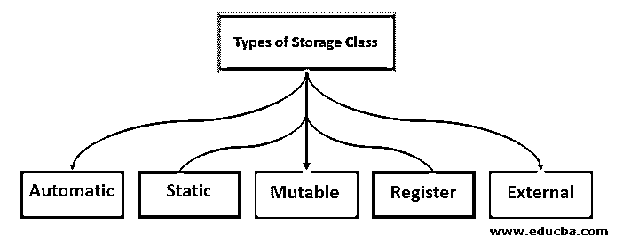
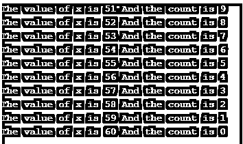

# C++中的存储类

> 原文：<https://www.educba.com/storage-class-in-c-plus-plus/>




## C++中的存储类介绍

下面的文章描述了 C++中的存储类。当我们在 C++中定义任何变量时，每个变量都有一个数据类型，以使用户了解它是哪种变量。我们还没有定义任何存储类，因为我们默认使用存储类。默认情况下，编译器会自动为定义变量分配一个存储类。为了定义编程中的方法或变量的特性，使用了存储类。可以定义生命周期、可见性和范围等特征。生存期意味着变量活动的持续时间，可见性意味着基于给定的可见性，特定变量可以访问代码的哪一部分。

### 存储类别的类型

C++编程语言中通常有 5 种类型的存储类。让我们用简单的例子来解释一下所有这些问题:

<small>网页开发、编程语言、软件测试&其他</small>




#### 1.自动存储类

对于所有的局部变量，自动类是默认的存储类。自从我们开始编程以来，我们都在使用自动类。如果一个变量在函数中声明时没有任何关键字，默认情况下它是自动的，否则使用 auto 关键字。

**语法:**

```
datatype var_name1 [= value]; // by default if you don’t use auto keyword
auto datatype var_name1 [= value];
```

**例如:**

```
auto int x;
auto float x =68.59;
```

**演示自动存储类概念的 C ++代码:**

```
#include <iostream>
using namespace std;
void autoStorageClass() {
cout << "Implementing auto storage class concept \n";
// Declaring an automatic variable named as "auto "
// No data-type declaration needed
auto p = 400;
auto q = 400.35;
auto r = "eduCBA";
auto s = 'F';
cout  <<  p <<"\n";
cout  <<  q <<"\n";
cout  <<  r <<"\n";
cout  <<  s <<"\n";
// printing the auto variables through cout
}
int main()
{ // To implement auto Storage Class
autoStorageClass();
return 0;
}
```

**输出:**


#### 2.静态存储类

当我们希望变量的可见性与局部变量相同，但外部变量的生存期相同时。即使函数执行结束，静态变量的作用域也不会消失。静态变量的默认值是 0。静态存储类用于保存程序中的递归函数值。

**语法:**

```
static datatype var_name1 [= value];
```

**例如**

```
static int r = 1;
static float total;
```

**演示静态存储类概念的 C ++代码:**

```
#include <iostream>
// declaring the function
void function(void);
static int count = 10;  //defining a global variable
main() {
while(count--) {
function();
}
return 0;
}
// defining the function
void function( void ) {
static int x = 50; // local static variable
x++;
std::cout << "The value of x is " << x ;
std::cout << " And the count is " << count << std::endl;
}
```

**输出:**




#### 3.可变存储类

最常用于当你不想改变信息，但功能或程序的状态。在银行里，货币交易应该被锁定，但是当你进行货币交易时，它应该被更改为从开始到完成的处理。为了在程序执行期间修改类对象，使用可变存储类。

**语法:**

```
mutable datatype var_name1;
```

**例子**

```
mutable int y;
mutable char c;
```

**C** **++演示可变存储类概念的代码:**

```
#include<iostream>
using namespace std;
// defining a class 'A'
class A {
public :
A (int x, int y) { // declaring a constructor with same class name
m = x;
n = y;    // initializing the data members
}
int m;
mutable int n;   // declaring the data members
};
int main() {
const A obj(50, 22);
cout << "m : " << obj.m << "  n : " << obj.n << endl;
// obj.m = 70;
obj.n = 80;
cout << "m : " << obj.m << "  n : " << obj.n << endl;
return 0;
}
```

**输出:**


#### 4.寄存器存储类

为了在 C ++编程中允许更快的访问，类寄存器的值被存储在 CPU 寄存器中。变量作用域对于函数来说是局部的，一旦执行完成，它就会终止。这就是为什么它可以更快地访问，因为一旦工作完成，就不再需要范围了。寄存器类提供了类似于自动存储类的功能。

**语法:**

```
register datatype var_name1 [= value];
```

**例子**

```
register int rollnumber;
register char c;
```

**演示寄存器存储类概念的 C ++代码:**

```
#include <iostream>
using namespace std;
void registerStorageClass()
{
cout << "Demonstrating the register class concepts \n ";
// register variable declaration
register char a = 'C';
// printing the register variable 'a'
cout << "Value of the variable 'a'"
<< " declared as register: " << a;
}
int main()
{ registerStorageClass();
return 0;
}
```

**输出:**


#### 5.外部存储类

简单易用的存储类，它定义了变量不在使用它的同一个块中定义。因为它将变量引用[赋给通常在代码外声明的全局变量](https://www.educba.com/python-global-variable/)。因为这类变量是“全局变量”。

**语法:**

```
extern datatype var_name1;
```

**例子**

```
extern float var2;
```

**演示外部存储类概念的 C ++代码**

```
#include <iostream>
using namespace std;
int i;
void externStorageClass()
{
cout << "Demonstrating the extern storage class concept \n";
extern int i;
cout << "The Value of the variable 'i'"
<< "declared, as extern: " << i << "\n";
i = 85;
cout << "Modified value of the variable 'i'" << " declared as extern: \n" << i;
}
int main()
{
// To implement extern Storage Class
externStorageClass();
return 0;
}
```

**输出:**


### 结论

存储类的概念在 C++编程语言中非常有用，因为用户可以定义程序中每个变量的可见性。除此之外，用户可以根据代码中的要求，使用这 5 种类型的存储类来决定变量的生命周期。

### 推荐文章

这是 C++中存储类的指南。在这里，我们讨论了基本概念和不同类型的 c++存储类的语法和例子。您也可以看看以下文章，了解更多信息–

1.  [c++的特性](https://www.educba.com/features-of-c-plus-plus/)
2.  [C 中的静态关键字](https://www.educba.com/static-keyword-in-c/)
3.  [C++数据类型](https://www.educba.com/c-plus-plus-data-types/)
4.  [C++数组函数](https://www.educba.com/c-plus-plus-array-functions/)


