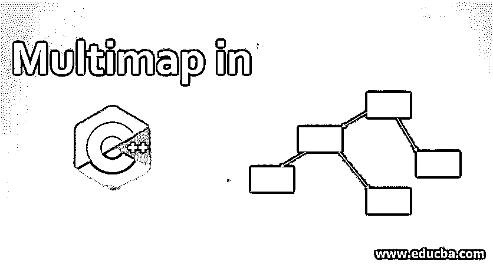
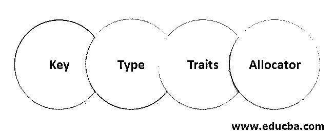
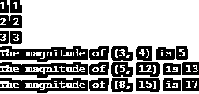

# C++中的多重映射

> 原文：<https://www.educba.com/multimap-in-c-plus-plus/>




## C++中的多重映射简介

C++编程语言中的 Multimap 就像一个关联容器，与 map 非常相似。该容器包含一个键-值对的排序列表，同时允许多个元素具有相同的键。map 和 multi-map 之间的主要区别在于，当您在代码中使用 multi-map 特性时，您可以对一组多个元素使用相同的键。或者我们可以说在一个映射中有多个条目具有相同的键。与映射不同，多重映射可以有与相同元素相关联的重复键，因为在映射上不允许相同元素有重复键。

让我们来看看多地图的语法。假设你想创建一个由整数和字符组成的多重映射，那么你可以这样定义它:

<small>网页开发、编程语言、软件测试&其他</small>

**语法:**

```
template <class Key,
class Type,
class Traits=less <Key>,
class Allocator=allocator <pair <const Key, Type>>>
class multimap;
```

### C++中 Multimap 的参数

现在让我们讨论一下在 C++编程语言中使用的多重映射中的参数。从上面的语法中，您可以看到我们用来定义多重映射的参数。




#### 1.钥匙

因为映射中的每个元素都使用一个键值来标识。密钥可以是不同的类型。键的数据类型将存储在多映射容器中。

```
multimap::key_type
```

#### 2.类型

它不同于 key，因为元素的数据类型将存储在多映射容器中。每个多重映射元素将存储一些数据作为映射值。

```
multimap::mapped_type
```

#### 3.特征

我们可以使用 compare 关键字来代替 traits，因为两者具有相同的功能。因为它以两个参数键作为参数，并返回一个布尔值，因为它就像一个二进制预测器。为了比较两个元素值，它提供了一个函数对象。

```
multimap::key_compare
```

#### 4.分配算符

它表示存储在分配器中的对象，分配器用于定义存储分配模型。我们使用的分配器类是最简单的内存分配，它也是值无关的。

```
multimap::allocator_type
```

### C++中 Multimap 的成员函数

正如我们看到的多地图的参数。现在是时候了解多重映射中的成员函数了:

| **成员函数** | **定义** |
| 构造器 | 这将创建一个空的多重贴图。 |
| 破坏者 | 这将破坏创建的多重地图。 |
| 操作员 | 这将把值分配给容器。 |
| 获取 _ 分配器 | 这将返回相关的分配器。 |

#### 带迭代器的成员函数

| **成员函数(迭代器)** | **定义** |
| 开始 | 这将返回一个迭代器来处理第一个多重映射元素。 |
| cbegin | 这将返回一个常量迭代器来处理第一个多重映射元素。 |
| 结束 | 这将返回一个迭代器，处理最后一个多重映射元素。 |
| cend | 这将返回一个常量迭代器来处理最后一个多重映射元素。 |
| rbegin | 这将返回一个反向迭代器来处理多重映射的开始。 |
| crbegin | 这将返回一个常量反向迭代器，从多重映射开始。 |
| 分裂 | 这将返回一个反向迭代器来处理多重映射结束。 |
| 克伦德 | 这将返回一个常量迭代器来处理多重映射结束。 |

#### 带修饰符的成员函数

| **成员函数(修饰符)** | **定义** |
| 清楚的 | 这将擦除所有多重贴图元素。 |
| 插入 | 这将在多重贴图中插入元素。 |
| 放列 | 这将在多重映射中的特定位置构造并插入一个元素。 |
| 安置 _ 提示 | 这将构造一个元素，并通过一个提示在多重映射中的特定位置插入一个元素。 |
| 抹去 | 这将擦除多重贴图元素。 |
| 交换 | 这将交换多重贴图元素。 |
| 提取 | 这将从多地图容器中提取节点。 |
| 合并 | 这将合并多重贴图中容器的节点。 |

#### 具有查找功能的成员函数

| **成员函数(查找)** | **定义** |
| 数数 | 这将计算并返回与特定键匹配的元素的数量。 |
| 发现 | 这将查找具有特定键的元素。 |
| 包含 | 这将在容器中检查具有特定键的元素。 |
| 相等 _ 范围 | 这将返回匹配给定键的一系列元素。 |
| 下限 | 这将返回一个迭代器到不小于给定键的第一个元素。 |
| 上限 | 这将向大于给定键的第一个元素返回一个迭代器。 |

#### 具有容量的成员函数

| **成员函数(容量)** | **定义** |
| 空的 | 这将检查容器是否为空。 |
| 大小 | 这将返回多重映射中的元素数量。 |
| 最大尺寸 | 这将返回多重映射中最大可能数量的元素。 |

### C++中多重映射的例子

现在，让我们来看一些 C++编程示例，以便正确理解多重映射:

#### 示例#1

**代码:**

```
#include <iostream>
#include <map>
struct Dot { double i, j; };
struct DotCompare {
bool operator()(const Dot& lhs, const Dot& rhs) const {
return lhs.i < rhs.i; // NB. ignores y on purpose
}
};
int main() {
std::multimap<int, int> n = {{1,1},{2,2},{3,3}};
for(auto& p: n) std::cout << p.first << ' ' << p.second << '\n';
// comparison
std::multimap<Dot, double, DotCompare> mag{
{ {5, 12}, 13 },
{ {3, 4}, 5 },
{ {8, 15}, 17 },
};
for(auto p : mag)
std::cout << "The magnitude of (" << p.first.i
<< ", " << p.first.j << ") is "
<< p.second << '\n';
}
```

**输出:**




#### 实施例 2

下面是另一个实现 begin 成员函数的 C++代码。

**代码:**

```
#include <iostream>
#include <map>
int main ()
{
std::multimap<char,int> food,chocobar; // defining multi-map
food.insert (std::make_pair('p',20));
food.insert (std::make_pair('q',45));
chocobar.insert (std::make_pair('y',128));
chocobar.insert (std::make_pair('y',178));
// food ({{p,20},{q,45}}) vs chocobar ({y,128},{y,178}}):
if (food==chocobar) std::cout << "food and chocobar are equal\n";
if (food!=chocobar) std::cout << "food and chocobar are not equal\n";
if (food< chocobar) std::cout << "food is less than chocobar\n";
if (food> chocobar) std::cout << "food is greater than chocobar\n";
if (food<=chocobar) std::cout &lt;< "food is less than or equal to chocobar\n";
if (food>=chocobar) std::cout << "food is greater than or equal to chocochocobar\n";
return 0;
}
```

**输出:**


### 结论

多地图帮助编码人员节省大量时间。假设您有一个具有相同键值的项目集合，现在您想运行一个搜索来查找一些值。那么最好使用迭代器并遍历多重映射，而不是向量&映射。

### 推荐文章

这是一个 C++中多重映射的指南。这里我们讨论 C++中 multimap 的语法、参数和成员函数，以及示例和代码实现。你也可以看看下面的文章来了解更多-

1.  [c++的特性](https://www.educba.com/features-of-c-plus-plus/)
2.  [C++关键词](https://www.educba.com/c-plus-plus-keywords/)
3.  [Rust vs C++](https://www.educba.com/rust-vs-c/)
4.  [c++中的回文](https://www.educba.com/palindrome-in-c-plus-plus/)


