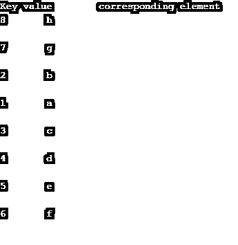

# C++无序 _ 映射

> 原文：<https://www.educba.com/c-plus-plus-unordered_map/>


## C++无序映射简介

在 C++中，无序映射被视为关联容器，这有助于存储由键值和映射值组合生成的元素。该函数允许快速检索基于键的独立元素。这里，键值主要用于唯一地查找项目，映射的值被认为是一个内容链接到该键的对象。键值和映射值的类型可能有所不同。让我们在接下来的小节中看到更多关于无序映射的内容。在这个主题中，我们将学习 C++ unordered_map。

### 定义

下面是 C++中无序映射的定义

<small>网页开发、编程语言、软件测试&其他</small>

```
template< class K , class T,class Hash = hash<K>,
classPred = equal_to<K>,
classAlloc = allocator< pair<constK,T>>
classunordered_map;
```

**参数有:**

*   k，也就是关键类型。
*   t，然后映射为值类型
*   Hash，一种一元函数对象，它获取一个 key 类型的对象作为参数，并返回一个大小为 t 的特定值。
*   Pred，这是一个二元谓词。
*   Alloc，这是分配器的对象类型。

t 可以替换为包含用户定义类型的任何数据类型。

### C++ unordered_map 的成员类型

下面是成员函数可以用作参数或返回类型的成员类型。

| **成员类型** | **描述** |
| 密钥类型 | 关键；用于模板的参数 1 |
| 映射类型 | t；用于模板的参数 2 |
| 厨师 | Default value: hash<key_type>;用于模板的参数 3 |
| 键相等 | Default value: equal_to<key_type>);用于模板的参数 4 |
| 分配器类型 | Alloc 用于模板的参数 5 |
| 值类型 | 配对 |
| 参考 | 价值类型& |
| 常量 _ 引用 | 常量值 _ 类型& |
| 差异类型 | ptrdiff_t |
| 尺寸 _ 类型 | 尺寸 _t |
| 指针 | 分配器 _ 特征<alloc>::指针</alloc> |
| 迭代程序 | 值类型值类型的前向迭代器 |
| 局部迭代器 | value_type 的前向迭代器 |
| 常量迭代器 | 常量值类型值类型的前向迭代器 |
| 常量指针 | 分配器 _ 特征<alloc>::常量 _ 指针</alloc> |
| 常量本地迭代器 | 常量值类型的前向迭代器 |

### 构造器

下面是 c++无序映射的构造函数。

*   unordered _ map::unordered _ map 默认构造函数

一个空的 unordered_map 将被构造成元素数量为零。

*   unordered _ map::unordered _ map copy 构造函数

将使用每个元素的副本构建一个 unordered_map。因此，这些元素将已经存在于现有地图上。

*   unordered _ map::unordered _ map move 构造函数

一个 unordered_map 将使用语义 move 用另一个 map 中的内容来构造。

*   unordered _ map::unordered _ map range 构造函数

一个 unordered_map 将由从第一个到最后一个范围内的项目构成。

*   unordered _ map::unordered _ map initializer _ list 构造函数

将从初始化列表中构造一个 unordered_map。

### 无序映射上的方法

在 C++的无序图中，出现了过多的函数。其中最有用的是=运算符、[]运算符、迭代器 begin 和 end、size 和 empty for capacity、lookup find 和 count、修改-插入和擦除。

### unordered_map 函数在 C++中是如何工作的？

在 unordered_map 中，元素最初并不根据键值或映射值的任何特定顺序进行排序。取而代之的是，它被构造成受哈希值支配的桶，以允许通过键值直接快速访问不同的项。

此外，无序映射的容器比映射的容器更快地基于它们的键访问不同的元素，即使它们通常对于基于通过它们的元素子集的范围的迭代效率较低。

这些无序映射实现了操作符[]，也称为直接访问操作符，它允许使用映射值的键值直接访问映射值。

使用示例代码让我们更好地理解无序映射。

*   用一些元素定义 unordered_map

```
unordered_map<char, int>mp = {
{'H', 21} ,
{'I', 52} ,
{'J', 36} ,
{'K', 47} ,
{'L', 54}
};
```

*   定义一个迭代器

```
auto itr = mp.find('L');
```

*   根据要求打印值

### C++无序映射的例子

为了更好地理解无序映射，让我们使用一些示例程序。

#### 示例#1

C++程序在无序映射中查找特定元素。

**代码:**

```
#include <iostream>
#include <unordered_map>
//use the namespace as std
using namespace std;
//code for unordered_map begins here
int main(void)
{
//define the unordered_map
unordered_map<char, int>mp = {
{'H', 21} ,
{'I', 52} ,
{'J', 36} ,
{'K', 47} ,
{'L', 54}
};
//Iterator itr
auto itr = mp.find('L');
//print the iterator than links to the character 'L'
cout<< "Iterator links to " <<itr->first
<<" is " <<itr->second <<endl;
return 0;
}
```

**输出:**


首先，使用名称空间作为 std。然后，用元素{'H '，21}、{'I '，52}、{'J '，36}、{'K '，47}、{'L '，54 定义 unordered_map。一旦定义了元素，使用迭代器查找元素 L 和链接到特定字符的键。在执行代码时，链接到 L 的值将被打印出来。

#### 实施例 2

C++程序打印无序地图中的所有元素。

**代码:**

```
#include <iostream>
#include <iterator>
#include <unordered_map>
//use the namespace as std
using namespace std;
//code for unordered_map begins here
int main()
{
unordered_map<int, char> mp1;
unordered_map<int, char>::iterator crs;
mp1[1] = 'a';
mp1[2] = 'b';
mp1[3] = 'c';
mp1[4] = 'd';
mp1[5] = 'e';
mp1[6] = 'f';
mp1[7] = 'g';
mp1[8] = 'h';
cout<< "Key value\t corresponding element" <<endl;
for (crs = mp1.begin(); crs != mp1.end(); crs++)
{
cout<<crs->first;
cout<< '\t' <<crs->second << '\n'
<<endl;
}
}
```

**输出:**




在这个程序中，首先，使用名称空间作为 std。然后，用元素{和一个迭代器定义 unordered_map。一旦定义了元素，使用迭代器查找所有元素和链接到特定字符的键。这是借助 begin()和 end()函数完成的。最后，在执行代码时，所有的元素和相应的值都会被打印出来。

### 结论

无序映射是关联容器，有助于存储由键值和映射值组合生成的元素。在本文中，将详细解释无序映射的不同方面，如定义、构造函数、方法、工作和示例。

### 推荐文章

这是一个 C++ unordered_map 的指南。这里我们讨论了 unordered_map 函数在 C++中是如何工作的，并给出了代码和输出。您也可以看看以下文章，了解更多信息–

1.  [C++字符串复制](https://www.educba.com/c-plus-plus-string-copy/)
2.  [c++中的类型转换](https://www.educba.com/type-casting-in-c-plus-plus/)
3.  [C++设定精度](https://www.educba.com/c-plus-plus-setprecision/)
4.  [C++列表](https://www.educba.com/c-plus-plus-list/)


