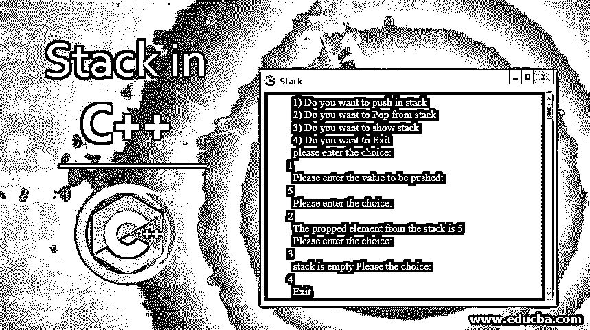
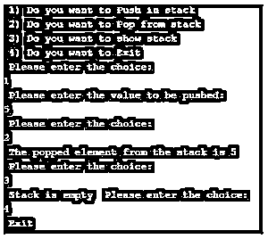

# C++中的堆栈

> 原文：<https://www.educba.com/stack-in-c-plus-plus/>




## C ++中的堆栈介绍

C ++编程语言中的堆栈在 LIFO(后进先出)上下文中起着重要的作用，这意味着元素只能从一端插入和提取。基本上，堆栈是一种容器适配器，其中在一端(顶部)添加一个新元素，从同一端移除一个元素，这称为堆栈。它是一种抽象的数据结构，用于按照 LIFO 机制收集堆栈中的元素。在堆栈中最后进入的元素将首先被删除，因为它只有一端。

**语法:**

<small>网页开发、编程语言、软件测试&其他</small>

```
template <
class C,
class Container = std::deque<C>
> class stack;
```

stack 类是一个容器适配器，一种后进先出的数据结构。

这个类模板将作为容器的包装器，包含一组指定的函数。堆栈从已定义容器的后面(称为堆栈的顶部)推送和弹出元素。

### C++中的 Stack 是如何工作的？

要了解编程语言中堆栈的工作方式，让我们看看与堆栈相关的函数列表。下面给出了函数:

*   **push(g)** **:** 该函数将在栈顶添加/插入元素或数据值‘g’。该函数的时间复杂度为 O(1)。
*   **pop()** **:** 此函数将移除/删除栈顶的元素或数据值。该函数的时间复杂度为 O(1)。它将删除栈顶的元素。
*   **top()** **:** 这个函数将返回一个对栈顶元素的引用。该函数的时间复杂度为 O(1)。
*   **size()** **:** 该函数将返回堆栈容器的大小，即堆栈中存储的元素总数。该函数的时间复杂度为 O(1)。
*   **empty()** **:** 该函数将检查堆栈容器是否为空。类似地，这个函数的时间复杂度是 O(1)。

### C++中的堆栈示例

在这里，我们将通过 C++代码来了解 C++编程语言中堆栈实际上是如何工作的。因此，让我们看一些 C++语言的编程例子来解释堆栈的工作原理。

#### 示例#1

演示 C ++编程语言中堆栈工作的 C ++代码:

**代码:**

```
#include <iostream>
#include <stack>
using namespace std;
void stackone ( stack < int > so)
{
stack < int > sg = so;
while ( !sg.empty() )
{
cout << '\t' << sg.top();
sg.pop();
}
}
int main ()
{
stack < int > nest;
nest.push ( 505 );
nest.push ( 404 );
nest.push ( 303 );
nest.push ( 202 );
nest.push ( 101 );
cout << "The stack nest is consists of these numbers: ";
stackone ( nest );
cout << "\n nest.size() : " << nest.size();
cout << "\n nest.top() : " << nest.top();
cout << "\n nest.pop() : ";
nest.pop();
stackone ( nest );
return 0;
}
```

**输出:**


在上面的 C++代码中，您可以看到像 push 和 pop 这样的堆栈函数是如何用于将值推入容器和从容器中取出的，这遵循 LIFO(后进先出)机制。正如您在推送和弹出值后在输出中看到的值。这段代码还显示了执行所有操作后堆栈容器的大小。它显示最顶端的元素和弹出的元素。

#### 实施例 2

演示 C ++编程语言中堆栈工作的 C ++代码:

**代码:**

```
#include <iostream>
using namespace std;
int stack[100], x =100, top =- 1;
void push ( int value ) {
if ( top >= x-1)
cout << " This is Stack Overflow " << endl;
else {
top++;
stack [top] = value;
}
}
void pop() {
if ( top <= -1)
cout << " This is Stack Underflow " << endl;
else {
cout << " The popped element from the stack is "<< stack[top] << endl;
top--;
}
}
void show() {
if ( top >= 0) {
cout << " Stack elements are: " ;
for ( int i =top; i >= 0; i--)
cout << stack[i] << " ";
cout << endl;
} else
cout << " Stack is empty ";
}
int main() {
int ch, value;
cout << " 1) Do you want to Push in stack " << endl;
cout << " 2) Do you want to Pop from stack " << endl;
cout << " 3) Do you want to show stack " << endl;
cout << " 4) Do you want to Exit " << endl;
do {
cout << " Please enter the choice: " << endl;
cin >> ch;
switch ( ch ) {
case 1: {
cout << " Please enter the value to be pushed: " << endl;
cin >> value;
push ( value );
break;
}
case 2: {
pop();
break;
}
case 3: {
show();
break;
}
case 4: {
cout << " Exit " << endl;
break;
}
default: {
cout << " Invalid Choice " << endl;
}
}
}while ( ch != 4);
return 0;
}
```

**输出:**




在上面的 C++代码中，您可以看到像 push 和 pop 这样的堆栈函数是如何通过添加遵循 LIFO(后进先出)机制的底层条件来将值推入和弹出容器的。因为您可以执行代码中提到的所有 4 个操作。这段代码允许用户在一个简单的流程中插入、删除、显示和退出堆栈容器中的元素。

### 结论

在处理大型程序时，堆栈非常有用，因为当程序中有大量数据时，有时很难找到并删除程序中可用的数据。因此，在编程中使用堆栈来轻松处理数据。

### 推荐文章

这是一个 C++中堆栈的指南。在这里我们讨论介绍，堆栈如何在 C++中工作的例子和代码实现。您也可以看看以下文章，了解更多信息–

1.  [c++中的类型转换](https://www.educba.com/type-casting-in-c-plus-plus/)
2.  [c++中的抽象](https://www.educba.com/abstraction-in-c-plus-plus/)
3.  [c++中的正则表达式](https://www.educba.com/regular-expressions-in-c-plus-plus/)
4.  [c++中的 size()](https://www.educba.com/size-in-c-plus-plus/)


