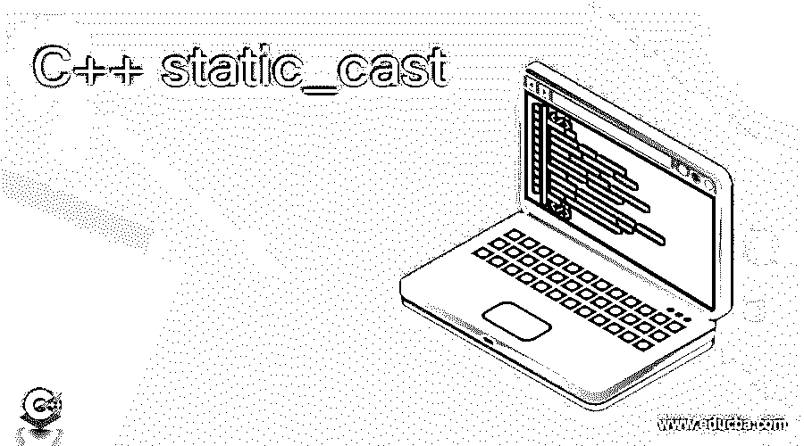

# C++静态转换

> 原文：<https://www.educba.com/c-plus-plus-static_cast/>




## C++静态强制转换简介

C++ static_cast 被定义为必须将变量从一种数据类型转换为另一种数据类型的运算符，主要是将变量转换为浮点数据类型。编译器只在 static_cast 中进行这种转换，因为它始终关注 const_cast 等常量类型， reinterpret_cast 它也从一种类型转换为另一种类型，类似于转换技术，它使用隐式和显式转换，构造函数只用于应用编译时，所以它不能抛出任何异常，而且如果有时转换没有在任何行中完成，它将不会被编译。

### 句法

Static_cast 就像是一个用于将变量转换成浮点类型的操作符。指针也包含在这些转换中，它同时应用隐式和显式转换函数。对于每一个 c++方法、操作符和其他变量，它们可以有适当的语法和格式来创建应用程序。

<small>网页开发、编程语言、软件测试&其他</small>

```
#include <iostream>
using namespace std;
datatype main()
{
data type v;
data type variable name=static_cast<data type>(v);
}
```

上述代码是在编程逻辑中使用 static_cast 运算符的基本语法，这些运算符转换不会引发任何异常，因为它是在编译时使用的。

### static_cast 方法在 C++中是如何工作的？

造型转换是编程语言的通用内容，因为它从一种类型转换成另一种数据类型。同样，static_cast 是操作符，用于在编译时完成转换操作。我们已经说过，隐式和显式转换都要进行转换。如果我们使用隐式转换序列，从任何类型的表达式到新类型，如果构造函数加载任何参数，它调用 static_cast 操作符，它创建至少一种类型的对象，用于调用其他一些区域的方法。对象引用是任何类型的，它也从任何类型的表达式中接受一些新类型，并且它至少找到任何可行的函数，以便使用 static_cast <new_type>(expression ),它接受 args 构造函数，它返回一些其他虚拟变量。通常情况下，变量命名为 temp，Temp 变量传递了参数，它涉及隐式类型转换来调用构造函数，它可以是任何类型。</new_type>

当调用新的类型转换时，它从操作符定义用户定义的转换。它使用的主引用和非引用对象，对象的输出结果在 static_cast 操作符中，带有表达式的值以及指针扮演常规角色，它使用所有类型转换。像被引用的对象被指向任何指针变量一样，它也计算表达式，这些表达式和值将是非虚拟对象引用，指针值被指向它。static _cast 执行向下转换，因为它的格式不正确，而且变量也是不明确的，虚拟对象无法访问。这种类型的 static_cast 仅用于运行时验证，并确保对象在运行时出现，因为这是一个安全目的，而且它还检查预验证并满足其他条件，以保证 C++概念中的其他实现机制，如多态、继承等。与 static_cast 相比，static_cast 使用 dynamic_cast 操作通过向下转换安全地完成。

我们可以在 c++中使用枚举类型，并将其类型转换为整数或其他一些类型。对象采购类型不同，目的地或目标类型是布尔类型或布尔类型。它只允许 true 和 false 条件，枚举用目标引用类型表示。

### 例子

让我们讨论 C++ static_cast 的例子。

#### 示例#1

**代码:**

```
#include <iostream>
#include <string>
using namespace std;
class demo {
int a;
public:
demo(int a_i = 1)
: a{a_i }
{
cout << "The conversion is called through this method" << endl;
}
operator string()
{
cout << "The casting conversion operation is:" << endl;
return to_string(a);
}
};
int main()
{
demo b(4);
string s = b;
b = 32;
string s1 = static_cast<string>(b);
b = static_cast<demo>(34);
return 0;
}
```

**输出:**


#### 实施例 2

**代码:**

```
#include <iostream>
using namespace std;
class first {
public:
int i, j;
first(int a1 = 18, int b1= 23) {
i = a1; j = b1;
}
void demo() {
cout<<"The first class object is: i = "<< i <<" , j = " <<j<< endl;
}
~first() {
}
};
class second : public first {
public:
int p;
second(int p1 = 34) { p = p1; }
void demo() {
cout << "The scond class object is:i = " << i << " , j = " << j << " , p = " << p << endl;
}
~second() {
}
};
int main() {
first* f = new first(18, 24);
second* s = new second(8);
f->demo();
s->demo();
second* s1 = static_cast<second*>(f);
cout << "The first class casting is doen to the second class, ";
s1->demo();
first* f1 = static_cast<first*>(s);
cout << "The second class casting is done to teh first class, ";
f1->demo();
delete f;
delete s;
return 0;
}
```

**输出:**


#### 实施例 3

**代码:**

```
#include <iostream>
template <class A>
bool demo(A *i) { return false;}
template <>
bool demo(void *i) { return true; }
using namespace std;
int main() {
char* a = (char*)"Welcome To My Domain";
void* p = static_cast<void*>(a);
cout << "Have a Nice day user " << (demo(p) ? "The pointer is used click yes " : "The pointer is not used click no") << endl;
cout << static_cast<char*>(p) << endl;
return 0;
}
```

**输出:**


在上面的例子中，我们以不同的方式使用了 static_cast 操作符，我们还使用指针来引用父类和子类的关系。

### 结论

在 C++中使用了许多不同的操作符，每个操作符都有不同的用法，这里 static_cast 主要用于操作符转换，它不受编程逻辑的其他方面的影响，因此它在编译时执行，所以它不会抛出任何运行时异常，这是该操作符的一个很大的优点。

### 推荐文章

这是一个 C++ static_cast 的指南。在这里，我们还讨论了 C++中 static_cast 方法的介绍和工作原理，以及不同的例子和代码实现。您也可以看看以下文章，了解更多信息–

1.  [C++ fstream](https://www.educba.com/c-plus-plus-fstream/)
2.  [C++ sort()](https://www.educba.com/c-plus-plus-sort/)
3.  [C++可变](https://www.educba.com/c-plus-plus-mutable/)
4.  [C++格式化程序](https://www.educba.com/c-plus-plus-formatter/)


