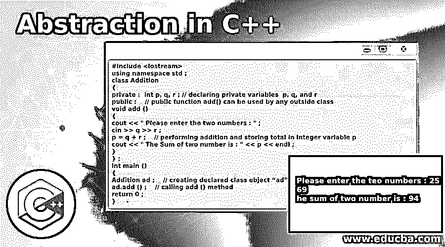

# C++中的抽象

> 原文：<https://www.educba.com/abstraction-in-c-plus-plus/>




## C++中的抽象介绍

抽象是面向对象 C++编程语言最重要的支柱之一。C++中的数据抽象概念帮助程序员只向外界提供必要的信息，而隐藏背景细节。这是最广泛使用的技术，它依赖于代码的实现和接口的分离。数据抽象有助于用户增加代码的灵活性，同时最大限度地减少问题。

**代码:**

<small>网页开发、编程语言、软件测试&其他</small>

```
#include <iostream>
using namespace std ;
class Addition
{
private :  int p, q, r ; // declaring private variables p, q, and r
public :    // public function add() can be used by any outside class
void add ()
{
cout << " Please enter the two numbers : " ;
cin >> q >> r ;
p = q + r ;    // performing addition and storing total in integer variable p
cout << " The Sum of two number is : " << p << endl ;
}
} ;
int main ()
{
Addition ad ;    // creating declared class object “ad”
ad.add () ;    // calling add () method
return 0 ;
}
```

**输出:**


### 抽象的类型

下面给出了两种类型的抽象:

**1。控制抽象:**在控制中，抽象实现细节永远是隐藏的，看不到。

**2。数据抽象:**在数据抽象中，关于代码中数据的信息总是被隐藏的。

为了实现我们自己的抽象数据类型(ADT ),我们可以使用类。我们使用输出流类的 cout 对象来传输数据。我们可以使用像 public、private 和 protected 这样的访问说明符来隐藏声明为 private-public 的数据成员，或者 protected 并对外界单独隐藏它们。

### C++中抽象的例子

在这里，我们将看到如何在 C++编程中通过类、头文件和说明符实现数据抽象。

#### 示例# 1–使用类

**代码:**

```
#include <iostream>
using namespace std ;
class abstractionClass // declaring class
{
private :
int x , y ; // private variables x and y
public :
// method to set values of all the declared private members
void set ( int a , int b ) // declaring public function set
{
x = a ;
y = b ;
}
void display () // declaring display() function
{
cout << " x  =  " << x  << endl ;
cout << " y  = " << y << endl ;
}
} ;
int main ()
{
abstractionClass obj ; // creating object of declared class
obj.set ( 110 , 250 ) ;
obj.display () ;
return 0 ;
}
```

**输出:**


在上面的代码中，你可以看到我们已经声明了一个称为抽象类的类。在这个类中，我们声明了两个私有整数变量 x 和 y。之后，我们在公共访问说明符中声明了 set 函数，并在公共模式中创建了一个 display()函数。最后，在主类中，我们创建了一个名为“obj”的类抽象类的对象。我们使用这个对象调用 set and display 函数来设置和显示结果。

#### 示例 2–使用头文件

**代码:**

```
#include <iostream>
#include <math.h>
using namespace std ;
int main ()
{
int x = 8 ;
int power = 4 ;
int result = pow ( x , power ) ;         // pow(n,power) is the power function to calculate power
std :: cout << " The square of x is : " << result << std :: endl ;
return 0 ;
}
```

**输出:**


在上面的代码中，你可以看到我们使用了一个头文件 math.h，这样我们就可以在代码中使用预定义的数学函数。在这段代码中，我们声明了三个公共整数变量 x、幂和结果。之后，我们使用 std:: out 来计算给定数字的平方，然后将它们存储在我们在代码开始时声明的 result integer 中。

#### 示例 3–使用说明符

**代码:**

```
#include <iostream>
using namespace std ;
class Addition {    // declaring class for the program
public :
// constructor
Addition ( int i = 0 ) { // constructor for class with the same name
total = i ;
}
// interface to outside world
void numAdd ( int number ) { // add function to add values
total += number ;
}
// interface to outside world
int getTotal () {
return total ;
} ;
private :
// hidden data from outside world
int total ;
} ;
int main () {
Addition ad ;
ad.numAdd ( 25 ) ;
ad.numAdd ( 35 ) ;
ad.numAdd ( 44) ;
cout << " The Total of the number is  " << ad.getTotal() << endl ;
return 0 ;
}
```

**输出:**


在上面的代码中，你可以看到我们已经声明了一个叫做加法的类。在这个类中，我们声明了一个名为“Addition”的构造函数，在这个构造函数中，我们将值初始化为零，并将总数设置为整数值“I”。然后，我们在函数“named”上创建了一个函数，不断地将数字添加到总数中。最后，在主类中，我们创建了一个名为“ad”的类添加对象。我们使用这个对象调用命名函数来传递值，并开始添加。

### 结论

数据抽象用于重用编写的代码，并在不影响源代码的情况下更改内部实现，这有助于编码人员保护外部数据。数据抽象在避免重复执行相同操作的代码中起着至关重要的作用。

### 推荐文章

这是一本关于 C++抽象的指南。这里我们讨论抽象的介绍以及类型和各自的例子。您也可以看看以下文章，了解更多信息–

1.  [c++中的阿姆斯特朗数](https://www.educba.com/armstrong-number-in-c-plus-plus/)
2.  [c++中的嵌套循环](https://www.educba.com/nested-loop-in-c-plus-plus/)
3.  [c++中的字符串](https://www.educba.com/string-in-c-plus-plus/)
4.  [在 C++中反转字符串](https://www.educba.com/reverse-string-in-c-plus-plus/)


