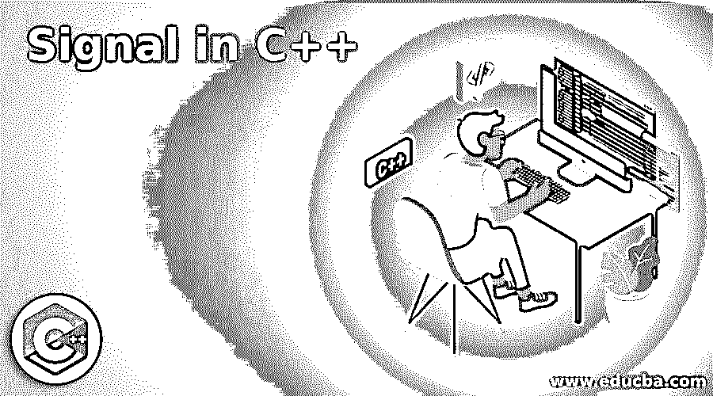
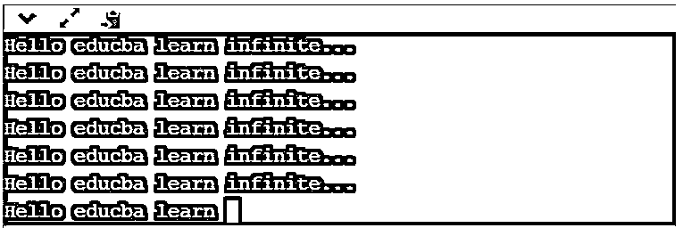
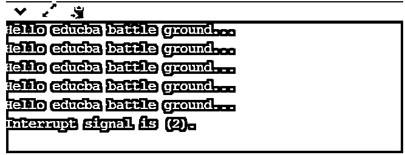
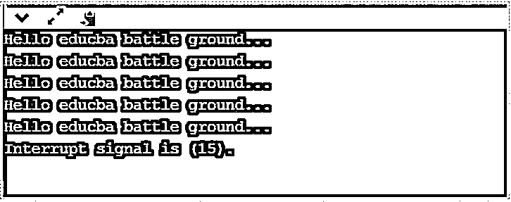
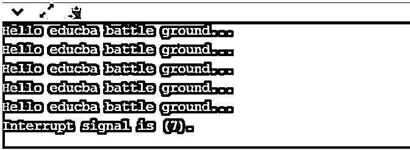
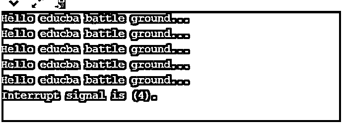
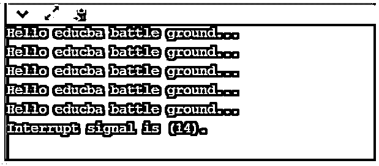
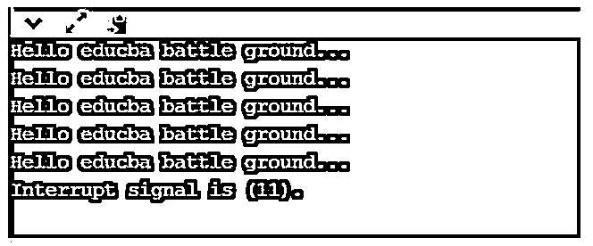

# C++中的信号

> 原文：<https://www.educba.com/signal-in-c-plus-plus/>




## C++中的信号介绍

信号是可以导致任何正在进行的活动异常暂停的中断。就操作系统而言，UNIX 平台 C++信号是一种中断，它在运行过程中停止正在进行的进程或线程。但另一方面，C++信号也有能力捕捉任何时间点的中断，并得出结论来解决导致程序执行暂停的问题。信号库提供的 Signal()函数可以捕获中断或异常，并提供解决方法。

**语法:**

<small>网页开发、编程语言、软件测试&其他</small>

```
Signal(signal registered, signal handler)
```

C++中的信号函数包含两个参数，其中第一个参数表示信号编号，第二个参数表示指向处理该函数的信号的指针。

**Note:** We must always keep in mind that signal function must first register with the signal registered parameter with signal and then it must get associate with the signal handling function. Signal handling function should be of void type.

### Signal 在 C++中是如何工作的？

*   在信号函数中传递两个参数，这两个参数在某种程度上起着非常重要的作用，注册的信号参数将注册到信号函数中，而信号函数的第二个参数是信号处理程序，它将尝试使用信号处理程序捕捉所有异常和中断的信号。
*   编译后，它们将产生一些输出，然后需要创建中断，这种可见的差异将会出现，这意味着 catch 信号将能够打印那些被捕获的中断。
*   随后还将包括另一个函数，即 raise()函数，它考虑第一个参数，即整数信号数，并可以发送任何已定义的信号。有可能产生一个函数来产生必要的信号。

### C++中的信号列表

以下是清单:

| **信号** | **操作说明** |
| 信号情报 | 为接收器端生成一个活动信号。 |
| 是 SIGTERM | 向程序发送终止正常执行的请求。 |
| SIGBUS | 通知访问无效地址的总线错误。 |
| -是啊 | 它检测到非法命令。 |
| 信号 | 该信号表示定时器到期，主要用于报警功能。 |
| 西格伯特 | 程序被异常终止。 |
| 信号停止 | 一个进程被这个信号停止、忽略、阻塞和处理。 |
| 西格尔瑟夫 | 存取无效的存储器。 |
| 西格弗 | 它可以识别任何数学错误或溢出操作。 |
| SIGUSR1，SIGUSR2 | 用户定义的信号。 |
| 西格胡普 | 它告诉用户终端已断开连接。一种用来报告控制过程结束的信号。 |
| 西格奎特 | 生成一个核心转储并用于终止进程。 |
| 信号陷阱 | 追踪所有的陷阱。 |
| 西格孔特 | 该信号被发送到进行继续处理的过程。 |

### C++中的信号示例

下面是一些例子:

#### 示例#1

这个程序演示了使用信号处理程序和 SIGABRT 方法创建的中断，一旦它进入无限循环，就会在退出后被中止。

**代码:**

```
#include <iostream>
#include <csignal>
using namespace std;
void signal_handler( int signl_no ) {
cout << "The interrupt signal is (" << signl_no << "). \n";
exit(signl_no);
}
int main () {
signal(SIGABRT, signal_handler);
while(true)
cout << "Hello educba learn infinite..." << endl;
return 0;
}
```

**输出:**




#### 实施例 2

这个程序演示了信号函数中的 SIGINT 信号功能。

**代码:**

```
#include <iostream>
#include <csignal>
using namespace std;
void signal_handler( int signl_num ) {
cout << "Interrupt signal is (" << signl_num << ").\n";
exit(signl_num);
}
int main () {
int count = 0;
signal(SIGINT, signal_handler);
while(++count) {
cout << "Hello educba battle ground..." << endl;
if( count == 5 )
raise(SIGINT);
}
return 0;
}
```

**输出:**




#### 实施例 3

这个程序演示了 signal 函数()中的 SIGTERM 信号。

**代码:**

```
#include <iostream>
#include <csignal>
using namespace std;
void signal_handler( int signl_num ) {
cout << "Interrupt signal is (" << signl_num << ").\n";
exit(signl_num);
}
int main () {
int count = 0;
signal(SIGTERM, signal_handler);
while(++count) {
cout << "Hello educba battle ground..." << endl;
if( count == 5 )
raise(SIGTERM);
}
return 0;
}
```

**输出:**




#### 实施例 4

这个程序演示了 SIG 函数()中的 SIGBUS 信号。

```
#include <iostream>
#include <csignal>
using namespace std;
void signal_handler( int signl_num ) {
cout << "Interrupt signal is (" << signl_num << ").\n";
exit(signl_num);
}
int main () {
int count = 0;
signal(SIGBUS, signal_handler);
while(++count) {
cout << "Hello educba battle ground..." << endl;
if( count == 5 )
raise(SIGBUS);
}
return 0;
}
```

**输出:**




#### 实施例 5

这个程序演示了信号函数()中的 SIGILL 信号。

**代码:**

```
#include <iostream>
#include <csignal>
using namespace std;
void signal_handler( int signl_num ) {
cout << "Interrupt signal is (" << signl_num << ").\n";
exit(signl_num);
}
int main () {
int count = 0;
signal(SIGILL, signal_handler);
while(++count) {
cout << "Hello educba battle ground..." << endl;
if( count == 5 )
raise(SIGILL);
}
return 0;
}
```

**输出:**




#### 实施例 6

这个程序演示了 signal 函数()中的 SIGALRM 信号。

**代码:**

```
#include <iostream>
#include <csignal>
using namespace std;
void signal_handler( int signl_num ) {
cout << "Interrupt signal is (" << signl_num << ").\n";
exit(signl_num);
}
int main () {
int count = 0;
signal(SIGALRM, signal_handler);
while(++count) {
cout << "Hello educba battle ground..." << endl;
if( count == 5 )
raise(SIGALRM);
}
return 0;
}
```

**输出:**




#### 实施例 7

这个程序演示了信号函数()中的 SIGSEGV 信号。

**代码:**

```
#include <iostream>
#include <csignal>
using namespace std;
void signal_handler( int signl_num ) {
cout << "Interrupt signal is (" << signl_num << ").\n";
exit(signl_num);
}
int main () {
int count = 0;
signal(SIGSEGV, signal_handler);
while(++count) {
cout << "Hello educba battle ground..." << endl;
if( count == 5 )
raise(SIGSEGV);
}
return 0;
}
```

**输出:**




**Note:** These programs can be made uniform and runnable by providing different signal functions within the same function for better understanding.

### 结论

C++中的信号在处理运行时程序执行时出现的意外中断方面起着举足轻重的作用。这些可以由信号函数平稳地处理，因为它充当了用户的指示器，具有捕捉程序执行中的错误的能力。

### 推荐文章

这是一个 C++中的信号指南。在这里，我们讨论 c++中的信号介绍，以及信号列表和相应的例子。您也可以看看以下文章，了解更多信息–

1.  [c++中的 2D 数组](https://www.educba.com/2d-arrays-in-c-plus-plus/)
2.  [C++文字](https://www.educba.com/c-plus-plus-literals/)
3.  [嵌套 if 在 C++中](https://www.educba.com/nested-if-in-c-plus-plus/)
4.  [C++ begin()](https://www.educba.com/c-plus-plus-begin/)


