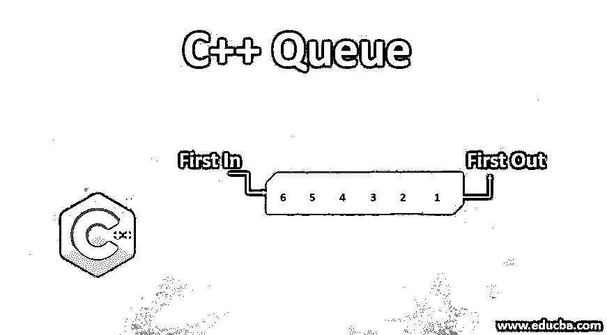

# C++队列

> 原文：<https://www.educba.com/c-plus-plus-queue/>




## C++队列简介

C++中的队列是一种数据结构，它被设计成一种先进先出(FIFO)数据容器。从队列一端输入的数据以 FIFO 的方式从队列的另一端提取。在 C++中，std:: queue 类为程序员提供了所有与队列相关的功能。在本文中，解释了如何在 C++中使用队列，以及它的语法、成员类型和可用的队列函数。

**语法:**

<small>网页开发、编程语言、软件测试&其他</small>

C++队列的语法如下:

```
// Syntax for queue in C++
using namespace std;
queue<data_type>queue_name;
```

要在 C++中使用上述队列语法，包含#include <queue>头文件很重要。</queue>

queue_name 是用户定义的队列名称。

data_type 是队列所有成员的数据类型。

### C++中队列是如何工作的？

使用上面解释的语法，C++中的队列可以被声明为。例如,“queue < int > roll_number”用所有整数成员声明名为 roll_number 的队列。此处声明的队列将按 FIFO(先进先出)方式工作，即首先进入队列的元素将首先被提取，最后插入的元素将最后被提取。C++中的 std:: queue 类也为程序员提供了许多有用的内置成员函数来使用队列。

如下图所示，如果在队列中按照 1->2->3->4->5 的顺序插入元素，则按照首先插入的顺序从队列中提取元素，然后按照 1->2->3->4->5 的顺序提取其余的元素。


请看看下面的示例代码，了解 C++中队列是如何工作的。

**代码:**

```
// C++ program to understand queue container
// including required header files
#include <iostream>
#include <queue> // header file to use queue functionalities in C++
using namespace std;
int main()
{
// declaration of queue named queue_sample
queue<int> queue_sample;
// inserting element in the queue container
queue_sample.push(1);
queue_sample.push(2);
queue_sample.push(3);
queue_sample.push(4);
queue_sample.push(5);
// Removing/Extracting the content from the queue container
while (!queue_sample.empty()) {
cout << ' ' << queue_sample.front();
queue_sample.pop();
}
return 0;
}
```

**输出:**


### C++队列成员类型

以下是关于 C++队列成员类型的详细信息:

*   **container _ type:**container _ type 是一种成员类型，它提供了一种将由队列调整的底层容器的类型。
*   **size_type:** size_type 是一个无符号整数，它将显示队列中元素的数量。
*   **value_type:** value_type 是表示存储在队列容器中的元素的类型的类型。

### C++队列的功能

下面是不同的 C++队列函数，并对每个函数进行了解释。

#### 1.队列::空()

这个函数用于检查队列是空的还是满的。

**参数:**该函数没有需要提供的参数值。

**返回值**:如果队列是空的，里面没有元素，函数的返回值= true。如果队列非空，函数的返回值= false。

#### 2.队列::大小()

该函数用于检查队列成员元素的大小或数量。

**参数:**该函数没有需要提供的参数值。

**返回值**:该函数返回 size_type 成员类型，为无符号整数类型。

#### 3.queue::front()

该函数可用于获取与队列前端元素相关的详细信息或引用。因为队列是先进先出(FIFO)容器，所以前面的元素只不过是队列容器中最老的元素。

**参数**:该函数没有需要提供的参数值。

**返回值**:这个函数返回一个对队列容器前面或第一个元素的引用。

#### 4.queue::back()

该函数可用于获取与队列最后一个元素相关的细节或引用。因为队列是先进先出(FIFO)容器，所以最后一个元素只不过是队列容器中的最新元素。

**参数**:该函数没有需要提供的参数值。

**返回值**:这个函数返回一个对队列容器最后或最新插入元素的引用。

#### 5.queue::push(const value _ type & value)

这个函数可以用来在队列中插入一个新元素。这个函数在最后插入的元素之后插入一个新元素。在队列中插入新元素的过程称为入队操作。

**参数:**该函数的参数是我们希望用来初始化插入元素的值。成员类型 value_type 是队列容器中插入的一种元素。

**返回值**:该函数不返回任何值。

#### 6.queue::pop()

这个函数用于从队列容器中移除一个元素。由该函数移除的元素将是队列中最老的可用元素。由于删除了一个最老的元素，在使用该函数后，队列的大小将减少一。从队列中删除元素的过程也称为出队操作。

**参数:**该函数没有需要提供的参数值。

**返回值**:该函数不返回任何值。

#### 7.队列::交换(队列&队列 2)

这个函数用于交换两个队列的内容。交换两个队列的内容后，两个队列的大小可能会不同于交换内容前的初始大小。两个队列的类型必须相同，才能使用 queue::swap()函数交换内容。

**参数:**该函数的参数将是另一个类似类型的队列容器。

**返回值**:该函数不返回任何值。

#### 8.队列::位置(常量值 _ 类型&值)

这个函数用于在队列容器中插入新元素。它在队列容器的末尾添加了一个新元素。

**参数:**该函数的参数将是插入队列容器末尾的值。

**返回值**:该函数不返回任何值。

### 结论

在本文中，解释了队列容器及其在 C++中的声明和用法。本文还解释了 C++中各种有用的内置成员函数，这有助于程序员更有效地使用队列容器。

### 推荐文章

这是一个 C++队列指南。在这里，我们讨论了 C++中的队列以及函数和它的参数。您也可以阅读以下文章，了解更多信息——

1.  [c++中的闰年程序](https://www.educba.com/leap-year-program-in-c-plus-plus/)
2.  [Java 中的队列](https://www.educba.com/queue-in-java/)
3.  [c#中的队列](https://www.educba.com/queue-in-c-sharp/)
4.  [Python 中的队列](https://www.educba.com/queue-in-python/)


