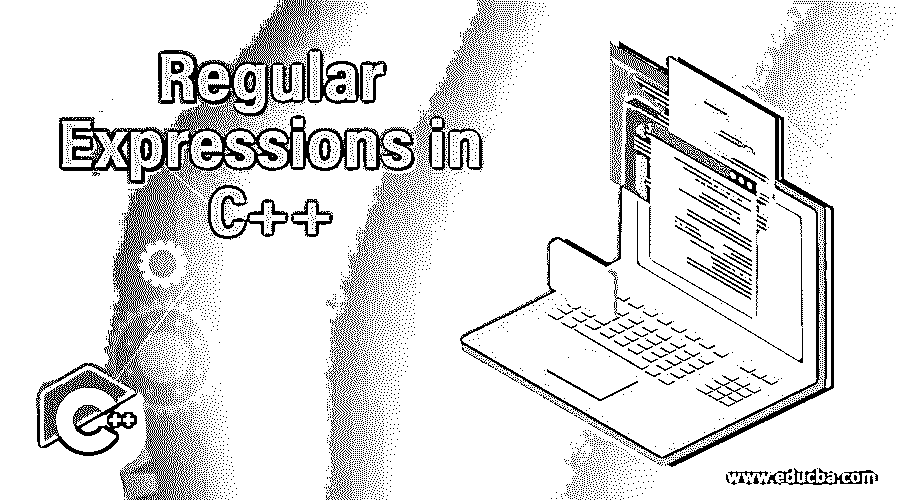

# C++中的正则表达式

> 原文：<https://www.educba.com/regular-expressions-in-c-plus-plus/>




## C++正则表达式简介

C++中的正则表达式是编程的一个重要部分，它有助于找到由一系列字符组成的模式。它也被称为“Regex ”,用于定义字符串搜索算法中可以使用的模式。它们也可以用来表示字符串语法。每个正则表达式字符都有一个有意义的字符或元字符。正则表达式是一种将字符序列与模式进行匹配的标准化方法。不同类型的正则表达式可以使用函数和迭代器来执行。

### C++中正则表达式的功能

让我们通过函数模板来看看编程中正则表达式的语法:

<small>网页开发、编程语言、软件测试&其他</small>

#### 1.regex_search()

在这个函数的帮助下，我们可以在字符串中搜索与代码中给定的正则表达式相匹配的模式。

下面是演示 regex_search()函数工作的 C++代码:

```
#include <iostream>
#include <regex>
#include<string.h>
using namespace std ;
int main()
{
string search_string = " Hello! Welcome to EDUCBA, Learn with the best " ;
regex regular_exp( "l[a-z_]+" ) ;
smatch sm ;
regex_search( search_string , sm , regular_exp ) ;
cout << " Given below string matches with the given pattern : " << endl ;
for ( auto i : sm )
cout << i << " " ;
return 0 ;
}
```

**输出:**


正如你在上面的代码中看到的，我们包含了一个名为<regex>的额外头文件，这样我们就可以在代码中使用正则表达式功能。之后，在主类中，我们声明了一个名为“search_string”的字符串，因为我们传递了一个文本语句，可以在以后进行搜索。现在，我们声明了一个需要搜索的正则表达式，正则表达式的名称是“regular_exp”，我们在其中添加了“l [a-z]”，这意味着这个正则表达式将从声明的字符串中搜索字符“l”。对于匹配行为，我们还声明了一个名为“sm”的标志。最后，正则表达式搜索将有助于在正则字符串中查找搜索模式。类似地，我们一直显示匹配模式，for 循环用于逐个字符地遍历字符串。</regex>

#### 2.regex_match()

在这个函数的帮助下，我们可以在一个字符串中匹配一个模式，这个模式匹配代码中给定的正则表达式。

下面是演示 regex_match()函数工作的 C++代码:

```
#include <iostream>
#include <string>
#include <regex>
using namespace std ;
int main () {
if ( regex_match ( "softwareDevelopment" , regex( "(Soft)(.*)" ) ) )
cout << "String:literal => matched\n" ;
const char search_string[] = "SoftwareDevelopmentHelp" ;
string text ( "software" ) ;
regex str_expr ( "(soft)(.*)" ) ;
if ( regex_match (text,str_expr) )
cout << "String:object => matched\n" ;
if ( regex_match ( text.begin() , text.end() , str_expr ) )
cout << "String:range(begin-end)=> matched\n" ;
cmatch cm ;
regex_match ( search_string , cm , str_expr ) ;
smatch sm ;
regex_match ( text ,sm , str_expr ) ;
regex_match ( text.cbegin(), text.cend(), sm, str_expr ) ;
cout << "String:range, size:" << sm.size() << " are the matches\n" ;
regex_match ( search_string, cm, str_expr, regex_constants::match_default ) ;
cout << "The total matches are : " ;
for ( int i = 0 ; i < sm.size() ; ++i ) {
cout << "[" << sm[i] << "] " ;
}
cout << endl ;
return 0 ;
}
```

**输出:**


正如你在上面的代码中看到的，我们包含了一个名为<regex>的额外头文件，这样我们就可以在代码中使用正则表达式功能。因此，首先我们将给定的字符串“softwareDevelopment”与正则表达式“(”(soft)()进行匹配。*)"使用 regex_match 函数。之后，我们还通过向 regex_match 传递一个 string 对象、range 等来演示它的不同变体。</regex>

#### 3.regex_replace()

在这个函数的帮助下，我们可以替换字符串中与代码中给定的正则表达式相匹配的模式。

下面是演示 regex_replace()函数工作的 C++代码:

```
#include <iostream>
#include <string>
#include <regex>
#include <iterator>
using namespace std;
int main()
{
string search_string = " Hello! Welcome to EDUCBA, Learn with the best  \n " ;
cout << " Here is the input string: " << search_string << endl ;
regex regexp( "H[a-zA-z]+" ) ;
cout << " Replace the word 'Hello' with word 'Hey' : " ;
cout << regex_replace( search_string , regexp , "Hey" ) ;
string output ;
cout << " Replace the word 'Hey' back to 'Hello' : " ;
regex_replace( back_inserter(output) , search_string.begin() , search_string.end() ,
regexp ,  "Hello" ) ;
cout << output ;
return 0 ;
}
```

**输出:**


正如你在上面的代码中看到的，我们包含了一个名为<regex>的额外头文件，这样我们就可以在代码中使用正则表达式功能。之后，在主类中，我们声明了一个名为“search_string”的字符串，因为我们传递了一个文本语句，可以在以后进行搜索。然后我们使用正则表达式来匹配以“H”开头的字符串。之后，我们使用 regex_replace()将匹配字符串替换为单词“Hey”。然后，我们使用 regex_replace()将匹配字符串替换回单词“Hello”。最后，您可以在输出屏幕上看到，我们是如何在代码中将 Hello 字替换为 Hey，然后再次将 Hey 字符串替换为 Hello 字符串的。</regex>

### 结论

正则表达式在编程中起着重要的作用，它有助于节省搜索字符串、文本，并在少量时间内轻松地处理大量复杂的代码。此外，我们可以通过在代码中使用正则表达式来匹配、替换和搜索给定的字符串。

### 推荐文章

这是 C++中正则表达式的指南。这里我们还讨论了 c++中正则表达式的介绍和功能，包括 regex_search()、regex_match()等。您也可以看看以下文章，了解更多信息–

1.  [c++中的抽象](https://www.educba.com/abstraction-in-c-plus-plus/)
2.  [c++中的字符串](https://www.educba.com/string-in-c-plus-plus/)
3.  [c++中的字谜](https://www.educba.com/anagram-in-c-plus-plus/)
4.  [c++中的堆栈](https://www.educba.com/stack-in-c-plus-plus/)


