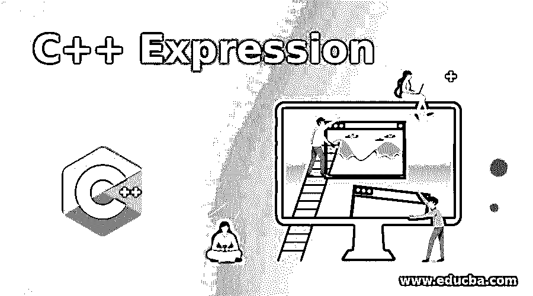

# C++表达式

> 原文：<https://www.educba.com/c-plus-plus-expression/>




## C++表达式简介

C++中的表达式是指定计算的操作符和操作数的有序集合。一个表达式可以包含零个或多个运算符和一个或多个操作数，操作数可以是常量或变量。此外，表达式还可以包含返回常数值的函数调用。使用赋值运算符将求值表达式后得到的结果赋给变量。考虑一些 C++中表达式的例子:b = 25 + a，a / (b + c)，x = 6.75 * 2，x == 2.6。等等。

### C++中的表达式类别–

根据表达式求值后得到的结果或表达式中操作数的类型，C++中有不同种类的表达式。

<small>网页开发、编程语言、软件测试&其他</small>

**1。常量表达式–**常量表达式在表达式中只包含常量值。

**举例:**

```
x=25+10
```

**2。积分表达式–**在对表达式求值后产生整数值的积分表达式。

**举例:**

```
x + int(12.0)
```

**3。浮点表达式–**对表达式求值后由浮点值产生的浮点表达式。

**举例:**

```
x+float(9)
```

**4。指针表达式–**指针表达式，在对表达式求值后产生变量的地址。

**举例:**

```
y=&x
```

**5。关系表达式–**对表达式求值后由布尔值 true 或 false 产生的关系表达式。

**举例:**

```
a-b >= x-y
```

**6。逻辑表达式–**逻辑表达式，在对两个或多个关系表达式的组合求值后产生布尔值 true 或 false。

**举例:**

```
a>20 || b==20
```

**7。逐位表达式–**逐位表达式在表达式的位级别执行运算。

**举例:**

```
x&4.
```

### C++表达式的例子

下面举几个例子

#### 示例 1–常量表达式

此表达式在表达式中仅包含常量值。常量值可以是整数、浮点、字符、双精度、枚举常量。在这个表达式中，值在编译时找到，在运行时计算。常量表达式可用于数组的索引、枚举中的数值、开关大小写匹配等。

接下来，我们编写 C++代码，通过下面的例子更清楚地理解常量表达式

**代码:**

```
#include <iostream>
using namespace std;
int main()
{
// declaration of variable
int result;
//constant expression
result = 3 + 2 * 10;
// display result value
cout<<"The result of constant expression = "<<result;
return 0;
}
```

**输出:**


#### 示例 2–积分表达式

该表达式是对表达式求值后得到的整数值，如果需要，表达式会执行隐式和显式转换。

接下来，我们编写 C++代码，通过下面的例子更清楚地理解整数表达式

**代码:**

```
#include <iostream>
using namespace std;
int main()
{
// declaration of variables
int a=2, b=3, result;
//integral expression
result = a*a + b*b;
// display result value
cout<<"The result of integral expression = "<<result;
return 0;
}
```

**输出:**


#### 示例 3–浮点表达式

该表达式由计算表达式后的浮点值产生，如果需要，表达式可以执行隐式和显式转换。

接下来，我们编写 C++代码，通过下面的例子更清楚地理解浮点表达式

**代码:**

```
#include <iostream>
using namespace std;
int main()
{
// declaration of variables
float a=2.5, b=3.6, result;
//float expression
result = (a+b)/float(10);
// display result value
cout<<"The result of float expression = "<<result;
return 0;
}
```

**输出:**


#### 示例 4–指针表达式

这个表达式结果是对一个表达式求值后另一个变量的地址。指针表达式包含&x，ptr++，ptr –, ptr 等等表达式。

接下来，我们用下面的例子编写 C++代码来更清楚地理解指针表达式

**代码:**

```
#include <iostream>
using namespace std;
int main()
{
// declaration of variables
int a=10, result;
// declaration of pointer
int *ptr;
// pointer initialize
ptr=&a;
cout<<"The value of a = "<<a<<endl;
cout<<"The ptr pointing to address = "<<ptr<<" which store value = "<<*ptr<<endl;
//pointer expression
*ptr=*ptr+1;
cout<<"The value of a after increment ptr = "<<a<<endl;
cout<<"The ptr pointing to address after increment = "<<ptr<<" which store value = "<<*ptr<<endl;
return 0;
}
```

**输出:**


#### 示例 5–关系表达式或布尔表达式

该表达式是对表达式求值后得到的布尔值 true 或 false。如果关系表达式包含算术表达式的组合，则首先计算算术表达式，然后比较结果。

接下来，我们编写 C++代码，通过下面的例子更清楚地理解关系表达式

**代码:**

```
#include <iostream>
using namespace std;
int main()
{
// declaration of variables
int a=2, b=3;
bool result;
//Relational expression
result = a*2>b;
// display result value
cout<<"The result of relation expression = "<<result;
return 0;
}
```

**输出:**


#### 示例 6–逻辑表达式

该表达式通过使用&& '和' || '逻辑运算符组合两个或多个关系表达式，并给出一个布尔值结果，该结果为真或假。

接下来，我们编写 C++代码，通过下面的例子更清楚地理解逻辑表达式

**代码:**

```
#include <iostream>
using namespace std;
int main()
{
// declaration of variables
int a=10, b=20, c=30;
bool result;
//Logical expression
result = (a<b)&&(b<c);
// display result value
cout<<"The result of logical expression = "<<result;
return 0;
}
```

**输出:**


#### 示例# 7–位表达式

此表达式在表达式中的位级别执行运算。按位表达式 and(&)、or(|)、not(~)和移位运算符。

接下来，我们通过下面的例子编写 C++代码来更清楚地理解位表达式

**代码:**

```
#include <iostream>
using namespace std;
int main()
{
// declaration of variables
int a=4;
int result;
//Logical expression first convert a=0100 2=0010 in binary and apply operators
result = a&2;
// display result value
cout<<"The result of bitwise expression for a&2 = "<<result<<endl;
result = a|2;
cout<<"The result of bitwise expression for a|2 = "<<result<<endl;
result = a>>2;
cout<<"The result of bitwise expression for a>>2 = "<<result<<endl;
return 0;
}
```

**输出:**


### 结论

C++表达式是指定计算的操作符和操作数的有序集合。根据表达式的操作数和或结果，表达式有不同的类别。有时表达式可以是复合表达式，它是上述表达式的组合。

### 推荐文章

这是一本 C++表达式指南。这里我们讨论 C++表达式的例子以及不同种类的表达式。您也可以看看以下文章，了解更多信息–

1.  [C++向量排序](https://www.educba.com/c-plus-plus-vector-sort/)
2.  [C++结构](https://www.educba.com/c-plus-plus-struct/)
3.  [c++中的字符串](https://www.educba.com/string-in-c-plus-plus/)
4.  [c++中的堆栈](https://www.educba.com/stack-in-c-plus-plus/)


