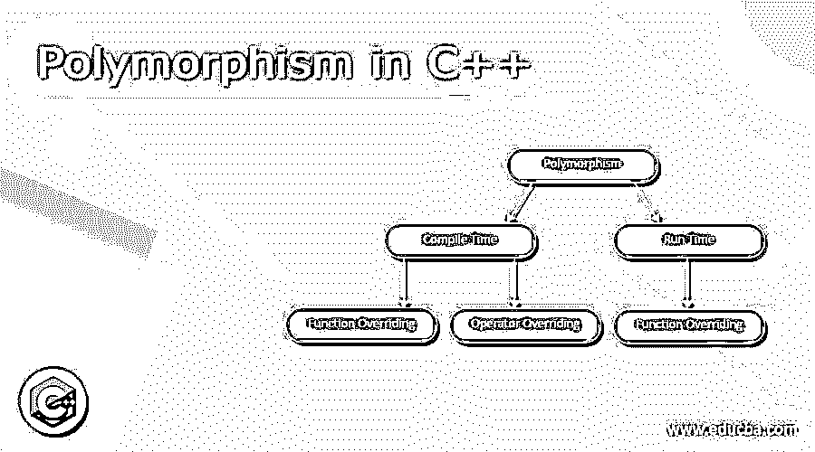

# C++中的多态性

> 原文：<https://www.educba.com/polymorphism-in-c-plus-plus/>




## C++中多态性的定义

在 C++中，多态性是指同一实体(对象或函数)在不同的情况下表现不同。在面向对象编程中，多态性是一个至关重要的概念。“多态性”是术语“poly”和“morphs”的混合，意思是“多种类型”。这是希腊语中的一个短语。我们在面向对象编程的三个核心原则中使用它，它们是多态、继承和封装。例如，同时，一个人可能具有多种特征。同时，他是一个父亲，一个儿子，一个丈夫，一个工人。因此，同一个人在不同的环境下会有不同的表现。

### 多态性的类型

多态性的类型及其工作——

<small>网页开发、编程语言、软件测试&其他</small>

C++中的多态性主要分为两种类型

#### 1.编译时多态性

在编译时多态性中，在程序编译期间调用一个函数。早期绑定或静态绑定是用于这种类型的多态性的术语。函数重载或运算符重载用于实现编译时多态性

**a .函数重载:**当存在几个同名但参数不同的函数时，称之为重载。参数数量或参数形式的变化可能会导致函数过载。
例如，这两个任务可以使用 sub()函数来完成。这两个请求将是减去两个整数值和两个浮点值。

**b .操作符重载:**操作符重载是指在不改变操作意义的情况下，给操作符分配额外的任务。如果我们使用用户定义的类型，比如对象或结构，我们可以在 C++中重载一个操作符。

#### 2.运行时多态性

在运行时多态性中，函数在程序执行期间被调用。因此，它被称为后期绑定或动态绑定。函数覆盖或虚函数用于完成运行时多态性。

**a .函数覆盖:**在函数覆盖中，覆盖派生类中的基类函数，给它一个新的定义。

**b .虚函数:**虚函数是基类成员函数。在派生类中，我们可以重新定义它。必须使用关键字 virtual 在基类中声明虚函数。

### C++中多态性的例子

C++中函数重载的多态性示例

#### 示例#1

**代码:**

```
#include<iostream>
using namespace std;
int add(int n1, int n2) {
return n1 + n2;
}
double add(double num1, double num2) {
return num1 + num2;
}
int add(int n1, int n2, int n3) {
return n1 + n2 + n3;
}
int main() {
// Calling function with 2 int parameters
cout << "Result 1 = " << add(10, 20) << endl;
// Calling function with 2 double parameters
cout << "Result 2 = " << add(10.5, 60.6) << endl;
// Calling function with 3 int parameters
cout << "Result 3 = " << add(50, 10, 20) << endl;
}
```

上述代码的输出是–


与上面的程序一样，创建了三个 add()函数，第一个函数接受两个整数参数，第二个函数接受两个双精度参数，第三个函数接受三个整数参数。最后，在主函数中调用所有三个 add()函数。这里哪个 add()函数被执行是基于传递的参数决定的，这叫做函数重载。并显示所有结果，正如我们在上面的输出中看到的。
c++中运算符重载的多态性示例——

#### 实施例 2

**代码:**

```
#include<iostream>
#include<string>
using namespace std;
class A
{
public:
string str;
A(){}
A(string i)
{
str = i;
}
A operator+(A a)
{
std::string res= str + a.str;
return res;
}
};
int main() {
A a1("Hello");
A a2(" World");
A res = a1+a2;
cout<< res.str;
}
```

上述代码的输出是


在上面的程序中，创建了类 A，并且通过在类中提供新的定义，运算符+重载。接下来，在 main 函数中创建类 A 的两个对象，并对它们调用+运算符。正如我们在上面的输出中所看到的，显示了+运算符的返回结果。

C++中函数重写的多态性示例–

#### 实施例 3

**代码:**

```
#include<iostream>
using namespace std;
class A {
public:
void display() {
cout << "This is from the base class function." << endl;
}
};
class B : public A {
public:
void display() {
cout << "This is from the derived class function. " << endl;
}
};
int main() {
B obj;
// Calling display() function of the class
obj.display();
return 0;
}
```

上述代码的输出是–


与上面的程序一样，创建了类 A 和 B，其中 A 是基类，B 是派生类。基类的 display()函数在派生类中被重定义称为函数重写。在创建类 B 的对象并调用 display()函数的 main 函数中，类 B 的 display()函数得到执行，这是根据它调用的对象决定的。正如我们在上面的输出中看到的。
虚函数在 C++中的多态性示例

#### 实施例 4

**代码:**

```
#include<iostream>
using namespace std;
class A {
public:
virtual void display() {
cout << "This is from the base class function." << endl;
}
};
class B : public A {
public:
void display() {
cout << "This is from the derived class function. " << endl;
}
};
int main() {
B obj1;
// pointer of A type that points to obj1
A* obj2 = &obj1;
// calls member function of the class B
obj2->display();
return 0;
}
```

上述代码的输出是–


与上面的程序一样，创建了类 A 和 B，其中 A 是基类，B 是派生类。基类的 virtual display()函数在派生类中重新定义。在创建类 B 的对象的主函数中，创建一个指向类 B 对象的指针类型，并使用指针操作符(“-->”)调用 display()函数，这里类 B 的 display()函数开始执行，正如我们在上面的输出中看到的。

### 结论

C++中的多态性是指同一实体在不同情况下表现不同。多态性有两种类型，即编译时多态性和运行时多态性。

### 推荐文章

这是一本关于 C++多态性的指南。在这里，我们讨论多态的描述、类型及其代码实现的工作示例。您也可以看看以下文章，了解更多信息–

1.  [C++ getline()](https://www.educba.com/c-plus-plus-getline/)
2.  [C++表达式](https://www.educba.com/c-plus-plus-expression/)
3.  [C++对](https://www.educba.com/c-plus-plus-pair/)
4.  [外壳排序 C++](https://www.educba.com/shell-sort-c-plus-plus/)


