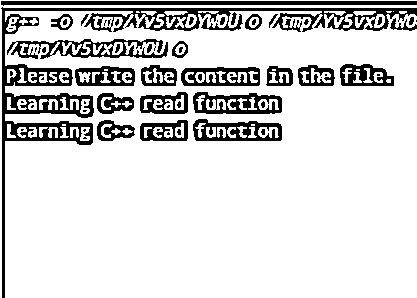

# C++读取文件

> 原文：<https://www.educba.com/c-plus-plus-read-file/>


## C++读取文件的定义

众所周知，C++是使用最广泛的语言之一，它提供了许多特性，允许程序员轻松地执行多项任务。在 C++中，使用 cin 和 cout 进行文件操作就像在控制台上正常操作一样简单。为了永久存储数据，实际上经常使用文件。fstream 是 C++库，用于像 iostream 一样执行读写文件操作。流只是用作从一个位置向另一个位置输入或输出数据的目的地。这个库有几种数据类型来执行文件操作的特定任务。“ifstream”是 C++中专门用于读取文件的数据类型之一。

### 如何在 C++中读取文件？

如上所述，使用“fstream”库的“ifstream”数据类型来读取 C++的文件。但在阅读之前，有几个任务是按顺序执行的，如打开文件，阅读和关闭它。不同的数据类型用于特定的目的。让我们理解下面提到的“ifstream”的数据类型:

<small>网页开发、编程语言、软件测试&其他</small>

| **数据类型名称** | **数据类型描述** |
| ofstream | 这种数据类型用于打开文件或在文件中写入内容。它表示输出文件流。 |
| ifstream 车 | 此数据类型用于从文件中读取数据。它表示输入文件流。 |
| fstream | 这种数据类型代表普通文件流，可以执行输入和输出文件流的任务。它可以用来打开、创建、读取和写入文件。 |

下面给出了用 C++编写文件内容的一步一步的过程:

#### 1.打开已经创建的文件

为了从文件中读取信息，我们需要首先打开它。使用文件的 ofstream 或 fstream 对象打开文件。C++中的文件可以根据写或读的目的以不同的模式打开。因此，我们需要指定文件打开的模式以及文件名。

在 C++中打开文件时，基本上有三种默认模式:

*   ofstreamios: : out
*   fstreamios: : in | ios: : out
*   ofstreamios : :out

**语法:**

```
void open(filename, ios: : openmodemode_name);
```

#### 2.从文件中读取信息

我们可以简单地使用带有文件名的操作符( >> )从文件中读取信息。我们需要使用 C++中的 fstream 或 ifstream 对象来读取文件。通过简单地使用 while 循环和 ifstream 的函数“getline()”就可以逐行读取文件。

#### 3.关闭文件

我们都知道 C++的内存管理，当程序终止时，它释放所有分配的内存和使用的资源。但是在执行了所需的操作之后关闭文件仍然被认为是一个好的做法。

**语法:**

```
void close();
```

### C++读取文件的例子

下面给出了几个示例及其输出，以演示如何在 C++中执行文件读取操作:

#### 示例#1

**代码:**

```
#include <iostream>
#include <fstream>
using namespace std;
intmain(){
char data[100];
// creating the file variable of the fstream data type for writing
fstreamwfile;
// opening the file in both read and write mode
wfile.open ("demo.txt", ios::out| ios::in );
// Asking the user to enter the content
cout<< "Please write the content in the file." <<endl;
// Taking the data using getline() function
cin.getline(data, 100);
// Writing the above content in the file named 'demp.txt'
wfile<< data <<endl;
// closing the file after writing
wfile.close();
//creating new file variable of data type 'ifstream' for reading
ifstreamrfile;
// opening the file for reading the content
rfile.open ("demo.txt", ios::in| ios::out );
// Reading the content from the file
rfile>> data;
cout<< data <<endl;
//closing the file after reading is done
rfile.close();
return 0;
}
```

**输出:**




**说明:**在上面的例子中，我们创建了两个数据类型为‘fstream’和‘ifstream’的文件变量，分别用于文件的写入和读取。为了读取或写入文件，我们需要首先使用 open()函数打开文件并定义其模式。打开后，通过(< <)操作符将内容写入文件，写入后使用 close()函数关闭文件。现在，该文件再次打开，以便读取其内容(使用> >操作符)并显示在控制台上(使用 cout 功能)。为了释放所有的资源并释放分配的内存，使用了 close()函数。

#### 实施例 2

当用户正在读取的文件未找到时。

**代码:**

```
#include<iostream>
#include<fstream>
using namespace std;
intmain()
{
char ch;
//creating the object of the data type 'istream'
ifstreamnew_file;
//opening the above file
new_file.open("demo1.txt",ios::in);
//checking whether the file is available or not
if(!new_file)
{
cout<<"Sorry the file you are looking for is not available"<<endl;
return -1;
}
// reading the whole file till the end
while (!new_file.eof())
{
new_file>>noskipws>>ch;
// printing the content on the console
cout<<ch;
}
//closing the file after reading
new_file.close();
return 0;
}
```

**输出:**


**解释:**在上面的代码中，我们创建了数据类型为‘ifstream’的对象，以便读取名为‘demo 1 . txt’的文件。使用“ios::in”在读取模式下使用 open()函数打开文件。我们使用了 if 和 else 语句来检查文件是否被重新发送。如果找不到该文件，控制台上会显示一条正确的消息。否则，它将使用'>' T3 '操作符读取整个文件，并将内容打印在控制台上。为了释放所有的资源和内存，使用了 close()函数。

### 结论

上面的描述清楚地解释了如何在 C++中读取文件，以及用于特定操作的文件流的各种数据类型。由于使用文件在现实世界中非常普遍，所以在使用它们之前深入理解每一个文件操作是非常重要的。

### 推荐文章

这是一个 C++读取文件的指南。这里我们还讨论了 c++中的定义和如何读取文件？以及不同的示例及其代码实现。您也可以看看以下文章，了解更多信息–

1.  [C++ Lambda 表达式](https://www.educba.com/c-plus-plus-lambda-expressions/)
2.  [C++ shuffle()](https://www.educba.com/c-plus-plus-shuffle/)
3.  [C++ endl](https://www.educba.com/c-plus-plus-endl/)
4.  [C++聚合](https://www.educba.com/c-plus-plus-aggregation/)


