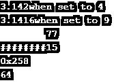
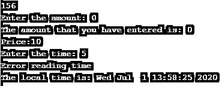

# C++ iomanip

> 原文：<https://www.educba.com/c-plus-plus-iomanip/>


## C++ iomanip 简介

iomanip 是一个 C++库，它帮助我们处理任何 C++程序的输出。这个库中有许多函数可以帮助处理输出。举几个例子，我们有重置标志、设置填充字符、设置精度、获取日期和时间等功能。它是 C++标准库的输入输出库的一部分。只要这些函数影响 iostream 对象的状态，就可以很容易地使用它们。我们将在前面详细介绍所有这些函数。

### C++ iomanip 库的功能

iomanip 库中有 10 个函数。让我们检查一下它们的语法。

<small>网页开发、编程语言、软件测试&其他</small>

1.  **resetiosflags:** 清除指定的 ios_base 标志。
2.  **setiosflags:** 它将设置 ios_base 标志。
3.  **setbase:** 根据所述基数改变所需的基数。
4.  **setfill:** 它将用指定的字符填充。
5.  **setprecision:** 会改变任意浮点数的精度。
6.  setw: 它帮助改变下一个输入或输出字段的宽度。
7.  **get_money:** 它会隔离货币价值。
8.  **put_money:** 它将格式化并生成一个货币值的输出。
9.  get_time: 它将分离日期或时间值，并以指定的格式发送。
10.  **put_time:** 将日期或时间格式化，按照指定的格式提供。

### C++ iomanip 的语法

让我们检查一下这些函数的语法。

```
setiosflags (ios_base::fmtflags mask);
```

掩码是必须设置的标志。

```
resetiosflags (ios_base::fmtflags mask);
```

这里，掩码也是必须重置的标志。

```
setbase (int base);
```

基数可以是设置了基数的整数。

```
setfill (char_type c);
```

这是一个新的填充字符，它是一个字符类型变量，可用于填充字符串。

```
setprecision (int n);
```

这里的整数是小数精度的新值。

```
setw (int n);
```

这里的整数表示将用作宽度的字符数。

```
get_money (moneyT& mon, bool intl = false);
```

这里，第一个参数将是存储货币值的对象。第二个参数将是一个布尔值。

```
put_money (constmoneyT& mon, bool intl = false);
```

类似地，这里第一个参数是货币值，第二个是布尔值。

```
get_time (struct tm* tmb, constcharT* fmt);
```

这里的第一个参数将是一个存储日期和时间的指针。第二种格式是需要时间的日期和时间格式。

```
put_time (conststruct tm* tmb, constcharT* fmt);
```

类似于上面的语法，我们将有一个指向结构的指针，第二个参数将有一个日期或时间的格式。

### iomanip 在 C++中是如何工作的？

让我们来看看这个函数是如何工作的:

**代码:**

```
int main()
{
// Initializing the decimal to a number
double num = 3.142857142857;
cout<< "Precision before using iomanip function: \n"
<<num<<endl;
// Using setprecision() to change the value of precision
cout<< "The precision is set using"
<< " setprecision to 3: \n"
<<setprecision(3);
cout<<num<<endl;
}
```

为了便于理解，我们只取了一个函数。我们取了一个设定精度的数字。iomanip 库允许更改精度。最初，精度是默认的，然后我们使用 setprecision()函数将它更改为 3。这将改变精度值，十进制数将不会只取前 3 位小数。将对输出进行操作，并相应地显示输出。这是因为 iomanip 库。

### 实现 C++ iomanip 的示例

以下是 C++ iomanip 的示例:

#### 示例#1

检查 setprecision、setw、setfill、setiosflags 和 resetiosflags 的示例。

**代码:**

```
#include <iostream>
#include <iomanip>
using namespace std;
int main ()
{
doubleflt_val =3.14159;
cout<<setprecision(4) <<flt_val<< "when set to 4 \n";
cout<<setprecision(5) <<flt_val<< "when set to 9 \n";
cout<<setw(10);
cout<< 77 <<endl;
cout<<setfill ('#') <<setw (10);
cout<< 15 <<endl;
std::cout<<std::hex <<std::setiosflags (std::ios::showbase);
std::cout<< 600 <<std::endl;
std::cout<<std::resetiosflags(std::ios::showbase) << 100 <<std::endl;
return 0;
}
```

**输出:**




**说明:**上面的程序帮助我们理解了 iomanip 库的 5 个功能。我们已经导入了库 iomanip，它提供了操作函数。我们已经使用了 5 个函数。第一个功能是 setprecision，它有助于设置所定义数字的精度。我们首先将它设置为 4，然后设置为 9。然后我们将输出字段的宽度设置为 10。之后，我们使用 setfill 函数，用字符 15 填充数字 15。我们将宽度设置为 10。前 8 个字符是#然后是 15。在这之后，我们使用 setiosflags 来设置标志基。以类似的方式，我们可以使用 resetiosflags 函数。

#### 实施例 2

检查 get_time、put_time、setbase、get_money 和 put_money 的示例。

**代码:**

```
#include <iostream>
#include <iomanip>
#include <chrono>
using namespace std;
int main ()
{
std::cout<<std::setbase(32);
std::cout<<156<<std::endl;
long double amt;
std::cout<< "Enter the amount: ";
std::cin>>std::get_money(amt);
if (std::cin.fail()) std::cout<< "Error reading price\n";
else std::cout<< "The amount that you have entered is: " << amt << '\n';
std::cout<< "Price:" <<std::put_money(10.50L) << '\n';
structstd::tm clk;
std::cout<< "Enter the time: ";
std::cin>>std::get_time(&clk,"%R"); // It will extract the date in 24 Hr format
if (std::cin.fail()) std::cout<< "Error reading time\n";
else {
std::cout<< "The entered time is: ";
std::cout<<clk.tm_hour<< " hours and " <<clk.tm_min<< " minutes\n";
}
using std::chrono::system_clock;
std::time_t t = system_clock::to_time_t (system_clock::now());
structstd::tm * ptm = std::localtime(&t);
std::cout<< "The local time is: " <<std::put_time(ptm,"%c") << '\n';
return 0;
}
```

**输出:**




**解释:**在这个程序中，我们使用 iomanip 库中剩余的 5 个函数。我们已经像以前一样导入了 iomanip 库，并使用 setbase 函数设置了库。之后，我们使用了 get_money 函数和 put_money 函数，它们获取金额并根据函数打印出来。get_time 和 put_time 函数帮助我们以给定的格式显示时间。输出将如下所示:

### 结论

顾名思义，iomanip 库是一个操作库，可以帮助我们操作我们想要的输出。我们可以使用这个库中的函数，得到我们想要的输出。

### 推荐文章

这是一个 C++ iomanip 的指南。在这里，我们讨论 C++ iomanip 及其不同功能的介绍，以及示例和代码实现。您也可以浏览我们推荐的文章，了解更多信息——

1.  [c++中的递归函数(示例)](https://www.educba.com/recursive-function-in-c-plus-plus/)
2.  [c++的 11 大特性](https://www.educba.com/features-of-c-plus-plus/)
3.  [机器学习 C++库](https://www.educba.com/machine-learning-c-plus-plus-library/)
4.  [C 语言中类型为](https://www.educba.com/hashing-function-in-c/)的哈希函数


