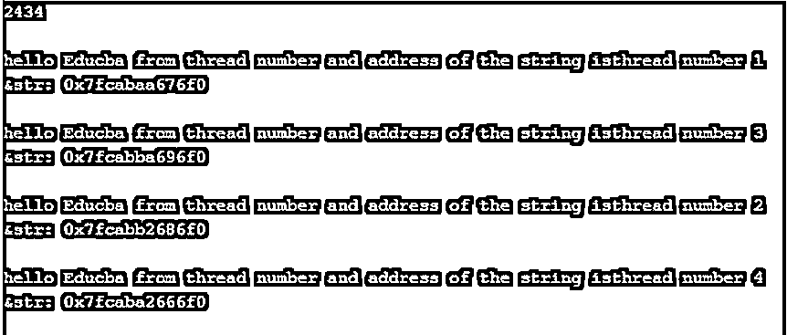

# C++线程 _ 本地

> 原文：<https://www.educba.com/c-plus-plus-thread_local/>


## C++线程 _ 本地简介

在 C++中，thread_local 被定义为用于定义线程本地数据的说明符，并且该数据在线程被创建时被创建，在线程也被销毁时被销毁，因此该线程本地数据被称为线程本地存储。此 thread_local 是除外部和静态说明符之外的存储类之一。因此，变量被声明为 thread_local。当每个线程创建变量时，它复制它的线程，因此这个 thread_local 说明符只能在变量上声明或定义，而不能应用于函数定义或声明，声明只能在静态持续时间内完成。

### C++中 thread_local 的使用

在本文中，我们将讨论 C++中的 thread_local。thread_local 数据是一种也被称为线程特定数据的数据，因为该 thread_local 是一个存储类说明符，通过用 thread_local 说明符声明任何变量，该变量可以将其数据存储在线程本地存储中，该线程本地存储被分配为每个线程基础，这意味着每个变量在线程被创建时被创建，并且这些变量也将在线程被销毁时被销毁。因此，在循环并行化优化性能期间，编译器可以在任何需要的时候分配这种线程本地存储。

<small>网页开发、编程语言、软件测试&其他</small>

在 C++中，使用下划线(_)将变量声明为线程本地数据，后跟 thread 关键字，如 __thread int a、__thread char s 等。这些变量可以作为任何变量进行访问，如全局变量、文件范围变量或函数范围变量。由于自动变量总是对线程本地无效，因此该线程本地说明符可以与静态或外部说明符结合使用。这种变量的初始化需要一个静态构造函数，并且如果这个具有命名空间或类范围的 thread_local 变量可以作为线程启动的一部分被初始化，并且只有当类的成员只能是线程本地的并且因此每个变量在每个线程中可以有一个副本时，它才是静态的。而这种初始化的线程局部变量是在。tdata 部分和未初始化的部分被存储为用“公共”符号定义的变量，并且对于每个创建或初始化的新线程，该线程在线程本地存储中被分配一个新块，每个线程具有指向线程的控制块的线程指针，并且具有当前执行线程的线程指针的指针值。因此，只有在创建任何新线程时，或者在加载共享对象之后或者在程序启动时，线程第一次引用任何线程本地存储块时，才可以创建线程本地存储。

现在让我们看一个将变量声明为 thread_local 的例子，它有自己的线程副本，我们可以通过它的名字引用它，然后当每个线程的这个副本被关联时，使用当前线程。让我们看看下面的例子，对于整数和字符串数据类型，变量可以声明为 thread_local。

### C++线程本地的例子

下面是一个例子:

**代码:**

```
#include <iostream>
#include <string>
#include <mutex>
#include <thread>
std::mutexcoutMutex;
thread_localint n=2;
thread_localstd::string str("hello Educba from thread number and address of the string is");
void thread_integer(intn_val){
n=n_val;
}
void thread_cnt(){
std::cout<<n;
}
void thread_func(int td){
thread_integer(td);
++n;
thread_cnt();
}
void thread_string(std::string const& a2){
str+=a2;
std::lock_guard<std::mutex> guard(coutMutex);
std::cout<<str<<std::endl;
std::cout<< "&str: " <<&str<<std::endl;
std::cout<<std::endl;
}
intmain(){
n=4;
std::thread it1(thread_func,1);
std::thread it2(thread_func,2);
std::thread it3(thread_func,3);
it1.join();
it2.join();
it3.join();
std::cout<<n<<std::endl;
std::cout<<std::endl;
std::thread tt1(thread_string,"thread number 1");
std::thread tt2(thread_string,"thread number 2");
std::thread tt3(thread_string,"thread number 3");
std::thread tt4(thread_string,"thread number 4");
tt1.join();
tt2.join();
tt3.join();
tt4.join();
}
```

**输出:**




在上面的程序中，我们可以看到，我们必须包括一些库，如用于使用 thread_local 说明符的线程、用于输入输出值的 iostream、用于使用或声明字符串变量的字符串库，以及用于保护可由多个线程访问的共享数据的互斥库。然后，我们声明了两个变量，一个是名为“n”的整数类型，另一个是名为“str”的字符串类型，我们将这两个变量都声明为 thread_local 以查看输出。在这个声明中，我们已经给出了两种类型的初始值，对于从线程“2”开始的整数类型，我们正在打印写在 str 值中的消息。然后，我们将编写读取整数值的函数，直到在主函数中指定。因此，如上面的屏幕截图所示，当我们打印从线程 2 号到线程 4 号的整数类型的线程时，我们只显示 3 个线程，因此在输出中，我们可以看到首先执行线程 2，然后执行线程 4、线程 3，再次执行线程 4。因此在运行该程序时可能会有所不同。这个想法可以通过使用字符串类型来澄清。因此，当我们执行上述程序时，我们可以看到第一个线程编号 3 被执行，然后线程 1、线程 2 和最后一个线程 4 被执行，字符串变量中声明的字符串与线程编号一起显示给各个线程。因此，我们可以看到每个线程都有自己的副本。所以在上面的程序中，我们可以说我们可以用随机数生成器来匹配它，这里每个线程都有自己的随机数，而不管其他线程。

### 结论

在本文中，我们可以得出结论，C++中的 thread_local 是一个说明符，用于变量在任何数据类型(如 int、string、char 等)的变量之前以 thread_local 作为关键字进行声明。在本文中，我们已经看到了 thread_local 变量是如何在它自己的内存(称为线程本地存储)中分配的，并且这个 thread_local 变量在每个线程中都有自己的副本。在本文中，我们看到了一个创建线程的简单示例，它将 int 类型和 string 类型变量声明为 thread_local，这需要线程库和互斥体库来显示正在执行的线程，并且有自己的副本，与其他线程无关。

### 推荐文章

这是一个 C++ thread_local 的指南。在这里，我们还讨论了 c++ thread_local 的定义和工作原理，以及不同的例子和代码实现。您也可以看看以下文章，了解更多信息–

1.  [C++格式化程序](https://www.educba.com/c-plus-plus-formatter/)
2.  [C++读取文件](https://www.educba.com/c-plus-plus-read-file/)
3.  [C++流](https://www.educba.com/c-plus-plus-stream/)
4.  [C++多集](https://www.educba.com/c-plus-plus-multiset/)


