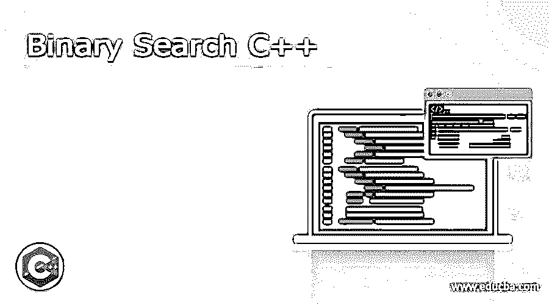

# 二分搜索法 C++

> 原文：<https://www.educba.com/binary-search-c-plus-plus/>




## 二分搜索法 C++简介

在任何编程语言中，搜索都是一个重要的特性。二分搜索法是一种查找数组中元素的方法，通过对数组进行排序，然后将数组分成两半，直到找到该数字。这是一种排序算法。如果被搜索的项目小于中间的项目，则搜索区间的上半部分，否则考虑下半部分。这一直进行到找到该号码为止。本文将通过适当的例子详细解释 c++中的二分搜索法。

**语法:**

<small>网页开发、编程语言、软件测试&其他</small>

```
binary_search(startadd, endadd, numbertofind)
```

**参数:**

*   **startadd:** 数组中第一个元素的地址
*   endadd: 数组中最后一个元素的地址
*   **numbertofind:** 要搜索的数字

**退货:**

如果找到该元素，则返回 true，否则返回 false。

**步骤:**

*   在搜索开始之前，应该对数组进行排序。
*   数组的元素应该被分成两半
*   取中间元素。如果它等于被搜索的数目，则搜索结束。
*   如果元素小于中间值，则考虑上半部分(左半部分)。
*   如果元素大于中间值，则考虑下半部分(右半部分)。

### C++中二分搜索法的例子

**代码:**

```
#include <iostream>
using namespace std;
int bs(int[], int, int, int);
int main()
{
int ip[10] = {10, 22, 37, 55, 92, 118};
int sip, lo=-1;
cout<<"Demo of binary search in C++";
cout<<"\nEnter the element to search ";
cin>>sip;
lo = bs(ip, 0, 6, sip);
if(lo != -1)
{
cout<<"Element found in the position "<<lo;
}
else
{
cout<<"Element is not found in the array";
}
return 0;
}
int bs(int a[], int fi, int la, int sip)
{
int mid;
if(la >= fi)
{
mid = (fi + la)/2;
if(a[mid] == sip)
{
return mid+1;
}
else if(a[mid] < sip)
{
return bs(a,mid+1,la,sip);
}
else
{
return bs(a,fi,mid-1,sip);
}
}
return -1;
}
```

**输出:**


有两种方法可以实现二分搜索法。迭代和递归方法。

#### 迭代法伪代码

直到最小和最大指针相遇。

```
mlevel = (least + max)/2
if (x == arr[mlevel])
return mlevel
else if (x > arr[mlevel])
least = mlevel + 1
else
max = mlevel – 1
```

#### 递归方法

```
bfs(arr, x, least, max)
if least > max
return False
else
mid = (least + max) / 2
if x == arr[mid]
return mid
else if x > arr[mid]
return bfs(arr, x, mid + 1, max)
else
return bfs(arr, x, least, mid - 1)
```

### 二分搜索法的复杂性

以下是二分搜索法的时间复杂性。

二分搜索法最好的时间复杂度是 0(1)。平均和最坏情况的复杂度是 o(log n)。二分搜索法的空间复杂度为 0(1)。

#### 示例–迭代搜索

**代码:**

```
#include <iostream>
using namespace std;
int bfs(int tes[], int a, int b, int z)
{
while (a <= b) {
int n = a + (b - a) / 2;
if (tes[n] == z)
return n;
if (tes[n] < z)
a = n + 1;
else
b = n - 1;
}
return -1;
}
int main(void)
{
int tes[] = { 2, 3, 4, 10, 40 };
int z ;
cout<<"\nEnter the element to search ";
cin>>z;
int n = sizeof(tes) / sizeof(tes[0]);
int besuat = bfs(tes, 0, n - 1, z);
(besuat == -1) ? cout << "Input is not part of array"
: cout << "Input is present at the position " << besuat;
return 0;
}
```

**输出:**


### 二分搜索法的优势

*   不是搜索整个 l0，而是在第一步中删除搜索列表的一半。
*   很容易识别正在搜索的元素是在列表中当前元素的位置之前还是之后。
*   这可以很容易地用来减少搜索和提高速度。
*   与线性搜索相比，它在搜索大型列表中的数据时效率更高。
*   可以在每一步中识别哪个子树包含所需的元素。
*   它比数组和链表更高效。
*   与其他数据结构(如链表或数组)相比，删除和插入发生得很快。

### 二分搜索法的缺点

*   因为递归方法用于搜索，所以需要更多的堆栈空间，这是一个主要的缺点
*   这种技术更容易出错，并且在出错的情况下很难调试
*   这提供了较差的内存缓存。
*   由于递归调用，这非常耗时。

### 二分搜索法的真实例子

*   二分搜索法的主要例子是我们使用字典的方式。为了找到一个单词，我们随机检查一个单词，并基于该单词移动。
*   类似地，要找到容纳员工的办公室所需的最小和最大尺寸，我们可以很容易地通过将可用列表减半来进行二分搜索法，从而得到尺寸。
*   当学生对自己的身高不是特别清楚时，根据身高选择学生。
*   当书被按顺序排列时在图书馆检查书。
*   随意打开一本书的页码。
*   访问大学数据库中的学生信息。这非常有帮助，因为通常信息被分类和存储，并且由于在第一步会有大量的学生信息，数据集本身被减半。

### 结论

于是，文章详细地报道了关于二分搜索法的详细情况。它解释了语法、参数、步骤以及适当的插图。这篇文章详细解释了实现二分搜索法的两种方法，并用伪代码展示了它们。它还解释了真实世界的场景，并用适当的例子进行了解释。通过练习示例程序可以更详细地理解它。

### 推荐文章

这是一个二分搜索法 C++的指南。这里我们讨论介绍，语法，参数，代码实现的例子。您也可以看看以下文章，了解更多信息–

1.  [C++ getline()](https://www.educba.com/c-plus-plus-getline/)
2.  [C++表达式](https://www.educba.com/c-plus-plus-expression/)
3.  [C++对](https://www.educba.com/c-plus-plus-pair/)
4.  [C++本](https://www.educba.com/c-plus-plus-this/)


