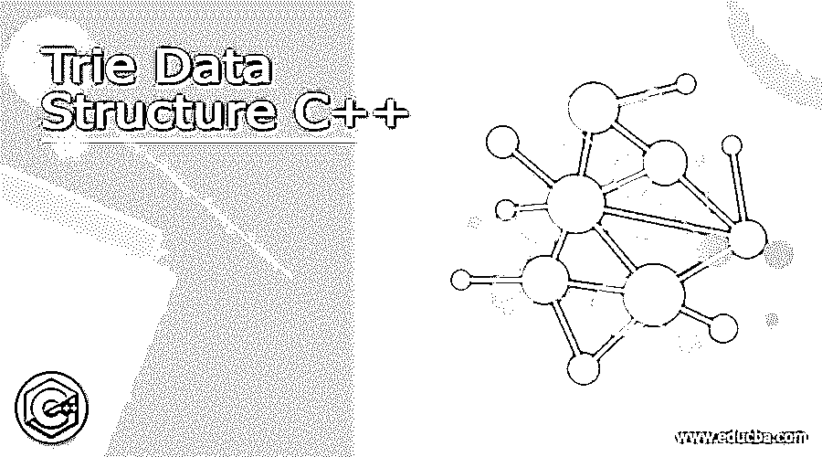
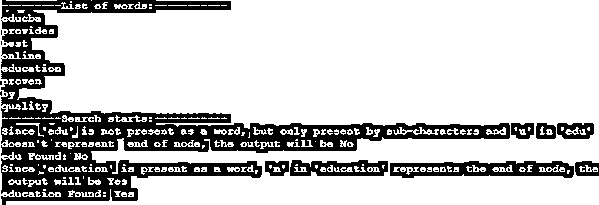

# 数据结构 C++

> 原文：<https://www.educba.com/trie-data-structure-c-plus-plus/>




## 数据结构 C++的定义

C++中的 Trie 数据结构被定义为一种数据结构的基于树的实现，这种数据结构能够从大型字符串数据集的池中有效地检索关键字。与二叉查找树的情况相比，基于 trie 的数据结构实现中的搜索复杂度可以缩小到最佳长度，即关键字长度，在该情况下，即使是平衡良好的二叉树也具有与 M * log (N)成比例的时间复杂度，其中 M 是最大字符串长度，N 表示二叉查找树中关键字的数量。显然，效率是以牺牲存储需求为代价的。在这篇文章中，我们将看看 C++中 trie 数据结构的实现，并具体理解 trie 数据结构的工作原理。

### 句法

当 trie 数据结构被证明是从大到足以使搜索变得复杂的数据集池中检索关键字的有效算法时，拥有 trie 数据结构的想法开始流行起来。trie 数据结构中的搜索操作可以被管理为具有与“密钥长度”一样最优的搜索复杂度。在本节中，我们将从语法的角度来看 C++中 trie 实现的语法，并从语法的角度来理解先决条件，这样，在拥有 C++中 trie 数据结构实现的实践经验并理解 trie 的工作原理的同时，了解语法将有助于通过代码接触来绘制更大的图像！

<small>网页开发、编程语言、软件测试&其他</small>

**创建结构:**

```
struct name_of_structure{
member_number 1;
.
.
.
member_number N;
};
```

**在 C++中声明函数:**

```
<return type> <function name>(<parameters separated by comma and precedes with the data type)
{
//Write the code here!
}
```

在返回类型为 void 的情况下，不需要 return 语句，但是如果它不是 void，我们就需要提到函数必须返回的变量。

**对于 C++中的循环:**

```
for (int i = <start index>; i < <max value it can attain>; i++)
{
//Perform the steps which needs to run within for loop.
}
```

**在 C++中声明指针:**

```
<data type of pointer> *<pointer variable’s name>;
```

### C++中的数据结构是如何工作的？

到目前为止，我们确实了解到 trie 数据结构支持高效的搜索算法，并且由于词典编纂解释，因此主要用于存储单词的字符或字母。该结构是这样的，一旦算法沿着树结构的分支路径向下遍历，该算法可以容易地检索单词或字符串。现在，进入主要部分，这就是数据结构的工作原理。

trie 由一个空的根节点组成，它包含树中其他节点的引用。这些引用是它的子对象的引用。现在，在第一次插入单词时，世界上的每个字符将相应地表示单词中按时间顺序排列的字母作为分支，最后一个字母作为结束节点。现在，当下一个单词出现时，它试图找到与分支中已经存在的单词的词典相似性，并在分支中向下钻，直到单词序列相同的点，然后在开始区分时按字母进行拆分。例如，假设第一个单词是“educba ”,下一个想要输入的单词是“educba ”,那么在树中向下钻取将是相同的，直到 edu，然后一个分支具有剩余的“cba ”,另一个具有“阳离子”,并且条件是最后一个字符将具有表示它是单词结尾的标志。


现在，为了在树中找到一个单词，搜索单词中的每个字符都被传递，如果在单词的时间遍历中找到了该单词，并且最后一个字符提到它自己是一个等于单词结尾的标志，我们返回已经找到该单词，否则返回没有找到该单词。例如，如果我们在数组中有 2 个单词“educba”和“educba ”,我们想找到 3 个单词，即“trie”、“edu”和“educba”。对于第一个，我们从字母“t”开始，并看到没有节点将“t”作为树的第一个节点，因此返回没有找到单词。现在，对于“edu ”,我们开始遍历树，到达单词“u ”,看到它没有被标记为单词的结尾，因此返回没有找到单词。最后，在单词“educba”中，我们开始遍历，并在单词“a”处结束，这也表示单词 flag 的结束，因此返回找到该单词。

我们由此看到，时间复杂度只是字符串的长度，但是随着字数的增加，空间复杂度也会增加！在下一节中，我们将着眼于数据结构的实践经验。

### 例子

让我们讨论数据结构 C++的例子。

#### 示例#1

trie 数据结构在 C++中的实现

**代码:**

```
#include <bits/stdc++.h>
using namespace std;
const int NUM_OF_ALPHABETS = 26;
// Construction the Trie node structure
struct TrieNodeDS
{
struct TrieNodeDS *childNode[NUM_OF_ALPHABETS];
// nodeEnd is true if the node represents
// the ending of a word
bool nodeEnd;
};
// New NULL Trie node is returned
struct TrieNodeDS *getNode(void)
{
struct TrieNodeDS *nodePointer = new TrieNodeDS;
nodePointer->nodeEnd = false;
for (int i = 0; i < NUM_OF_ALPHABETS; i++)
nodePointer->childNode[i] = NULL;
return nodePointer;
}
//Insert Algorithm in Trie
void insertFunc(struct TrieNodeDS *headRoot, string searchKey)
{
struct TrieNodeDS *crawlPointer = headRoot;
for (int i = 0; i < searchKey.length(); i++)
{
int head = searchKey[i] - 'a';
if (!crawlPointer->childNode[head])
crawlPointer->childNode[head] = getNode();
crawlPointer = crawlPointer->childNode[head];
}
// End of node is marked as true; to point that the search will end here
crawlPointer->nodeEnd = true;
}
//Search Algorithm in Trie
bool searchFunc(struct TrieNodeDS * headRoot, string searchKey)
{
struct TrieNodeDS *crawlPointer = headRoot;
for (int i = 0; i < searchKey.length(); i++)
{
int head = searchKey[i] - 'a';
if (!crawlPointer->childNode[head])
return false;
crawlPointer = crawlPointer->childNode[head];
}
return (crawlPointer != NULL && crawlPointer->nodeEnd);
}
// Main Function for execution
int main()
{
// we will use only lowercase characters to keep consistency
string arrayWords[] = {"educba", "provides", "best",
"online", "education", "proven",
"by", "quality" };
int n = sizeof(arrayWords)/sizeof(arrayWords[0]);
struct TrieNodeDS * headRoot = getNode();
// Construct trie
for (int i = 0; i < n; i++)
insertFunc(headRoot, arrayWords[i]);
cout<< "---------List of words:-----------\n";
for (int i = 0; i < n; i++)
cout<< arrayWords[i] << "\n";
// Search for different words
cout<< "---------Search starts:-----------\n";
cout<< "Since 'edu' is not present as a word, but only present by sub-characters and 'u' in 'edu' doesn't represent end of node, the output will be No\n";
searchFunc(headRoot, "edu")? cout << "edu Found: Yes\n" :
cout << "edu Found: No\n";
cout<< "Since 'education' is present as a word, 'n' in 'education' represents the end of node, the output will be Yes \n";
searchFunc(headRoot, "education")? cout << "education Found: Yes\n" :
cout << "education Found: No\n";
return 0;
}
```

**输出:**




### 结论

总之，在本文中，我们研究了 C++中 trie 数据结构的工作方式。尽管我们学习了单词的树遍历，我们也可以用同样的方式将数字存储为“位串”,尽管这不是存储数字的首选方式。它是留给读者尝试的练习！

### 推荐文章

这是一个数据结构 C++的指南。这里我们讨论定义，语法，数据结构在 C++中是如何工作的？代码实现示例。您也可以看看以下文章，了解更多信息–

1.  [堆数据结构](https://www.educba.com/heap-data-structure/)
2.  [数据结构中的散列](https://www.educba.com/hashing-in-data-structure/)
3.  [数据结构中的 B+树](https://www.educba.com/b-plus-tree-in-data-structure/)
4.  [数据结构中的堆栈](https://www.educba.com/stack-in-data-structure/)


