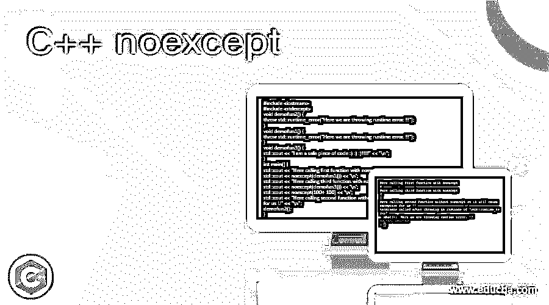
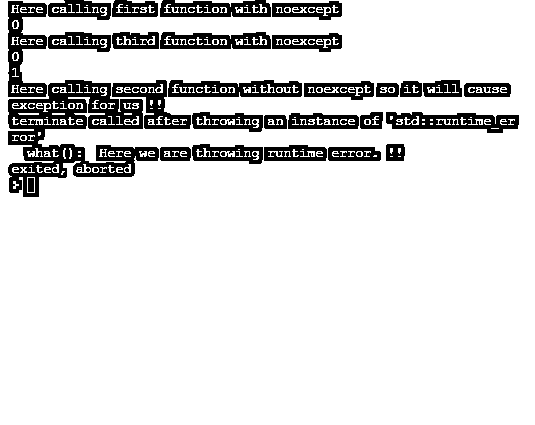

# C++ noexcept

> 原文：<https://www.educba.com/c-plus-plus-noexcept/>




## C++ noexcept 方法的定义

在每一种编程语言中，我们都需要有一种机制来处理异常，所以在 C++中我们使用 noexcept 来处理错误。在 C++中，我们可以用 noexcept 关键字包围我们的方法、lambda 和方法，这仅仅意味着这部分代码不会抛出任何异常。简而言之，我们对那些不会导致异常的代码行使用 noexcept 关键字，如果它们导致了异常，我们可以忽略它。这个 noexcept 接受一个布尔值 true 或 false，以指定函数是否应该抛出异常。在我们的程序中使用 noexcept 有几个好处，比如它可以优化代码，而且它们和其他代码一起使用也是安全的。我们将在后面的章节中讨论这一点。

**语法:**

<small>网页开发、编程语言、软件测试&其他</small>

我们可以在函数、lambda 表达式和方法中使用 noexcept 方法来指定这段代码可以被认为是安全的，并且不会在运行时导致任何异常。我们将讨论它的语法，如何在我们的程序中实现它。为了更好地理解，我们将看到一个练习语法，见下文；

```
// it may a throw exception
void mydemofun1() noexcept(false);
// it will not throw exception
void mydemofun1() noexcept(true);
// it will not throw exception
void mydemofun1() noexcept;
// it will not throw exception
void mydemofun1() throw();
```

在上面的代码行中，我们有三个不同的 synatx 来定义 noexcept 方法和 C++中的函数，我们可以使用布尔值来指定它们的行为。我们将在本教程的下一节看到一个练习示例。

### noexcept 方法在 C++中是如何工作的？

到目前为止，我们知道在 c++中我们使用 noexcept 方法来处理异常。这意味着我们可以在函数中编写代码，并使用 noexcept 方法来决定这个函数是否会抛出异常。这将简单地表明这段代码是安全的，不会抛出任何异常，我们可以将它用于另一段也不会抛出任何异常的代码。此外，noexcept 方法接受一个布尔值参数，在这里我们还可以根据需要指定该函数的值 true 或 false。在本节中，我们将看到一个例子，说明为什么我们需要使用这个方法，以及在我们的程序中使用 noexcept 方法的优点。

通过使用 noexcept 方法，我们可以保证这个函数将抛出一个异常，这将允许一些编译器优化并提高性能。还有一件事，如果发生了我们不想要的异常，这不会导致我们的程序终止。随着我们对 noexcepm 方法的深入研究，C++ 11 很晚才引入它。

如果我们谈到 noexcept 操作符，它只是负责执行或提供对函数的编译时检查。它根据计算结果返回布尔值 true 或 false。如果运算符返回 true，这意味着它不抛出任何异常，否则它将抛出。当我们使用 noexcept 方法时，它表示 c++中的一个非抛出函数，在非抛出方法内部使用时是安全的。现在我们将看到如何在 c++中将我们的函数定义为一个非抛出异常函数(见下文);

**例如:**

```
void sum() noexcept;
```

如上所述，我们通过使用 noexcept 方法来定义我们的函数，这表示这个函数是安全的，不会抛出异常，如果抛出异常，我们可以忽略它。但是我们可以在这个 noexcept 方法中传递一个参数，这个参数在这里是一个布尔值。我们有两种情况如下:

1) **true:** 如果我们将 noexcept 函数的值指定为 true，这意味着这等同于 noexcept 方法。因此它不会抛出任何异常。让我们看看它的语法，以便更好地理解。

**例如**

```
void sum() noexcept (true);
```

2) **false :** 如果我们将 noexcept 函数的值指定为 false，这意味着这不等同于 noexcept 方法。所以它会抛出一个异常。让我们看看它的语法，以便更好地理解。

**例如**

```
void sum() noexcept (false);
```

所以我们可以在编程中以这三种不同的方式使用 noexcept 方法。在 c++中，我们有一些默认情况下本质上不抛出的函数，让我们看看每个函数的名字；

1)复制构造函数

2)默认构造函数

3)析构函数

4)移动构造函数

5)复制操作符

6)移动操作员

使用 noexcept 方法时要记住的几点；

*   它用于在 C++中定义一个非抛出函数。
*   它可以接受布尔值为真或假。

### 例子

1)在本例中，我们创建了多个使用 noexcept 方法处理异常的函数。我们还创建了一个函数，这个函数不使用异常方法并抛出异常。这是为了更好地理解 c++中的函数。

#### 示例#1

**代码:**

```
#include <iostream>
#include <stdexcept>
void demofun2() {
throw std::runtime_error("Here we are throwing runtime error. !!");
}
void demofun1() {
throw std::runtime_error("Here we are throwing runtime error. !!");
}
void demofun3() {
std::cout << "I am a safe piece of code :) :) :)!!!!" << "\n";
}
int main() {
std::cout << "Here calling first function with noexcept" << "\n";
std::cout << noexcept(demofun1()) << '\n';
std::cout << "Here calling third function with noexcept" << "\n";
std::cout << noexcept(demofun3()) << '\n';
std::cout << noexcept(100+ 100) << '\n';
std::cout << "Here calling second function without noexcept so it will cause exception for us !!" << "\n";
demofun2();
}
```

**输出:**




### 结论

我们使用 noexcept 方法来处理异常。这是用来定义 c++中的非抛出函数的。通过使用 noexcept，我们可以保证我们的代码没有异常，我们也可以在非抛出方法中使用这一点。它将允许编译器优化并提高性能。

### 推荐文章

这是一个 C++ noexcept 的指南。这里我们讨论 noexcept 方法在 C++中的定义和工作原理？分别举例说明。您也可以看看以下文章，了解更多信息–

1.  [C++线程 _ 本地](https://www.educba.com/c-plus-plus-thread_local/)
2.  [C++静态](https://www.educba.com/c-plus-plus-static/)
3.  [C++静态转换](https://www.educba.com/c-plus-plus-static_cast/)
4.  [C++线程()](https://www.educba.com/c-plus-plus-thread/)


