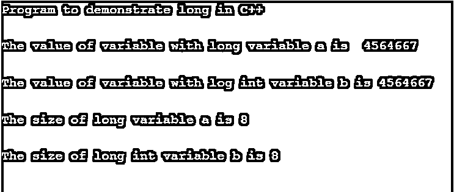

# C++ long

> 原文：<https://www.educba.com/c-plus-plus-long/>


## C++ long 简介

在 C++中，long 是常量或变量的数据类型，能够以 64 位存储方式存储变量或常量值，并且是有符号整数数据类型，用于存储值大于标准整数 32 位数据类型的变量或常量。一般来说，long 是一种基本的基本数据类型，由所有编程语言实现，用于存储大于 2，147，483，647 (231 ÷ 2)的变量或常量值，甚至是有限数量的 32 位值，几乎所有属于数字整数类型的系统都支持该类型。

### C++中长数据类型的处理

在本文中，我们将讨论 C++中的长数据类型。long 数据类型是一种基本的数字有符号和无符号整数类型，用于指定程序中使用的变量或常数的存储大小和位置，只要单个 64 位有符号(数字可以是正数或负数)整数类型或无符号(仅正数)长整型可以存储 263，其中一位用于符号。这种 long 类型用于存储相当于 long int 类型的大值。这些 long 类型变量可以和 double 变量一起使用，也可以作为 long int 使用。在 C++中，还有另一种数据类型，它可以帮助我们存储大于 long 的数字，这种变量可以存储在 long long 数据类型中，这种数据类型使用 long 数据类型创建了两次，但这种 long long 类型修饰符只能用于 int 数据类型。在 C++中，为这些数据类型提供了特定的文字，例如，对于 long 类型，我们使用“L”或“L”作为这些字母的后缀来标识 long 文字，对于 long long int，我们用“LL”作为后缀，用于表示有符号的文字，如果我们想用“UL”和无符号 long long int 来表示无符号的 long，我们必须用“ULL”作为后缀。

<small>网页开发、编程语言、软件测试&其他</small>

### C++ long 示例

现在在下一节，让我们看看如何在程序中声明长变量。

#### 示例#1

**代码:**

```
#include<iostream>
using namespace std;
int main()
{
long a = 4564667;
long int b = 4564667;
cout <<"Program to demonstrate long in C++" <<"\n"<<endl;
cout <<"The value of variable with long variable a is  "<< a <<"\n"<< endl;
cout <<"The value of variable with log int variable b is "<< b << "\n"<<endl;
cout <<"The size of long variable a is " << sizeof(a) <<"\n" << endl;
cout <<"The size of long int variable b is "<< sizeof(b) <<"\n" <<endl;
return 0;
}
```

**输出:**




在上面的程序中，我们可以看到我们创建了一个 long 类型的变量“a”和另一个 long int 类型的变量“b ”,这两个变量具有相同的值，所以我们可以说 long long 和 long int 类型是相同的，我们还可以看到我们声明了变量的大小，这可以使用 size of()函数来完成。所以我们可以说 long 和 long int 的大小都是 8。

#### 实施例 2

现在我们将在下面的程序中看到 long 和 long 类型的示例:

**代码:**

```
#include <iostream>
using namespace std;
int main ()
{
long p, q;
long long res;
p = 5456943859;
q = 254689;
res = p * q;
cout<<"Program to demonstrate long long type in C++" <<"\n"<<endl;
cout<<"The long type varaibles p " << p << " and q " <<q << "is \n"<<endl;
cout <<"The product of two long variables p*q = "<< res <<endl;;
cout<< sizeof(res)<<endl;
return 0;
}
```

**输出:**


在上面的程序中，我们可以看到我们声明了两个 long 变量 p 和 q，我们试图找到这两个变量的乘积，这将是一个非常大的值，所以我们声明了变量“res ”,它将是 long long 类型，可以存储比 long 类型大的值。因此，在上面的屏幕截图中，我们可以看到输出，我们还可以看到一个大小为 long long 的变量“res ”,它打印 8，产品值为 1389823574504851。

#### 实施例 3

现在，我们将看到一个将文字用于长无符号和有符号数据类型的示例。

**代码:**

```
#include <iostream>
using namespace std;
int main ()
{
long p = -5456943859L;
long z = 8647627343UL;
long long r = 1389823574504851LL;
cout<<"Program to demonstrate long long and long type literals in C++" <<"\n"<<endl;
cout<<"The long type varaibles p literal is  " << p <<"\n"<<endl;
cout<<"The long type variable z literal of unsigned long variable is "<<z <<"\n"<<endl;
cout<<"The long long type of variable r literal is = "<< r <<endl;
return 0;
}
```

**输出:**


在上面的程序中，我们可以看到我们声明了一个带值的长型变量“p ”,并为其添加了后缀“L ”,我们还声明了长型变量“r ”,并为其添加了后缀“LL”。在上面的程序中，我们已经看到 p 值的后缀是 L“5456943859 L ”, r 变量是 long long 类型，值为 1389823574504851LL，我们可以看到 p 和 r 是带符号的 long 变量。因此，变量“z”也是一个长类型，但它是无符号的，所以它只能有一个正数，可以在上面的截图中看到。

### 结论

在本文中，我们可以得出结论，C++中的 long 类型变量是一种用于存储大到 64 位值的数据类型，在 C++中，它还提供了一种数据类型 long long，这是另一种用于存储大于 long 类型的值的数据类型，这意味着它可以保存两倍于 long 类型的值。在本文中，我们看到了一个如何声明 long 类型变量的简单示例，它相当于 C++中的 long int。在本文中，我们还看到了 long long 类型变量以及文字的示例，这些文字通过在它后面加上值来表示有符号或无符号的 long 类型变量。

### 推荐文章

这是一本 C++长指南。在这里，我们还讨论了 c++中 long 数据类型的引入和使用，以及不同的例子和代码实现。您也可以看看以下文章，了解更多信息–

1.  [C++ Max](https://www.educba.com/c-plus-plus-max/)
2.  [C++保留()](https://www.educba.com/c-plus-plus-reserve/)
3.  [C++静态转换](https://www.educba.com/c-plus-plus-static_cast/)
4.  [C++ sort()](https://www.educba.com/c-plus-plus-sort/)


