# C++中的模式

> 原文：<https://www.educba.com/patterns-in-c-plus-plus/>

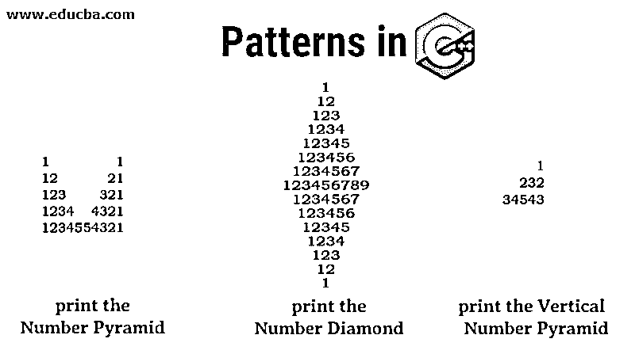


## C++模式介绍

在学习任何编程语言时，学生必须练习打印各种模式，以实用和更有趣的方式理解和实现逻辑思维以及语言的流程控制知识。C++中的模式是用于基本理解任何语言的基本程序。使用两个或三个流量控制回路来实现这些程序。通常，在模式程序中至少使用两个循环，即一个循环创建行，另一个循环创建列。第一个循环是外部循环，表示行数，第二个循环是内部循环，表示列数。C++语言中模式的基本结构如下所示:

**表头:**#包含< iostream >

<small>网页开发、编程语言、软件测试&其他</small>

**Main():** int main()

{

**变量声明:**int z = 10；

**体**:cout<T3】z；

**返回:**返回 0；

}

### C++中模式的例子

C ++语言中有各种各样的模式，如星形模式、[数字模式](https://www.educba.com/number-patterns-in-java/)和字符模式。在这一节中，我们将讨论如何借助例子创建不同的模式。

#### 1.数字模式

在这一节中，我们将看到如何用 C 语言打印不同的数字模式

##### **示例# 1–打印数字金字塔**

在下面的程序中，用户可以根据自己的需要提供打印数字金字塔图案的行数，结果将显示在屏幕上:

**代码:**

```
#include <iostream>
using namespace std;
int main()
{
int n, x,  y, k;
cout << "Enter the number of rows to show number pattern: ";
cin >> n;
for(x = 1; x <= n; x++)
{
for(y = 1; y <= n; y++)
{
if(y <= x)
cout << y;
else
cout << " ";
}
for(y = n; y >= 1; y--)
{
if(y <= x)
cout << y;
else
cout << " ";
}
cout << "\n";
}
return 0;
}
```

**输出:**


##### 示例 2–打印菱形数字

在下面的程序中，用户可以根据自己的需要提供打印菱形图案的行数，结果将显示在屏幕上:

**代码:**

```
#include <iostream>
using namespace std;
int main()
{
int n, x, y, k;
cout << "Enter the number of rows to show number paatern: ";
cin >> n;
for(x = 1; x <= n; x++)
{
for(y = x; y <n; y++)
{
cout << " ";
}
for(k = 1; k < (x*2); k++)
{
cout << k;
}
cout << "\n";
}
for(x = 4; x >= 1; x--)
{
for(y = n; y >  x; y--)
{
cout << " ";
}
for(k = 1; k < (x*2); k++)
{
cout << k;
}
cout << "\n";
}
return 0;
}
```

**输出:**

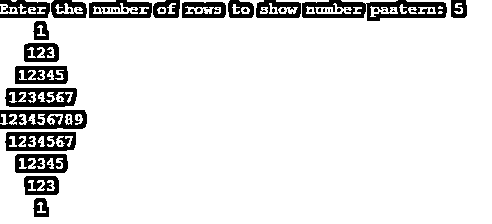


##### 示例 3–打印数字金字塔图案

在下面的 C++程序中，用户可以根据自己的需要提供打印数字金字塔图案的行数，结果将显示在屏幕上:

**代码:**

```
#include <iostream>
using namespace std;
int main()
{
int x, s, n,  y = 0, cntr = 0, cntr1 = 0;
cout << "Enter the number of rows to show number pattern: ";
cin >> n;
for(x = 1; x <= n; ++x)
{
for(s = 1; s <= n-x; ++s)
{
cout << "  ";
++cntr;
}
while(y != 2 * x - 1)
{
if (cntr <= n - 1)
{
cout << x + y;
++cntr;
}
else
{
++cntr1;
cout <<  (x + y - 2 * cntr1);
}
++y;
}
cntr1 = cntr = y = 0;
cout << "\n";
}
return 0;
}
```

**输出:**


##### 示例 4–打印垂直数字金字塔

在下面的 C++程序中，用户可以根据自己的需要提供打印垂直数字金字塔图案的行数，结果将显示在屏幕上:

**代码:**

```
#include <iostream>
using namespace std;
int main()
{
int  n, x, y;
cout << "Enter the number of rows to show number pattern: ";
cin >> n;
for(int x = 1; x < n; x++)
{
for(int y = 1; y <= x; y++)
cout << y;
cout << "\n";
}
for(int x = n; x >= 0; x--)
{
for(int y = 1; y <= x; y++)
cout << y;
cout << "\n";
return 0;
}
}
```

**输出:**

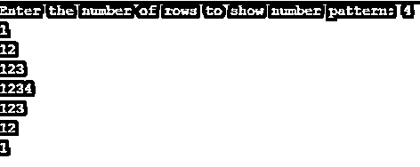


##### 示例 5–打印数字金字塔

在下面的 C++程序中，用户可以根据自己的需要提供打印数字金字塔图案的行数，结果将显示在屏幕上:

**代码:**

```
#include <iostream>
using namespace std;
int main()
{
int  n, x, y;
cout << "Enter the number of rows to show number patterns: ";
cin >> n;
for (int x = n; x >= 0; x--)
{
for (int y = 1; y <= x; y++)
cout << y;
cout << "\n";
}
for(int x = 1; x <= n; x++)
{
for(int y = 1; y <= x; y++)
cout << y;
printf("\n");
}
return 0;
}
```

**输出:**

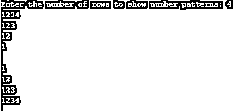


#### 2.星形图案

在这一部分，我们将看到如何打印不同的星形图案。

##### 示例 1-印刷星形钻石

在下面的程序中，用户可以根据自己的需要提供打印星形钻石图案的行数，结果将显示在屏幕上:

**代码:**

```
#include <iostream>
using namespace std;
int main()
{
int n, s, x, y;
cout << "Enter number of rows to show star pattern: ";
cin >> n;
for(x = 0; x <= n; x++)
{
for(s = n; s > x; s--)
cout << " ";
for(y = 0; y < x; y++)
cout << "* ";
cout << "\n";
}
for(x = 1; x < n; x++)
{
for(s = 0; s < x; s++)
cout << " ";
for(y = n; y > x;  y--)
cout << "* ";
cout << "\n";
}
return 0;
}
```

**输出:**

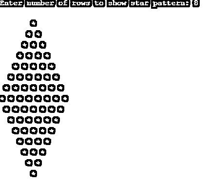


##### 示例 2–打印垂直曲线

在下面的 C++程序中，用户可以根据需要提供打印竖曲线图案的行数，结果将显示在屏幕上:

**代码:**

```
#include <iostream>
using namespace std;
int main()
{
int n, x , y;
cout << "Enter number of rows to show star pattern: ";
cin >> n;
for(x = 1; x <= n; x++)
{
for(y = 1; y <= x;  y++)
{
cout << "*";
}
cout << "\n";
}
for(x = n; x >= 1; x--)
{
for(y = 1; y <= x; y++)
{
cout << "*";
}
cout << "\n";
}
return 0;
}
```

**输出:**

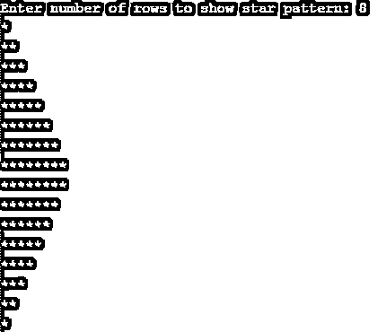


##### 示例 3–打印空心菱形数字

在下面的程序中，用户可以根据需要提供打印空心菱形图案的行数，结果将显示在屏幕上:

**代码:**

```
#include <iostream>
using namespace std;
int main()
{
cout << "Enter the number of rows to show the star pattern:  ";
int n, x,  y,  s = 1, k;
cin >> n;
for(x = 0; x <= n; x++)
{
for(y = n; y > x; y--)
{
cout << " ";
}
cout << "*";
if (x > 0)
{
for(k = 1; k <= s;  k++)
{
cout << " ";
}
s += 2;
cout << "*";
}
cout << "\n";
}
s -= 4;
for(x = 0; x <= n -1; x++)
{
for(y = 0; y <= x; y++)
{
cout << " ";
}
cout << "*";
for(k = 1; k <= s; k++)
{
cout << " ";
}
s -= 2;
if(x != n -1)
{
cout << "*";
}
//ending line after each row
cout << "\n";
}
return 0;
}
```

**输出:**

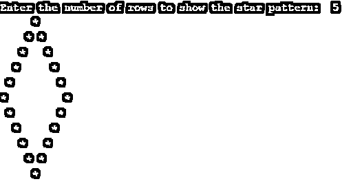


##### 示例 4–打印空心星形三角形

在下面的程序中，用户可以根据自己的需要提供打印空心星形三角形图案的行数，结果将显示在屏幕上:

**代码:**

```
#include <iostream>
using namespace std;
int main()
{
int n, x, y, s;
cout << "Enter number of rows to show the star pattern: ";
cin >> n;
for(x = 1; x <= n; x++)
{
//for loop to put space in pyramid
for (s = x; s < n; s++)
cout << " ";
//for loop to print star
for(y = 1; y <= (2 * n - 1); y++)
{
if(x == n || y == 1 || y == 2 * x - 1)
cout << "*";
else
cout << " ";
}
cout << "\n";
}
return 0;
}
```

**输出:**


##### 示例 5–打印星形三角形

在下面的程序中，用户可以根据自己的需要提供打印星形三角形图案的行数，结果将显示在屏幕上:

**代码:**

```
#include <iostream>
using namespace std;
int main()
{
int n, s, x, y;
cout << "Enter number of rows to show star pattern: ";
cin >> n;
for(x = 1; x <= n; x++)
{
for(s = x; s < n; s++)
cout << " ";
//for loop for displaying star
for(y = 1; y <= x; y++)
cout << "* ";
cout << "\n";
}
return 0;
}
```

**输出:**

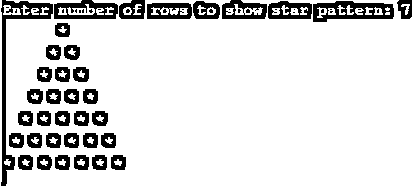


#### 3.字符模式

在这一节中，我们将看到如何打印不同的字符图案。

##### 示例 1–打印连续字符的三角形

在下面的程序中，用户可以根据需要提供打印连续字符的三角形的行数，结果将显示在屏幕上:

**代码:**

```
#include <iostream>
using namespace std;
int main()
{
int n, x, y;
cout << "Enter number of rows to show character pattern: ";
cin >> n;
for(x = 1; x <= n; x++)
{
for(y = 1; y <= x; y++)
{
cout << char('A' + y -1);
}
cout << "\n";
}
return 0;
}
```

**输出:**

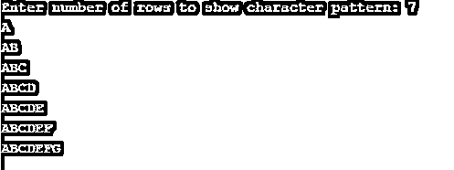


##### 示例 2–打印字符的三角形

在下面的程序中，用户可以根据需要提供打印字符三角形图案的行数，结果将显示在屏幕上:

**代码:**

```
#include <iostream>
using namespace std;
int main()
{
int n, x, y;
cout << "Enter number of rows to show character pattern: ";
cin >> n;
for(x = 1; x <= n; x++)
{
for(y = 1; y <= x; y++)
{
cout << char('A'-1 + x);
}
printf("\n");
}
return 0;
}
```

**输出:**

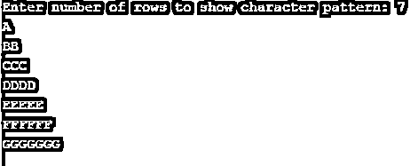


##### 例 3–打印字符的倒三角形

在下面的程序中，用户可以根据需要提供打印字符倒三角图案的行数，结果将显示在屏幕上:

**代码:**

```
#include <iostream>
using namespace std;
int main()
{
int n, x, y;
cout << "Enter number of rows to show character pattern: ";
cin >> n;
for(x= 1; x <= n; x++)
{
for(y = n; y >= x; y--)
{
cout << char('A'-1 + x);
}
cout << "\n";
}
return 0;
}
```

**输出:**

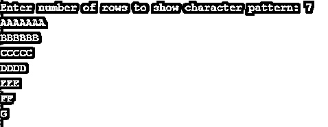


### 结论

在这篇文章中，我们看到了不同的数字，星和字符的模式。我希望这篇文章对你有所帮助。

### 推荐文章

这是 C++模式的指南。这里我们讨论 C++中的模式介绍和它的不同模式，以及例子和语法。您也可以浏览我们推荐的其他文章，了解更多信息——

1.  [Java 中的星型模式](https://www.educba.com/star-patterns-in-java/)
2.  [Python 中的星形模式](https://www.educba.com/star-patterns-in-python/)
3.  [JavaScript 中的模式](https://www.educba.com/patterns-in-javascript/)
4.  [c#中的模式](https://www.educba.com/patterns-in-c-sharp/)


