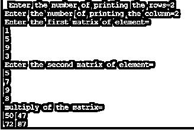
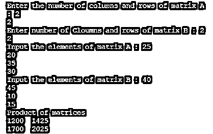

# C++中的矩阵乘法

> 原文：<https://www.educba.com/matrix-multiplication-in-c-plus-plus/>


## C++中矩阵乘法的介绍

C++中的矩阵乘法是一种二元运算，可以对两个矩阵进行加减乘除。行号、列号、第一矩阵元素和第二矩阵元素的输入来自消费者，以乘以矩阵。然后将消费者输入的矩阵相乘。

### 矩阵乘法的例子

以下是一些例子:

<small>网页开发、编程语言、软件测试&其他</small>

#### 示例#1

**代码:**

```
#include <iostream>
using namespace std;
int main()
{
int a[10][10],b[10][10],mul[10][10],m,c,p,j,k;
cout<<" Enter the number of printing the rows=";
cin>>m;
cout<<"Enter the number of printing the column=";
cin>>c;
cout<<"Enter the first matrix of element=\n";
for(p=0;p<m;p++)
{
for(j=0;j<c;j++)
{
cin>>a[p][j];
}
}
cout<<"Enter the second matrix of element=\n";
for(p=0;p<m;p++)
{
for(j=0;j<c;j++)
{
cin>>b[p][j];
}
}
cout<<"multiply of the matrix=\n";
for(p=0;p<m;p++)
{
for(j=0;j<c;j++)
{
mul[p][j]=0;
for(k=0;k<c;k++)
{
mul[p][j]+=a[p][k]*b[k][j];
}
}
}
//for printing result
for(p=0;p<m;p++)
{
for(j=0;j<c;j++)
{
cout<<mul[p][j]<<" ";
}
cout<<"\n";
}
return 0;
}
```

**输出:**




#### 实施例 2

在这个例子中，你将看到两个矩形矩阵的 C++程序

**代码:**

```
#include<bits/stdc++.h>
using namespace std;
// Multiplies 2 matrices first is matricsA[][] and second is matricsB[][] and prints result.
// (a1) x (a2) and (b1) x (b2) are
// dimensions of given matrices.
void multiply(int a1, int a2, int matA[][2],
int b1, int b2, int matB[][2])
{
int x, i, j;
int res[a1][b2];
for (i = 0; i < a1; i++)
{
for (j = 0; j < b2; j++)
{
res[i][j] = 0;
for (x = 0; x < a2; x++)
{
*(*(res + i) + j) += *(*(matA + i) + x) *
*(*(matB + x) + j);
}
}
}
for (i = 0; i < a1; i++)
{
for (j = 0; j < b2; j++)
{
cout << *(*(res + i) + j) << " ";
}
cout << "\n";
}
}
// Driver code
int main()
{
int matA[][2] = { { 4, 4 }, { 3, 4 } };
int matB[][2] = { { 2, 2 }, { 2, 3 } };
int a1 = 2, a2 = 2, b1 = 2, b2 = 2;
multiply(a1, a2, matA, b1, b2, matB);
return 0;
}
```

**输出:**


#### 实施例 3

在本例中，您将看到 C++程序两个方阵

**代码:**

```
#include <iostream>
using namespace std;
#define N 4
// This function will multiplies A1[][] and B2[][], and it will stores the result in this res[][]
void multiply(int A1[][N],
int B2[][N],
int res[][N])
{
int a, z, k;
for (a = 0; a < N; a++)
{
for (z = 0; z < N; z++)
{
res[a][z] = 0;
for (k = 0; k < N; k++)
res[a][z] += A1[a][k] *
B2[k][z];
}
}
}
// Driver Code
int main()
{
int a, z;
int res[N][N]; // this is use to store result
int A1[N][N] = {{5, 5, 5, 5},
{6, 6, 6, 6},
{7, 7, 7, 7},
{8, 8, 8, 8}};
int B2[N][N] = {{5, 5, 5, 5},
{6, 6, 6, 6},
{7, 7, 7, 7},
{8, 8, 8, 8}};
multiply(A1, B2, res);
cout << "Resulted matrix are as follow \n";
for (a = 0; a < N; a++)
{
for (z = 0; z < N; z++)
cout << res[a][z] << " ";
cout << "\n";
}
return 0;
}
```

**输出:**


#### 实施例 4

**代码:**

```
#include<iostream>
using namespace std;
int main ()
{
int F1, c1, F2, c2, i, j, k;
int A[5][5], B[5][5], C[5][5];
cout << "Enter the number of columns and rows of matrix A : ";
cin >> F1 >> c1;
cout << "Enter number of Cloumns and rows of matrix B : ";
cin >> F2 >> c2;
if (c1 != F2)
{
cout << "Matrices can't be multiplied..";
exit(0);
}
cout << "Input the elements of matrix A : ";
for (i = 0; i < F1; i++)
for (j = 0; j < c1; j++)
cin >> A[i][j];
cout << "Input the elements of matrix B : ";
for (i = 0; i < F2; i++)
for (j = 0; j < c2; j++)
cin >> B[i][j];
for (i = 0; i < F1; i++)
{
for (j = 0; j < c2; j++)
{
C[i][j] = 0;
for (k = 0; k < F2; k++)
{
C[i][j] += A[i][k] * B[k][j];
}
}
}
cout << "Product of matrices\n";
for (i = 0; i < F1; i++)
{
for (j = 0; j < c2; j++)
cout << C[i][j] << "  ";
cout << "\n";
}
return 0;
}
```

**输出:**




**程序说明**

要求用户输入矩阵 A 和矩阵 B 的行和列。如果矩阵 A 的列数不适合矩阵 B 的列数，矩阵就不能相乘。类似地，循环的矩阵被组合，并且如果它们相等，结果被放置在矩阵 C 中。

### 推荐文章

这是一个 C++中矩阵乘法的指南。这里我们讨论矩阵乘法的介绍和例子，以及代码和输出。您也可以浏览我们推荐的其他文章，了解更多信息——

1.  [NumPy 中的矩阵乘法](https://www.educba.com/matrix-multiplication-in-numpy/)
2.  [Matlab 中的矩阵乘法](https://www.educba.com/matrix-multiplication-in-matlab/)
3.  [NumPy 中的矩阵](https://www.educba.com/matrix-in-numpy/)
4.  [Matlab 中的单位矩阵](https://www.educba.com/identity-matrix-in-matlab/)


