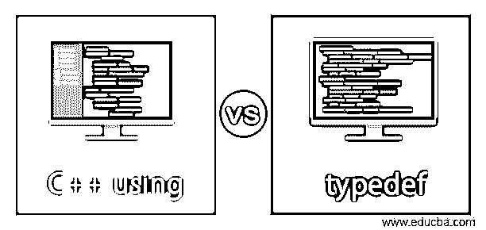

# C++使用 vs typedef

> 原文：<https://www.educba.com/c-plus-plus-using-vs-typedef/>




## 使用 vs typedef 在 C++上定义

在 C++中，“using”和“typedef”执行声明类型别名的相同任务。两者没有太大的区别。在 C++中使用“被认为是定义类型同义词。这种方法也称为别名声明。定义这些别名声明的工作方式类似于在 C++中用“using”语句定义变量。它有助于提高代码的整体可读性。与“typedef”语句不同，C++中的“using”能够创建别名模板，从而为基础类型提供能力。通过在 C++代码中使用“using ”,人们可以在相同的抽象级别上使用常见的类型别名，并且可以在将来指定模板参数。

C++中的“Typedef”执行定义别名的类似任务。它基本上引入了一个名称，该名称使用该范围内的类型声明成为给定类型的同义词。“typedef”的一个重要特性是，它允许程序员封装可能随时间变化的实现细节。在 C++中，typedef 提供了所有类似“using”语句的功能，除了它不允许使用对编码非常有用的模板。与 union、enum、class 等不同,“typedef”声明没有引入新类型。相反，它们给已经存在的类型赋予新的名称。这些新名称与其他标识符占用相同的名称空间。

<small>网页开发、编程语言、软件测试&其他</small>

### C++与 typedef 的直接比较(信息图表)

下面是 C++使用 vs typedef 的 8 大区别。


### C++使用 vs typedef 比较表

下面给出的比较表描述了 C++中“using”和“typedef”之间的点对点差异:

| **使用** | **typedef** |
| C++中的“using ”(也称为别名声明)可以被模板化，这可用于创建通用模板。这些模板可以根据将来的具体要求进行修改。 | 与“using”不同，C++中的“typedef”不能被模板化 |
| 有了 C++中的“using ”,将来修改代码变得更加容易，而不会妨碍更高层次的代码 | 随着 C++中“typedef”的使用，在后期阶段修改代码变得相对困难。 |
| 创建一个通用类型别名很容易，如下所示:

```
template<typename T>
using Details = std::unordered_map<Stud_id, std::vector<T>>;
```

 | 使用“typedef”on 创建泛型别名需要将其包装在一个结构中，类似于下面示例中给出的结构:

```
template<typename T>
struct Details {
typedef std::map<Stud_id, std::vector<T>> type;
};
Details<Student_Detail>::type Student_Details;
```

 |
| C++中的“Using”语句不是 init 语句，因此不用于允许初始化语句的地方。 | 在 C++中，“typedef”是一个 init 语句，所以它用在允许初始化语句的地方。 |
| 在 C++中使用“using”语句的一个优点是，与 typedef 相比，声明函数指针是非常清楚的。 | 使用“typedef”声明函数指针不像“using”那样清晰。 |
| 在 C++中借助“using”语句创建别名模板不需要任何类型名。 | “typedef”要求 typename 在其声明前面作为包装指令。 |
| 使用“using”语句创建别名有助于开发干净、可理解和可读的代码。 | 虽然使用“typedef”创建别名并不困难，但从程序员的角度来看，它并不那么清晰易读。 |
| 使用' using '语句声明的语法:

```
template<[template-parameters (T1, T2…)]> using [alias] = [original-type];
```

 | 用“typedef”语句声明的语法:

```
typedef struct struct_type short_type_t;
```

 |

### 使用 C++和 typedef 的主要区别

C++中的“using”语句和“typedef”语句之间的一些主要区别如下:

*   在 C++中，using 语句和 typedef 语句的主要区别之一是,“using”可以执行“typedef”可以执行的所有任务，而 typedef 不能执行的任务也可以使用模板。
*   从程序员的角度来看，使用“using”语句非常简单明了，尤其是在使用函数指针及其别名定义时。事实上,“using”语句为代码提供了更好的可读性，如下例所示:

```
typedef void(*func_pointer)(int);
vs
using func_pointer = void(*)(int);
```

*   由“using”和“typedef”语句完成的别名声明可以在代码中的任何位置完成，如在类、命名空间和块内，而仅由“using”语句完成的模板声明不能在类内声明，为此需要遵循一些严格的规则。
*   对于泛型别名，在“typedef”的情况下，声明需要包装在结构中，不像“using”语句那样简单明了，不需要包装。让我们借助下面给出的例子来理解这一点:

```
template<typename T>
using Accounts = std::unordered_map<Student_ID, std::vector<T>>;
Vs
template<typename T>
struct Accounts {
typedef std::map<Student_ID, std::vector<T>> type;
};
//Using the above like:
Accounts<StudentAccount>::type StudentDetailsAccounts;
```

*   虽然“typedef”允许声明所有类型，如函数指针、数组指针等，但与 C++中的“using”语句相比，使用它是一个有点冗长和复杂的过程，因为后者只使用了一行代码。也可以在定义结构之前，向指针或结构声明 typedef 名称，直到定义和声明具有相同的可见性。
*   在 typedef 声明的情况下，可以进行重新声明。一个人可以在两个或更多不同的文件中使用 typedef 声明同一个变量，并且在两者引用同一个类型之前不会抛出错误。
*   在 C++中，“typedef”允许程序员一次声明多个类型，这与“using”语句不同。

**例如:**

```
typedef int X, *ptr, (*Func)();
```

### 结论

上面的描述清楚地解释了什么是 C++中的“using”和“typedef”语句，以及这两者之间的主要区别。虽然两者都用于创建类型别名，但“typedef”的主要限制是它不能与模板一起工作。在处理非模板时,“using”和“typedef”在机械上的表现是一样的。所以在那种情况下使用什么是程序员的个人选择。

### 推荐文章

这是使用 C++和 typedef 的主要区别的指南。在这里，我们还将讨论信息图和比较表的主要区别。您也可以看看以下文章，了解更多信息–

1.  [C++与 Visual C++](https://www.educba.com/c-plus-plus-vs-visual-c-plus-plus/)
2.  [C++ vs Objective C](https://www.educba.com/c-plus-plus-vs-objective-c/)
3.  [C++ vs C#](https://www.educba.com/c-plus-plus-vs-c-sharp/)
4.  [C++ vs Java](https://www.educba.com/c-plus-plus-vs-java/)


