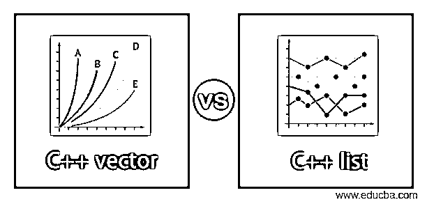
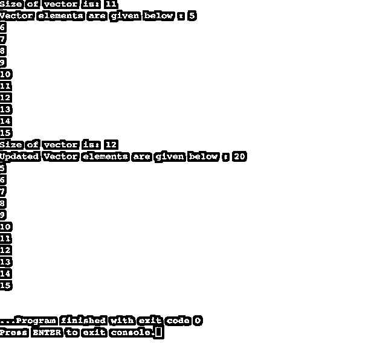
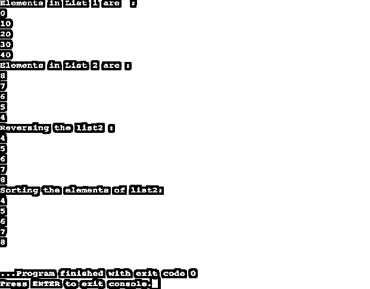

# C++ vector vs list

> 原文：<https://www.educba.com/c-plus-plus-vector-vs-list/>




## C++向量与列表的定义

C++中的 Vector 只不过是一个容器，用来存储计算机内存中的元素。它在内部实现为一个动态数组，可以在成功插入和删除元素后调整自身大小。因为它被实现为一个数组，所以元素被存储在连续的内存位置，可以使用迭代器轻松地遍历，并通过提供索引通过随机访问来访问。如果使用 Vector，默认内存是为数组预先分配的。默认情况下，在 Vector 中插入元素发生在数组的末尾。

C++中的 List 也是一个容器(数据结构),它将元素存储在不连续的内存位置。List 实现了双向链表来存储具有下一个和前一个元素的地址(由指针指出)的元素，以便于向后和向前遍历。对于元素的每次新插入，内存都是动态分配的，并通过指针与其他元素的节点相链接。所以在 List 的情况下不需要默认的内存分配。

<small>网页开发、编程语言、软件测试&其他</small>

### C++ vector 与 list 的直接比较(信息图)

下面是 C++ vector vs list 的 6 大区别。


### C++ vector 和 list 的主要区别

下面给出了 C++ Vector 和 List 之间的主要区别:

*   因为向量中的元素存储在连续的存储位置，所以它们是同步的，而列表中的元素是随机存储的，并且通过链接(指针)相互连接，所以它们是非同步的。
*   当涉及到插入和删除时，与向量相比，List 更有效，因为在任何位置的插入/删除都需要相同的时间，并遵循相同的指针交换过程，而在最后位置的向量中的插入/删除很简单(默认情况下，它在最后插入/删除元素)，但在中间或开始需要遍历整个数组，插入新元素并移动其余的元素。
*   因为向量的存储器是预先分配的，所以在插入的情况下，如果存储器变得不足，则需要分配新的连续存储器，并且元素在其中移位，而在列表中不存在存储器不足的问题，因为存储器是动态分配的。
*   Vector 最重要的优点之一是它是线程安全的，而 C++中的 List 不是线程安全的。
*   当谈到内存效率时，Vector 被认为更有效，因为它只需要存储元素的内存，而在 List 的情况下，(作为双向链表实现)保存单个元素所需的内存非常大，因为还需要指针的内存来保存前一个和后一个节点的地址。
*   从程序员的角度来看，处理指针是很棘手的，需要更高层次的编码知识(特别是对新手来说)，所以处理列表比处理普通数组操作的向量要困难得多。
*   对于少量的元素，向量比列表快得多，因为搜索和插入变得非常容易，并且向量中实现的数组可以容易地被遍历和访问。

### C++向量与列表对照表

下面给出的是 C++ vector 与 list 的对比表:

| **C++列表** | **C++矢量** |
| C++中的 List 将元素存储在不连续的内存位置。它在内部被认为是一个双向链表。 | C++中的向量将元素存储在连续的内存位置。它在内部被认为是一种动态数组。 |
| 在链表中任何位置插入和删除元素都需要花费一定的时间，因为这涉及到指针的使用和它们的交换。 | 在最后插入和删除元素需要恒定的时间，但是在其他地方(在开始或中间)插入和删除需要大量时间，因为需要遍历数组。 |
| List 没有任何固定大小或默认大小，因为它是一个双向链表，可以在插入或删除时调整大小。 | Vector 是一个动态数组，具有默认大小。 |
| 存储列表中的元素所需的内存相对较大，因为它保存了元素以及下一个和上一个节点的指针。 | 存储 Vector 中的元素所需的内存小于 List，因为它只为元素使用内存。 |
| 随机访问列表中的元素是不可能的，因为它是作为双向链表实现的。程序员需要通过遍历指针来访问元素。 | 由于 Vector 中的元素像数组一样按顺序存储，所以只需提供索引号就可以随机访问这些元素。 |
| 在 List 的情况下，即使元素被插入或删除，迭代器仍然有效。 | 当元素从迭代器中删除或插入时，迭代器变得无效。 |

### 例子

让我们讨论 C++ vector vs list 的例子。

#### 示例 1–矢量

**代码:**

```
#include <iostream>
#include <vector>
using namespace std;
int main()
{
vector<int> vec;
for (int i = 5; i <= 15; i++)
{
vec.push_back(i);
}
cout<< "Size of vector is: " << vec.size() << endl;
cout << "Vector elements are given below : ";
for (auto i = vec.begin(); i != vec.end(); i++)
cout << *i << endl;
vec.insert(vec.begin(), 20);
cout<< "Size of vector is: " << vec.size() << endl;
cout << "Updated Vector elements are given below : ";
for (auto i = vec.begin(); i != vec.end(); i++)
cout << *i << endl;
return 0;
}
```

**输出:**




#### 示例 2–列表

**代码:**

```
#include <list>
#include <iterator>
using namespace std;
//function to display the elements of list using iterator 'itr'
void display(list <int> x)
{
list <int> :: iterator itr;
for(itr = x.begin(); itr != x.end(); itr++)
cout << *itr << endl;
}
int main()
{
list <int> list1, list2;
for (int i = 0; i < 5; ++i)
{
list1.push_back(i * 10);
list2.push_front(i + 4);
}
cout << "Elements in List 1 are: "<< endl;
display(list1);
cout << "Elements in List 2 are : " << endl;
display(list2);
cout << "Reversing the list2 : "<< endl;
list2.reverse();
display(list2);
cout << "Sorting the elements of list2:"<< endl;
list2.sort();
display(list2);
return 0;
```

**输出:**




### 结论

上面的描述清楚地解释了什么是 C++中的 vector 和 List，以及两者之间的主要区别。两者都是 C++中广泛用于顺序存储元素的容器。虽然两者都执行相同的任务，在一定程度上各有利弊，但它们的实现是不同的。根据具体的需求来实现其中的任何一个，就看程序员的选择了。

### 推荐文章

这是 C++ vector 和 list 之间最大区别的指南。在这里，我们还将讨论信息图和比较表的主要区别。您也可以看看以下文章——

1.  [C++与 Visual C++](https://www.educba.com/c-plus-plus-vs-visual-c-plus-plus/)
2.  [C++ vs Objective C](https://www.educba.com/c-plus-plus-vs-objective-c/)
3.  [C++ vs C#](https://www.educba.com/c-plus-plus-vs-c-sharp/)
4.  [C++ vs 围棋](https://www.educba.com/c-plus-plus-vs-go/)


