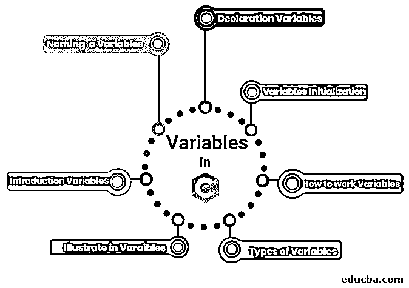

# C 语言中的变量

> 原文：<https://www.educba.com/variables-in-c/>




## C 语言中的变量介绍

变量在 C 语言中起着重要的作用。我们也可以说变量是[许多编程语言](https://www.educba.com/what-is-a-programming-language/)的主干。C 语言中的变量用于存储不同形式的数据。它就像一个存储卡，保存所有的数据，并在程序执行过程中使用。C 中有不同类型的变量；根据它们的类型，它所需要的内存或存储空间量是不同的。我们说过，C 语言中的变量是用来保存值的存储器。变量可以是不同的数据，如 int、float、char、double 等。所有代码或程序都依赖于变量，因为它描述了要执行的数据类型。
在本文中，我们将看到变量如何在 C 中发挥重要作用，如何初始化变量，如何声明等。

### C 语言中定义变量的规则

*   C #中的变量不能以数字开头；否则，变量将无效。例如(1 字符串不是有效变量)。
*   变量之间不允许有空格。例如，(string one 无效，string_one 是有效变量)。
*   关键字不允许定义为变量。例如，(For 不是有效变量，因为它在 C 语言中用作关键字)。
*   由于 C 是区分大小写的语言，大写和小写被视为不同的变量。比如(在 C 中 number 和 NUMBER 会被当作两个不同的变量)。
*   变量名可以是字符串、数字和下划线(_)等特殊字符的组合。

### 如何工作？

*   在声明变量时，它告诉编译器它保存的数据类型。
*   变量告诉编译器程序中正在使用的变量的名字。
*   由于变量指定存储，编译器不必担心变量的内存位置，直到它们被声明。

### 如何申报？

变量应该在程序之前首先声明，因为它起着重要的作用。

<small>网页开发、编程语言、软件测试&其他</small>

变量声明的语法如下。

```
data_type variable_name;
```

在哪里，

*   **数据类型:**表示其存储的数据类型。数据类型可以是 int、float、char、double、long int 等。
*   **变量名称:**表示变量的名称。它可以是除关键字以外的任何内容。

例如

1.  int a；
2.  int a，b，c；

比如 1，int 是数据类型，a 是变量名。在第二个例子中，我们声明了三个变量，a、b 和 c。

在变量被声明之后，那些变量的空间已经被分配，因为它将被程序使用。

#### 说明 C 语言中变量声明的程序

```
#include<stdio.h>
#include<conio.h>
int main()
{
int m, n;
m = 2;
n = 3;
z = m + n;
printf("Sum of two numbers is: %d \n", z);
return 0;
}
```

### 如何初始化？

在 C 中初始化变量意味着在声明变量时直接给变量赋值。初始化变量的语法如下:

**数据类型变量名称=值；**

例如

1.  int a = 10
2.  int a = 5，b = 8；

在示例 1 中，变量 a 被创建并用值 10 初始化。例如，两个变量 a 和 b 分别被分配了值 5 和 8。

#### 说明 c 中变量初始化的程序。

```
#include<stdio.h>
#include<conio.h>
int main()
{
int m = 2, n = 3;
z = m + n;
printf("Sum of two numbers is: %d \n", z);
return 0;
}
```

### 变量的类型

有以下 5 种类型的变量:

1.  局部变量
2.  全局变量
3.  静态变量
4.  自动变量
5.  外部变量

#### 1.局部变量

在函数内部声明的变量称为局部变量。局部变量必须在使用前声明。只有局部函数可以改变变量值。

**例子**

```
int main()
{
int m =10; //local variable
}
```

#### 2.全局变量

在函数外部声明的变量称为全局变量。任何函数都可以改变变量的值。

**例子**

```
int n = 6; //global variable
int main()
{
int m =10; //local variable
}
```

#### 3.静态变量

用静态关键字声明的变量称为静态变量。

```
int main()
{
int m =10; //local variable
static n = 6; //static variable
}
```

#### 4.自动变量

函数中声明的所有变量都被默认为自动变量。可以使用 auto 关键字声明自动变量。

```
int main()
{
int m =10; //local variable (Automatic variable)
auto n = 6; //automatic variable
}
```

#### 5.外部变量

外部变量是使用 extern 关键字声明的。带有 extern 关键字的变量可以在多个 C 源文件中使用。

```
extern m =10; //external variable
```

### 结论–C 语言中的变量

在本文中，我们已经看到了如何声明、初始化，以及它们的语法和程序，以了解如何实现它们。此外，我们已经看到了 it 的类型以及定义它们的规则。我希望这篇文章对你有所帮助。

### 推荐文章

这是一个 c 语言中变量的指南。这里我们讨论如何初始化变量，如何声明它们的语法和程序，以理解如何实现它们。您还可以浏览我们推荐的其他文章——

1.  [c#中的变量](https://www.educba.com/variables-in-c-sharp/)
2.  [JavaScript 中的变量](https://www.educba.com/variables-in-javascript/)
3.  [C 中的静态关键字](https://www.educba.com/static-keyword-in-c/)
4.  [外壳脚本中的变量](https://www.educba.com/variables-in-shell-scripting/)


