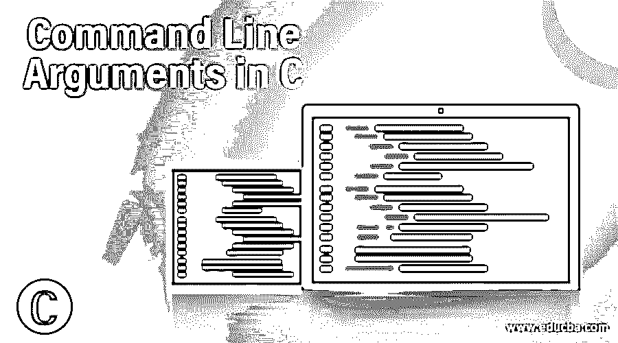

# C #中的命令行参数

> 原文：<https://www.educba.com/command-line-arguments-in-c/>




## C 语言命令行参数介绍

当程序执行时，从命令行传递给 C 程序的值在 C 中称为命令行参数。当我们想从外部将值传递给程序而不想在代码内部使用它时，命令行参数对程序很重要。程序中的 main()函数处理命令行参数，其中传递给程序的参数数量由 argc 表示，传递给程序的每个参数都由一个指针指向，该指针保存在由 argv[]表示的指针数组中。

**语法:**

<small>网页开发、编程语言、软件测试&其他</small>

```
int main(int argc, char *argv[])
```

其中，argc 表示传递给程序的参数计数，argv[]是一个指针数组，保存指向传递给程序的参数的 char 数据类型的指针。

### C 语言中命令行参数的使用

*   每当需要将值从外部传递给程序，而又不想在代码内部使用时，我们就使用 c 中的命令行参数。
*   执行程序时从命令行传递给 C 程序的值在 C 中称为命令行参数。
*   程序中的 main()函数在程序执行时处理传递给程序的命令行参数。
*   传递给程序的参数数量由 argc 表示，传递给程序的每个参数都由一个指针指向，该指针保存在由 argv[]表示的指针数组中。

### 命令行参数的示例

下面举几个例子:

#### 示例#1

这个程序演示了在程序中使用命令行参数来显示传递给程序的参数。

**代码:**

```
#include <stdio.h>
#include <conio.h>
//main method is called to which the command line arguments are passed to the program
int main(int argc, char *argv[])
{
//an integer variable is defined
int a;
//if condition is applied to check if the count of arguments passed to the program is greater than or equal to two and if the condition is true, the command line arguments passed to the program is printed otherwise no argument is passed to the program is printed
if( argc >= 2 )
{
printf("The arguments passed to the program are:\n");
for(a = 1; a < argc; a++)
{
printf("The argument passed to the program is: %s\t", argv[a]);
}
}
else
{
printf("No argument is passed to the program\n");
}
return 0;
}
```

**输出:**


在上面的程序中，调用了 main 方法，命令行参数被传递给程序。然后定义一个整数变量。然后，如果应用条件来检查传递给程序的参数计数是否大于或等于 2，并且如果条件为真，则打印传递给程序的命令行参数，否则不打印传递给程序的参数。我们没有向程序传递任何命令行参数，因此屏幕上会显示输出“没有参数传递给程序”。

#### 实施例 2

c 程序，演示在程序中使用命令行参数来显示传递给程序的参数。

**代码:**

```
#include <stdio.h>
#include <conio.h>
//main method is called to which the command line arguments are passed to the program
int main(int argc, char *argv[])
{
//an integer variable is defined
int a;
//if condition is applied to check if the count of arguments passed to the program is greater than or equal to two and if the condition is true, the command line arguments passed to the program is printed otherwise no argument is passed to the program is printed
if( argc >= 2 )
{
printf("The arguments passed to the program are:\n");
for(a = 1; a < argc; a++)
{
printf("The argument passed to the program is: %s\t", argv[a]);
}
}
else
{
printf("No argument is passed to the program\n");
}
return 0;
}
```

**输出:**


在上面的程序中，调用了 main 方法，命令行参数被传递给程序。然后定义一个整数变量。然后，如果应用条件来检查传递给程序的参数计数是否大于或等于 2，并且如果条件为真，则打印传递给程序的命令行参数，否则不打印传递给程序的参数。我们不会将 Hello 作为命令行参数传递给程序。

Note: Please pass the command line argument along with giving the program name to execute the program.

### C #中命令行参数的优势

下面提到了几个优点:

*   每当需要将值从外部传递给程序，但又不想在代码内部使用时，c #中就可以使用命令行参数。
*   要执行的程序可以从外部控制，而不是通过使用命令行参数对程序内部的值进行硬编码。

### 结论

在本教程中，我们通过编程示例及其输出来了解命令行参数的定义、语法和工作原理，以及在程序中使用命令行参数从外部控制程序比在程序内部硬编码值的优势。

### 推荐文章

这是一个关于 C 语言中命令行参数的指南，这里我们讨论了 C 语言中命令行参数的工作方式，以及编程示例和优点。您也可以看看以下文章，了解更多信息–

1.  [C 语言中的编程错误](https://www.educba.com/programming-errors-in-c/)
2.  [Linux 中的 rmdir 命令](https://www.educba.com/rmdir-command-in-linux/)
3.  [Python 命令行参数](https://www.educba.com/python-command-line-arguments/)
4.  [C 编程矩阵乘法](https://www.educba.com/c-programming-matrix-multiplication/)


