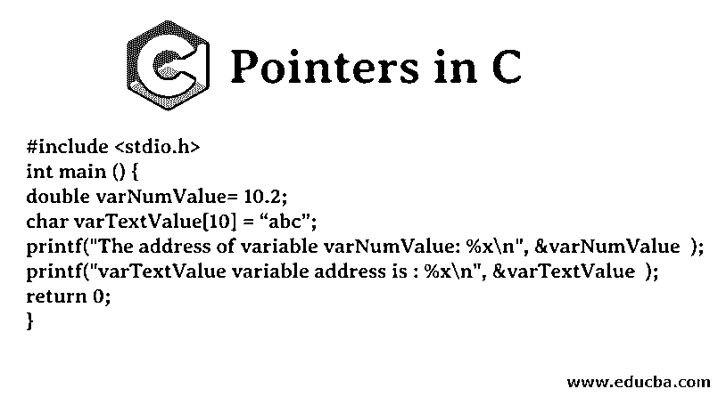

# C 语言中的指针

> 原文：<https://www.educba.com/pointers-in-c/>




## C 语言中指针的介绍

下面的文章提供了 C 语言中指针的概要。在 C 或其他编程语言中，我们有一个变量的概念。这些变量用于保存其中的值。人们可以在编程时使用这些变量。然而，很少有任务不需要变量，但需要这些变量的地址。变量的地址意味着这些变量实际存在的内存位置。我们可以将指针定义为一种变量，它保存任何其他可能保存某个值的变量的地址。

**编程语言和 C 语言中指针的使用:**

<small>网页开发、编程语言、软件测试&其他</small>

*   在用 c 编程时，许多任务如动态内存分配都需要指针。
*   使用指针，这样的任务可以很容易地完成。

### C 语言中访问变量地址的不同方法

让我们试着了解在 c 语言中打印变量地址的不同方法。

有两种方法可以打印变量的地址。

这两种方法是:

*   通过使用与号(&)方法
*   通过使用指针

#### 1.通过使用与号(&)方法

在这个方法中，我们将使用与号的概念来打印变量的地址。

让我们看一个例子。

**代码:**

```
#include <stdio.h>
int main () {
double varNumValue= 10.2;
char varTextValue[10] = "abc";
printf("The address of variable varNumValue: %x\n", &varNumValue  );
printf("varTextValue variable address is : %x\n", &varTextValue  );
return 0;
}
```

**输出:**


但是，在运行该示例时，可能会看到随机分配的不同值。

上面提到的例子用的不多，但值得了解。

#### 2.通过使用指针

这是一种访问变量地址的现代方法。

在使用指针之前，让我们了解一下声明指针的一般语法。

声明指针的一般语法。

```
data_type *variable
```

这是在 C 中声明任何指针的常用方法，这里 data_type 表示需要存储地址的变量的类型。 ***** 表示声明的变量是指针。变量只是用来访问值。

一个简单的例子是:

**代码:**

```
double *var_text
```

要在 C 语言中使用指针，基本上需要遵循以下三个步骤:

*   指针变量的定义。
*   为指针变量分配我们想要保存的地址。
*   现在，一旦我们有了一个带有地址的指针变量，我们就可以再次从指针中存储的地址中检索变量的值。这可以通过在 c 中使用*来实现，因为*只是一元运算符之一。

让我们用一个例子来使用上面提到的步骤，然后我们将一步步地看到这个例子。

**举例:**

**代码:**

```
#include <stdio.h>
int main () {
int  varNumValue = 10;
int  *ipointervarNumValue;
ipointervarNumValue = &varNumValue;
printf("Address of the variable varNumValue is: %x\n", &varNumValue  );
printf("Address stored in the variable ipointervarNumValue is: %x\n", ipointervarNumValue);
printf("Value of the variable *ipointervarNumValue is: %d\n", *ipointervarNumValue );
return 0;
}
```

**输出:**


现在，让我们试着理解上面的例子。

line int varNumValue = 10 简单地声明一个值为 10 的变量。

它旁边的第二行是:int *；被简单地声明来存储变量的地址。

下一个代码片段是:ipintervarnumvalue = & varNumValue，用于保存变量的地址。

现在，我们可以简单地获取值，并在代码片段中使用指针。

### C 语言中指针的类型

C 语言中有不同类型的指针:

*   空指针:空指针是一种不指向任何东西的指针。它通常指向该段的基址。如果没有给指针赋值，那么它就有一个空值。一般用在 stdio.h，alloc.h 这样的头文件中。
*   **悬挂指针:**这种类型的指针可以通过删除对象来创建，而无需修改指针值。
*   **通用指针:**这种类型的指针是使用 void 类型的变量声明的。因为它是 void 数据类型，所以被称为泛型指针。这种类型的指针不指向任何数据。
*   **野指针:**未初始化的指针称为野指针。这种类型的指针在运行时需要使用时被初始化。这种类型的指针称为通配符指针。

### 结论–C 语言中的指针

C 语言中的指针用来指向变量的地址。这些变量用于在 c 中动态分配内存。这些变量用星号声明，以表明该变量是一个指针。这些在编程时用于头文件中。

### 推荐文章

这是一个 C 语言中指针的指南，在这里我们用方法和例子来讨论 C 语言中指针的不同类型和用法。您也可以看看以下文章，了解更多信息–

1.  [最佳 C 编译器](https://www.educba.com/best-c-compilers/)
2.  [C 编程生涯](https://www.educba.com/career-in-c-programming/)
3.  [后端编程语言](https://www.educba.com/back-end-programming-languages/)
4.  [离子列表](https://www.educba.com/ionic-list/)


