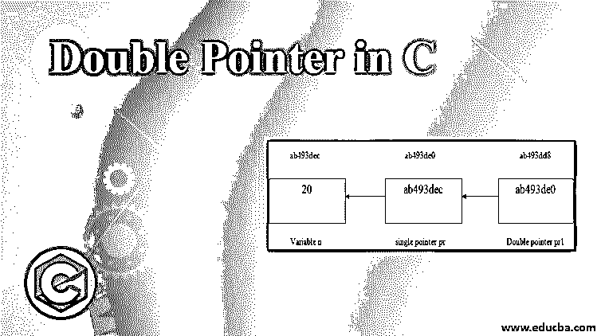
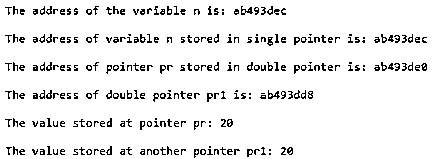

# C 语言中的双指针

> 原文：<https://www.educba.com/double-pointer-in-c/>




## C 语言中双指针的介绍

在 C 编程语言中，我们已经看到了指针是什么以及它们的用途。在 C 语言中，指针意味着直接指向另一个变量。一般来说，指针是存储另一个变量地址的变量。而指针指向指针，这意味着一个指针存储另一个指针的地址，而第二个指针将存储前一个或第一个指针的地址，这在 c 语言中也称为双指针。通常，指针被用来访问变量的地址，我们希望得到值或访问它。

### C 中双指针是如何工作的？

在这篇文章中，我们将看到如何用语法和例子来声明双指针，也将看到如何在 C 编程语言中使用它们。所以让我们从语法开始。

<small>网页开发、编程语言、软件测试&其他</small>

**语法:**

```
int **pointer_var;
```

在上面的语法中，我们可以看到变量 pointer_var 以两个星号(**)为前缀，也称为间接操作符(*)，用于声明双指针。

所以一般来说，如果指针指向或者指向内存中的一个对象，那么双指针就是一个指向或者指向内存中另一个对象的指针。让我们通过下面的例子和图示来看看这到底是如何工作的:


### 用 C 语言实现双指针的例子

下面是提到的例子:

#### 示例#1

**代码:**

```
#include<stdio.h>
void main ()
{
int n = 20;
int *pr;
int **pr1;
printf("\nThe address of the variable n is: %x\n", &n);
pr = &n;
printf("\nThe address of variable n stored in single pointer is: %x\n",pr);
pr1 = &pr;
printf("\nThe address of pointer pr stored in double pointer is: %x\n",pr1);
printf("\nThe address of double pointer pr1 is: %x\n", &pr1);
printf("\nThe value stored at pointer pr: %d\n",*pr);
printf("\nThe value stored at another pointer pr1: %d\n",**pr1);
}
```

**输出:**




**解释:**在上面的代码中，我们声明了一个变量“n”并将其初始化为值“20”。现在我们声明了一个单指针“*pr”和双指针“**pr1 ”,其中变量 n 的地址将存储在指针“*pr”中，而这个单指针“*pr”的地址存储在指针“**pr1”中，该指针现在是双指针。因此，当我们打印单指针或双指针的值时，值将是 20，因为双指针间接指向变量“n ”,它将访问它的值。这可以表现为


#### 实施例 2

在本文中，让我们看看为什么以及在哪里可以使用双指针。当指针是数据的地址时，指针有几种用法。这可以通过写这段代码来解释。

**代码:**

```
int n = 50;
int* p1 =&n;
int** p2= &p1;
```

如果我们看到上面的代码，如果“n”在地址 100，指针“p1”指向或分配给地址 n (100)，p1 也有地址 200，指针“p2”现在分配给地址 p1 (200)。双指针的另一个用途是当我们想在矩阵中分配空间时。这可以在下面的代码中解释。

**代码:**

```
#include <stdlib.h>
int main(){
int **matrix;
int row=5,col=5;
int i;
matrix = (int**)malloc(row*sizeof(int*));
for (i=0;i<row;i++)
matrix[i]= (int*)malloc(col*sizeof(int));
}
```

**解释:**在上面的代码中，由于“matrix”是一个双指针，所以它使用了 malloc 函数，该函数为 5 行 5 列的矩阵动态分配内存。我们知道，在代码中“矩阵”是整数数据类型，所以整数指针可以用在数组的开始，因为“矩阵”指针的地址是整数。因此，以同样的方式，指向整数指针的指针可以在整数数组中有起始地址，因为它也是一个整数。

#### 实施例 3

当我们想改变指针的值时，也可以使用双指针。一般来说，如果我们想在函数调用之外存储或保留内存分配或赋值，我们可以使用双指针，只需用** arg 传递这些函数。正如我们在前面的代码中所做的那样。让我们考虑一个例子，我们想从一个函数中改变或更新一个字符。

**代码:**

```
void func(char ch)
{
ch = 'B';
}
int main()
{
char ptr;
ptr = 'A';
printf("%c", ptr);
func(ptr);
printf("%c\n", ptr);
}
```

上面的代码将不会执行，因为我们已经将值传递给了函数，所以这可以通过在按引用传递时使用指针来完成。

**代码:**

```
#include<stdio.h>
void func( char *p)
{
*p = 'Y';
}
int main()
{
char *p;
p = (char *)malloc(sizeof(char) * 1);
*p = 'X';
printf("%c\n", *p);
func(p);
printf("%c\n", *p);
}
```

**输出:**


**解释:**所以在上面的代码中，它将允许你把指针“p”处的字符用值“X”更新为值“Y”。

### 结论

在本文中，我们可以得出结论，指针也是可以存储值的变量。但是指针通常将值存储为另一个变量的地址。所以通常我们可以将双指针定义为指针对指针，这意味着一个指针存储另一个指针的地址。这样，双指针用于分配内存或将值指定为另一个指针的地址，以便即使在函数调用之外也能访问该值，从而绕过使用** arg 对参数的引用。

### 推荐文章

这是一个 C 语言中双指针的指南。这里我们讨论双指针在 C 语言中是如何工作的，并举例说明以便更好的理解。您也可以浏览我们的其他相关文章，了解更多信息——

1.  [C 语言中的指针](https://www.educba.com/pointers-in-c/)
2.  [C 语言中嵌套的 if 语句](https://www.educba.com/nested-if-statement-in-c/)
3.  [C 文字量](https://www.educba.com/c-literals/)
4.  [空 C 中的指针](https://www.educba.com/void-pointer-in-c/)


