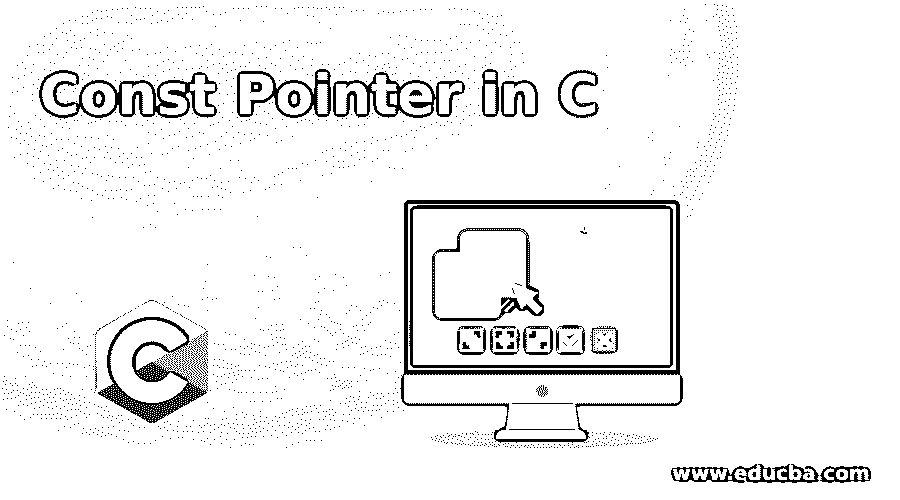

# C 语言中的常量指针

> 原文：<https://www.educba.com/const-pointer-in-c/>




## C 语言中常量指针的介绍

C 语言中的常量指针是保存任何变量的地址的指针，这些常量指针的值一旦被赋值就不能改变，换句更专业的话说，如果任何指针指向变量的内存地址，它不允许我们改变指针内存分配到其他内存位置， 如果我们希望任何变量的地址是固定的，或者我们不想给一个指针分配任何其他的内存位置，我们可以根据我们的要求或者 cons 指针所指向的变量的数据类型，设置 cons 指针的数据类型，它们可以是整型，等等。 在这个主题中，我们将学习 c 语言中的常量指针。

### 句法

下面是 C 语言中常量指针的语法，我们可以在下面的步骤中解释这个语法。

<small>网页开发、编程语言、软件测试&其他</small>

*   **指针的数据类型:**这个部分是关于我们要保存的变量的数据类型。我们可以根据需要定义 char，int，float。

*   **const** :该属性用于通知 C 编译器我们将在程序中使用的变量行为。这通知编译器，无论它保存什么样的变量地址，在程序的其余部分都保持不变。以防我们试图改变内存地址，这意味着分配其他变量的地址而不是旧的地址。

*   **任意指针名称:**这是将要保存变量地址的指针的名称。如果我们打印打印机，我们可以看到保存变量地址的输出。

*   *** :** 这里*代表指针所保持的变量的值。

这是常量指针声明的语法。

```
<Data type of pointer> * const <Any name of pointer>
```

这是常量指针定义的语法。

```
const <Data type of pointer>* <Any name of pointer>
```

### C 中的常量指针是如何工作的？

我们可以在下面的步骤中解释常量指针的工作原理，

*   const int *ptr，这里写 const 意味着我们在通知编译器关于 ptr 变量的信息。我们告诉他们，这是一个变量，它将保存一个可变整数的地址。
*   如果我们试图改变指针指向的值，它将抛出一个错误。简单地说，我们不能改变它所指向的值，但是我们可以改变指针。
*   要改变指针本身，我们可以这样分配它“ptr = &variable1”。这里我们改变的是指针本身。
*   如果我们试着写它*ptr=variable1，它不会工作，因为我们试着改变指针指向的值。
*   要创建任何常量指针，我们首先需要的是指针的数据类型。这通知 C 编译器指针将要保存的变量的数据类型。我们可以根据需要定义 char，int，float。
*   任何常量指针的第二个重要属性是关键字 const。这个属性用于通知 C 编译器我们将在程序中使用的变量行为。这通知编译器它将保存的任何变量地址。它通知 C 编译器，无论它保存什么，在程序的其余部分都保持不变。如果我们试图改变指针值，它将抛出一个错误。
*   常量指针的第三个重要属性是指针的任意名称。这个属性是指向变量地址的指针的名字。如果我们打印打印机" * pointer "名称将向我们显示指向变量的地址。
*   常量指针的第四个重要属性是*。这里*代表指针所保存的变量的值。

### C 语言中常量指针的例子

下面举几个例子:

#### 示例#1

在这个例子中，我们定义了一个常量指针并改变了它所指向的变量。

*   我们在 main 中编写代码，在这里我们定义了一些变量，比如 variable1 和 variable2，并且定义了一个 const char 指针。
*   const char 指针变量将指向变量 1 地址。
*   最后，我们将数据打印成两种格式，一种是用指针保存变量 1 的地址，另一种是在改变指针的分配后。
*   在最后一幅图中，我们可以看到指针指向变量 2。

请看下面的例子和输出屏幕。

**代码:**

```
#include<stdio.h>
#include<stdlib.h>
int main()
{
char variable1 ='X', variable2 ='Y';
const char *pointer = &variable1;
//*pointer = variable2; This is not the correct way to change the pointer value , it will throw an error.
// Still we can change the pointer by changing the pointer itself
printf( "Current value of the pointer is : %c\n", *pointer);
pointer = &variable2;
printf( "The value of the pointer after change is : %c\n", *pointer);
}
```

**输出:**


#### 实施例 2

在这个例子中，我们看到了我们是如何改变指针所指向的变量的，即使改变了指针所指向的变量，指针仍然保持着相同的内存地址。

请看下面的例子和输出屏幕。

**代码:**

```
#include<stdio.h>
#include<stdlib.h>
int main()
{
char variable1 ='X', variable2 ='Y';
char *const pointer = &variable1;
//*pointer = variable2; This is not the correct way to change the pointer address , it will throw an error.
// Still we can change the pointer by changing the pointer itself
printf( "The value pointed by the pointer is : %c\n", *pointer);
printf( "The address pointed by the char pointer is : %d\n\n", pointer);
// We are only changing the variable point by pointer it address still same
*pointer = variable2;
printf( "The value pointed by the pointer is : %c\n", *pointer);
printf( "The address pointed by the char pointer is : %d\n", pointer);
}
```

**输出:**


### 结论

从本教程中，我们了解了 C 编程中的常量指针，并且通过一些重要的例子了解了常量指针的行为。借助一些重要的例子，我们了解了这些常量指针在现实生活中的应用。

### 推荐文章

这是一个 C 语言中常量指针的指南，在这里我们讨论了常量指针在 C 语言中是如何工作的，并给出了相应的编程例子以便更好地理解。您也可以看看以下文章，了解更多信息–

1.  [C 文字量](https://www.educba.com/c-literals/)
2.  [C 编程矩阵乘法](https://www.educba.com/c-programming-matrix-multiplication/)
3.  [C 编程中的模式](https://www.educba.com/patterns-in-c-programming/)
4.  [C 编程中的数组](https://www.educba.com/arrays-in-c-programming/)


