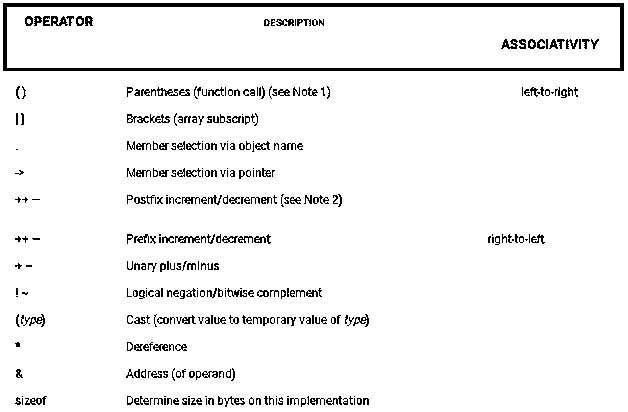
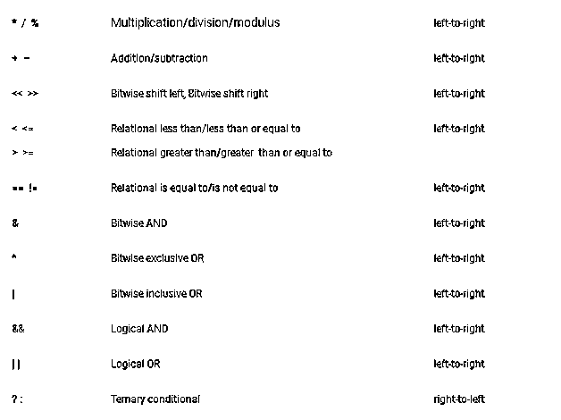
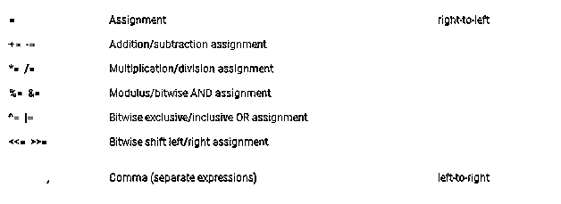
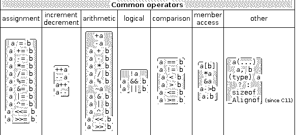
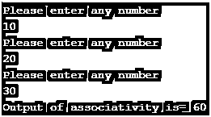

# C #中运算符的优先级

> 原文：<https://www.educba.com/operators-precedence-in-c/>


## C 语言中运算符优先级介绍

C #中的运算符优先级告诉你在一个包含多个不同优先级运算符的表达式中，先执行哪个运算符，然后执行哪个运算符。这在我们进行日常算术运算时起着至关重要的作用。C #中的运算符优先级用于确定运算符的顺序，以计算准确的输出。在 c 语言中，圆括号的优先级最高，而逗号的优先级最低。

### 为什么这个优先概念会出现？

假设我们有加法、乘法、除法、减法等。在一句话中。如果我们没有这个优先级的概念，那么我只是从左到右或者从右到左开始计算。但这是不正确的，因为在语句开始时有时会有加法、乘法和除法等运算。因此，用户可能会也可能不会遵循这些运算符的正确顺序。因此，为了创建一个计算原始结果的独特解决方案，开发人员引入了这个优先级。

<small>网页开发、编程语言、软件测试&其他</small>

**语法:**

5+2*10/1-3+([++4]-5*2-1);

**代码:**

```
int out=1+4*10/2;
Calculate Left to Right then output 25.
Calculate Right to Left then output 21.
Now calculate based on precedence first *, followed by /,+.
4*10=40
40/2=20
20+1=21
```

对于始终恒定的输出，我们必须使用优先概念。

### 单个语句中的优先运算符相同

如果相同的优先操作符出现在一个语句中会发生什么？如果在一个表达式中出现两个相同的优先级，则称之为“结合性”。现在，在这种情况下，我们可以从左到右或从右到左计算这个语句，因为两者的优先级相同。

**语法:**

5+10+20;//如果我们从左到右或从右到左计算，将得到相同的输出。

**操作员优先表*:**










**变量的优先级:**




### C #中运算符优先级的示例

下面是 C #中运算符优先级的示例:

#### 示例# 1–括号优先级

**代码:**

```
//used to include basice c library files
#include <stdio.h>
//main method for run the C application
int main()
{
//declaring variables
int a,b;
double output;
//Asking user to enter 2 numbers as input
printf("Please enter any 2 numbers \n");
//store 2 numbers in 2 variables
scanf("%d\n\t%d",&a,&b);
//assigning resultant of operators to a variable
output=(a-b)*(a+b*a)+a/b;
//displaying output
//first precedence given to (), followed by / and +
printf("output of %d and %d is = %lf ",a, b,output);
return 0;
}
```

**输出:**


**说明:**

*   第一个编译器读取整个输出语句，并根据优先级开始计算。如上所述，括号(())具有优先权。如果内括号中也有两个以上带有不同运算符的参数，则内括号也遵循优先规则。
*   (10-2)=8 且(10+2*10)=10+20=30
*   8*30=240
*   10/2=5
*   240+5=245
*   因此我们得到的输出是 245。

#### 示例 2–算术运算符的优先级

**代码:**

```
//used to include basic c library files
#include <stdio.h>
//main method for run the C application
int main()
{
//declaring variables
int a,b;
double output;
//Asking user to enter 2 numbers as input
printf("Please enter any 2 numbers  \n");
//store 2 numbers in 2 variables
scanf("%d\n\t%d",&a,&b);
//assigning resultant of operators to a variable
output=a+b*b-a/b%a;
//displaying output
//first precedence given to *, followed by /, %, + and -
printf("Output of %d and %d is =%lf ",a, b,output);
return 0;
}
```

**输出:**

**

** 

**说明:**

*   在上面的例子中，优先顺序是*、/、%、+和-。
*   b*b=>5*5=25
*   a/b=>10/5=2
*   a/b/%a=>a/b 已经是 2，所以 2%5=2
*   a+b*b=>10+25=35
*   a+b*b-a/b%a=>35-2=33
*   因此我们得到的输出是 33。

#### 例# 3–函数的加法关联性相同

**代码:**

```
//used to include basice c library files
#include <stdio.h>
//main method for run the C application
//defining methods
int function1();
int function2();
int function3();
int main()
{
//assigning resultant of operators to a variable
int output=function1()+function2()+function3();
//displaying output
//equal precedence operators so we can calculate in any order, get same output
printf("Output of associativity is= %d ",output);
return 0;
}
//method definination
int function1()
{
//declaring variables
int a;
//Asking user to enter 2 numbers as input
printf("Please enter any number \n");
//store a number in a variable
scanf("%d",&a)
return a;
}
//method definination
int function2()
{
//declaring variables
int a;
//Asking user to enter 2 numbers as input
printf("Please enter any number \n");
//store a number in a variable
scanf("%d",&a);
return a;
}
//method definination
int function3()
{
//declaring variables
int a;
//Asking user to enter 2 numbers as input
printf("Please enter any number \n");
//store a number in a variable
scanf("%d",&a);
return a;
}
```

**输出:**




#### 实施例 4

**代码:**

```
//used to include basice c library files
#include <stdio.h>
//main method for run the C application
int main()
{
//declaring variables
int a;
//assign values to a variable
a=1,2,3,4,5,6,7,8;
//displaying output
//, has least precedence
printf("\n Output of a variable is = %d ",a);
return 0;
}
```

**输出:**


**解释:**从上面的输出中，我们知道 c 语言中所有运算符中逗号的优先级最低。

### 推荐文章

这是一个 C 语言中运算符优先级的指南。这里我们讨论 C 语言中运算符优先级的介绍和它的表格，以及不同的例子和代码实现。您也可以浏览我们推荐的其他文章，了解更多信息——

1.  [C 中的质数](https://www.educba.com/prime-numbers-in-c/)
2.  [C 中如何反数？](https://www.educba.com/reverse-number-in-c/)
3.  [反转 C 中的字符串](https://www.educba.com/reverse-string-in-c/)
4.  [Java 中的质数](https://www.educba.com/prime-numbers-in-java/)


