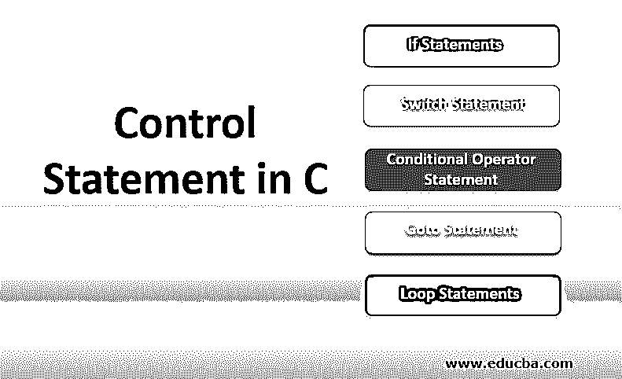

# C 语言中的控制语句

> 原文：<https://www.educba.com/control-statements-in-c/>




## C 语言中控制语句的介绍

在 C 语言中，控制从一条指令流向下一条指令，直到现在在所有程序中都是如此。从一个命令到下一个命令的控制流称为顺序控制流。尽管如此，在大多数 C 程序中，程序员在编写逻辑时可能想跳过指令或重复一组指令。这可以称为顺序控制流。C 语言中的声明让程序员做出这样的决定，这些决定被称为决策制定或控制声明。下面我们将讨论 c 语言中控制语句的类型。

### C 语言中控制语句的类型

c 还支持一组无条件的分支语句，将控制转移到程序中的另一个位置。c 语言中的选择声明。

<small>网页开发、编程语言、软件测试&其他</small>

1.  [If 语句](https://www.educba.com/if-statement-in-r/)
2.  交换语句
3.  [条件运算符语句](https://www.educba.com/conditional-operator-in-java/)
4.  [Goto 语句](https://www.educba.com/goto-statement-in-c-plus-plus/)
5.  循环语句

#### 1.If 语句

[If 语句](https://www.educba.com/if-statement-in-c/)使程序员能够根据条件选择一组指令。当条件被评估为真时，将执行一组指令，而当条件被评估为假时，将执行另一组指令。我们有 4 种类型的 if 语句，它们是:
1 .如果..else
2。嵌套 if
3。Else if 梯
4。简单 if 或 null else
5。Null else 或简单 else

##### If…else 语句

在这个语句中，有两种类型的语句执行。首先，如果条件为真，将执行第一个语句；如果条件为假，将执行第二个条件。

**语法:**

```
If(condition)
{
Statement(s);
}
else
{
Statement(s)
}
Statement
```

##### 嵌套 if

如果条件在第一个 If 语句中被评估为真，那么在第二个 [if 语句中的条件被评估为](https://www.educba.com/if-statement-in-matlab/)等等。

**语法:**

```
If(condition)
{
If(condition)
{
Statement(s);
}
Else
{
Statement(s)
}
}
```

##### 否则如果梯子

当第一个条件正确时，执行相应的指令阵列。如果条件不正确，将验证下一个条件。如果所有规范都失败，将执行默认的 block 语句。阶梯的其余部分可以如下图所示。

**语法:**

```
If(condition)
{
Statement(s);
}
Else if(condition)
{
Statement(s);
}
else if(condition)
{
Statement(s)
}
…
Else
{
Statement(s)
}
Statement(s);
```

##### Null else 或简单 else

如果程序员可以根据条件值执行或跳过一组指令。选择简单的单向语句。如果条件为真，则执行一组语句。如果条件为 false，则控件将在 If 声明之后继续下面的声明。简单的 else 语句:

**语法:**

```
If(condition)
{
Statement(s);
}
Statement(s);
```

#### 2.交换语句

c 以几种方式提供了一个选择语句，就好像当条件的数量增加时，程序的可读性会降低。c 有一个多路选择语句叫做[switch 语句](https://www.educba.com/switch-statement-in-c/)很容易理解来解决这个问题。如果存在 3 个以上的选择，那么 switch 声明就很容易理解了。该命令基于表达式值在块之间切换。每个块将有一个相应的值。

**语法:**

```
Switch(expression)
{
Case label1:
Statement(S);
Break;
Case label2:
Statement(S);
Break;
Case label3;
Statement(s);
Break;
….
Case labelN:
Statement(s);
Break;
Default:
Statement(s);
Break;
}
```

使用 case 关键字显示每个块，块标签跟在 case 关键字后面。默认块和[中断语句](https://www.educba.com/break-statement-in-c/)在 switch 语句中是可选的[。](https://www.educba.com/python-switch-statement/)

#### 3.条件运算符语句

c 语言提供了一个不常见的运算符，表示为条件运算符。

**语法:**

```
(condition)? expr1: expr2
```

当条件有效时，执行 Expr1。那么如果语句不正确，将执行 Expr2。

#### 4.goto 语句

[goto 语句](https://www.educba.com/goto-statement-in-c/)因[跳转控制语句](https://www.educba.com/control-statement-in-javascript/)而闻名。它用于将程序的控制权从一个程序块转移到另一个程序块。goto 关键字用于[声明 goto 语句](https://www.educba.com/goto-statement-in-c-sharp/)。

**语法:**

```
goto labelname;
labelname;
```

在上面的语法中，goto 是一个关键字，用于将控制转移到 labelname。labelname 是一个变量名。在这种情况下，goto 会将程序的控制权转移给 labelname，并执行 labelname 后面的语句。

#### 5.循环语句

在编写 C 程序时，程序员可能希望重复几个指令，直到满足某些要求。为此，C 为决策制定进行循环声明。我们有三种类型的循环，

1.  For 循环
2.  While 循环
3.  [Do While 循环](https://www.educba.com/do-while-loop-in-matlab/)

##### For 循环

在 For 循环中，初始化语句只执行一次。之后，检查条件，如果条件的结果为真，它将执行循环。如果为假，则 for 循环终止。但是，条件评估的结果为真，for 循环体内的语句被执行，表达式被更新。之后，再次检查条件。这个过程一直持续到条件的结果变为假。当条件为假时，循环终止。

**语法:**

```
for( initialization statement; condition)
{
//statements inside the loop
}
```

##### While 循环

在 C #中，while 循环是一个导向入口循环。只有当条件有效时，才会执行 while 循环体。如果条件得分不正确，则不执行循环结构。当几个指令必须无限期重复时，通常使用 while 循环。

**语法:**

```
While(condition)
{
//statements inside the loop
}
```

##### Do While 循环

与 while 循环不同，do 的主体是 while 和… while 循环的区别，它保证一次只执行一次。

**语法:**

```
Do
{
//statements inside the loop
}
While(condition);
```

### 结论

在本文中，我们已经看到了 C 语言中的各种控制语句及其语法和示例。

### 推荐文章

这是 C 语言中控制语句的指南。这里我们讨论 C 语言中不同类型的控制语句，如 If、Switch、条件运算符、goto 和 Loop 以及语法。您也可以浏览我们推荐的其他文章，了解更多信息——

1.  [继续 C#中的语句](https://www.educba.com/continue-in-c-sharp/)
2.  [Python 中的 Break 语句](https://www.educba.com/break-statement-in-python/)
3.  [c++中的控制语句](https://www.educba.com/control-statement-in-c-plus-plus/)
4.  [PHP 中的控制语句](https://www.educba.com/control-statement-in-php/)


