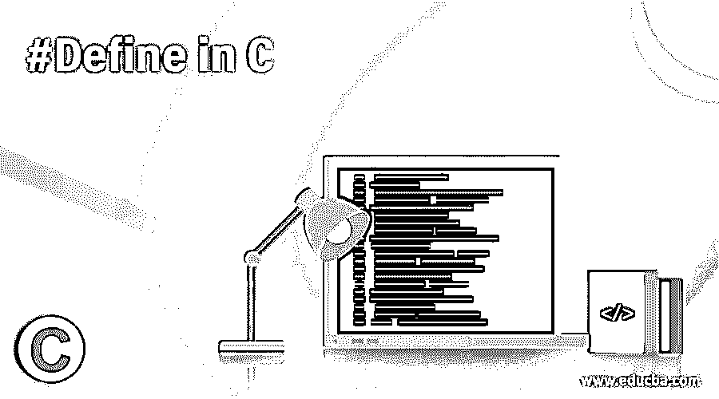

# #用 C 语言定义

> 原文：<https://www.educba.com/sharp-define-in-c/>




## C #中的#Define 简介

#define 是 C 编程语言中的一个函数，它帮助定义宏以及当前的源代码。使用宏定义，我们可以定义常量值，这些常量值可以在我们所有的代码中全局使用。这些宏定义不同于变量。它们不能像程序中的变量一样被改变。宏可以用来创建字符串甚至数字的表达式。宏是高效的、可重用的和快速的。这是创建常数的一种方式。

**语法**

<small>网页开发、编程语言、软件测试&其他</small>

```
#define CONSTNAME value
```

或者

```
#define CONSTNAME expression
```

指令#define 有助于创建一个常量值的标识符。仅当 CONSTNAME 形成标记时，它才会被替换。CONSTNAME 后面的参数可以是标记、常量值，也可以是完整的语句。这个指令可以在需要的时候在整个程序中使用。

### C#指令在 C 中是如何工作的？

```
#include <stdio.h>
#define MATHPI 3.14
main() {
printf("%f",MATHPI);
}
```

如前所述，该程序帮助我们创建可以直接使用的常量值。在上面的例子中，我们试图理解#define 函数的工作原理。和#include 一样，我们使用了#define，并将其值声明为 3.14。这有助于我们为 MATHPI 常量变量设置一个常量值。一旦定义了这个函数，它就被存储在内存中，然后可以在整个程序中直接使用。它的值只能由 MATHPI 变量名引用。在程序中使用这个函数时，它将被替换为它的值。对于其值不会改变的值，可以这样做。

### C #中的#Define 示例

下面是 C #中#Define 的例子:

#### 示例#1

使用#define 函数替换数值

**代码:**

```
#include <stdio.h>
#define MATHPI 3.1415
int main()
{
float radius, area, circum;
printf("Enter the radius for the circle: ");
scanf("%f", &radius);
area = MATHPI*radius*radius;
printf("The area of circle is= %.2f",area);
return 0;
circum = 2*MATHPI*radius;
printf("The circumference of circle is= %.2f",circum);
}
```

上面的函数帮助我们通过使用#define 函数导出的常量值来获得圆的面积。这里我们使用了 define，并将 MATHPI 的值定义为 3.1415。该值将在整个程序中保持不变，并且可以多次使用。我们取了三个浮点变量。这些变量将存储变量的本地值。我们可以通过使用#define 变量和局部变量来计算圆的面积和周长。我们在代码中使用了 MATHPI 变量两次。一次计算面积，第二次计算圆的周长。这两次我们都使用了这些变量。这个值保持不变，我们得到面积和周长。下面将是上述程序的输出。

**输出:**


#### 实施例 2

使用#define 替换字符串值

**代码:**

```
// C program to demonstrate #define to replace a string value
#include <stdio.h>
// We have defined a string PUN for Pune
#define PUN "Pune"
int main()
{
printf("The city I live in is %s ", PUN);
return 0;
}
```

上面的程序是一个例子，我们使用#define 函数定义了一个字符串变量 PUN。它帮助我们在代码的任何地方使用这个字符串值。在主程序中，我们打印了一个字符串，显示您居住的城市。要以双关语打印的变量是使用#define 定义的。不能再改变了。上述程序的输出如下所示。变量 PUN 的值将被我们声明的常量字符串替换。

**输出:**


#### 实施例 3

使用#define 定义表达式

**代码:**

```
#include <stdio.h>
#define MAX(x,y) ((x)>(y)?(x):(y))
void main() {
printf("The maximum by using #define function is: %d\n", MAX(97,23));
}
```

上面的程序演示了#define 函数作为表达式的用法。我们已经定义了一个表达式，帮助我们找到两个数字之间的最大值。表达式 MAX 的定义逻辑是找出两个数之间的最大值。这个#define 变量曾经有这样一个值，求两个数的最大值。在 main 函数中，我们只是使用了一个 print 函数来帮助我们找到任意两个数字的最大值。在打印函数中，我们刚刚调用了 MAX 函数。我们已经向这个 MAX 变量传递了两个数字，它被定义为两个数字的最大值。这段代码的输出如下所示。

**输出:**


#### 实施例 4

使用 define 函数时使用' # '

**代码:**

```
#include <stdio.h>
#define  msg_for(a)  \
printf(#a " : Let us learn something new!\n")
int main(void) {
msg_for(EduCBAians);
return 0;
}
```

在本例中，我们使用了' # '运算符。这里的#操作符作为一个操作符，帮助我们接受特定变量的用户输入。我们可以向变量发送参数，该变量是通过#define a variable 传递和创建的。我们在这里定义了一个变量名，并用#打印出来。通过调用 msg_for 函数从 main 发送的 id 值。这里我们将参数作为 EduCBAians 发送。使用#define 函数定义打印信息的功能。这是一个常量函数。这个函数无论何时被调用，都将打印变量，该变量被传递给 msg_for 函数。下面是上面代码的输出，它帮助我们定义常量函数。

**输出:**


### 结论

#define 函数帮助我们定义可以在整个程序中使用的常量变量。该值将保持不变。它可以是表达式、变量或任何您希望保持不变的值。这有助于变量的一致性。因为在代码开始运行之前就已经定义了值，所以速度更快。它也很有效，因为您只需在代码中指定变量名。当使用#define 函数时，代码看起来也很整洁。使用 C 语言的这个函数既快捷又高效，而且简单易行。

### 推荐文章

这是一个 C#定义的指南。这里我们讨论 C #指令在 C #中是如何工作的，以及代码和输出的例子。您也可以看看以下文章，了解更多信息–

1.  [R 编程语言](https://www.educba.com/r-programming-language/)
2.  [C 中的常数](https://www.educba.com/constants-in-c/)
3.  [C 语言中的一元运算符](https://www.educba.com/unary-operator-in-c/)
4.  [C 语言中的 sizeof()](https://www.educba.com/sizeof-in-c/)


