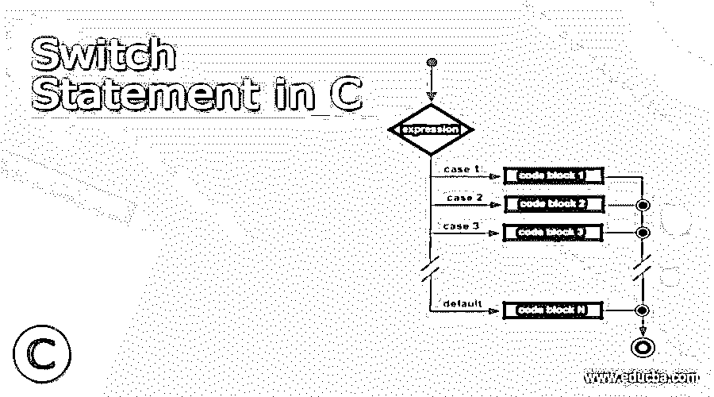
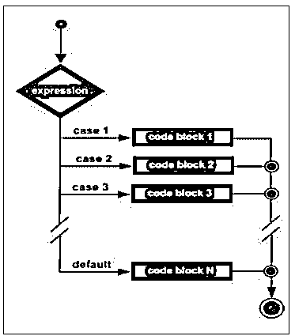
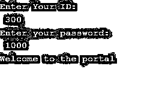
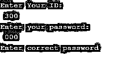

# C 语言中的 Switch 语句

> 原文：<https://www.educba.com/switch-statement-in-c/>




## C 语言中 Switch 语句介绍

在学习什么是 C 中的 Switch 语句之前，我们先来了解一下什么是 C. C，一种由 Dennis Ritchie 开发的面向过程的编程语言。开发 C 语言的基本目的是将其用作系统的编程语言，即编写操作系统的程序。许多语言借用了 C 语言的语法。例如，C++是 C 编程语言的扩展，或者可以被认为是 C 编程语言的升级版本。

### C 语言中的 Switch 语句是什么？

考虑这样一种情况，有人给了你一串不同大小的钥匙。现在你被要求用这串钥匙中的一把打开一扇门。那么你对这个问题的解决方法是什么呢？这很简单，你猜对了，你将选择一把钥匙，并尝试使用它打开门。如果这把钥匙打不开门，你用另一把试试。这个过程一直持续到你最终找到打开门的钥匙。找到钥匙，打开门后，你停下来。如果你第一次就能找到钥匙，你就不会在那之后继续找其他的钥匙，对吗？

<small>网页开发、编程语言、软件测试&其他</small>

switch 语句也是类似的情况。这个例子可以帮助你容易地理解 switch 语句的基本定义和流程。switch 语句的基本流程和功能在所有编程语言中都是相同的。只有在基于所使用的编程语言的通用语法中才能看出这种差异。

用一个非常基本的术语来说，switch 语句评估一个表达式，测试它，并将其与代码中编写的几种情况进行比较。一旦找到与任何 case 的匹配，控件就进入该 case 并开始执行在该 case 中编写的语句，直到遇到 break 语句。break 语句一出现，switch 语句就终止，程序控制退出开关。

有时可能会出现没有大小写与表达式的值匹配的情况。对于这种情况，我们提到一个默认情况，如果没有找到匹配，它将总是执行。switch 语句块中的事例由不同的数字或字符串表示，称为标识符。将表达式的值或用户提供的值与这些情况进行比较，直到找到匹配。

C 编程语言中 switch 语句的语法如下所示:

**语法:**

```
switch( expression )
{
case value1:
//Block of code;
break;
case value2:
//Block of code;
break;
case valueN:
//Block of code
break;
default:
//Block of code
break;
```

**举例:**

这个例子将更清楚地说明 switch 语句的用法。

**代码:**

```
#include <stdio.h>
int main () {
char grade_report = 'D';
printf("Your performance is : ");
switch(grade_report) {
case 'A' :
printf("Outstanding Result!\n" );
break;
case 'B' :
printf("Excellent Result!\n" );
break;
case 'C' :
printf("Good Result\n" );
break;
case 'D' :
printf("Satisfying Result\n" );
break;
case 'F' :
printf("Poor Result\n" );
break;
default :
printf("You did not appear for exam\n" );
}
return 0;
}
```

**输出:**


### Switch 语句流程图

下面给出了 switch 语句的流程图:




### Switch 语句在 C 中是如何工作的？

让我们理解上面流程图中描述的控制流，以便更好地理解执行流。

使用 switch 语句传递一个表达式，该表达式等于 cases 的值之一。如果值不相等，则执行默认情况。然后将该表达式的值与事例标识符或第一个事例进行比较。如果第一种情况匹配，则执行与第一种情况关联的代码块。

一旦遇到中断，执行将停止，您将退出 switch 语句。但是，如果大小写不匹配，执行将转到下一个大小写。如果这种情况匹配，则执行第二个代码块；否则，流程以类似的方式检查下一个案例。最后，如果没有匹配的案例，则执行默认代码块。

### C 语言中 Switch 语句的示例

下面是提到的例子:

#### 示例#1

此示例描述了开关中 break 语句的用法。如果在 case 之后没有指定 break 语句，执行流将继续，直到遇到 break 语句。

**代码:**

```
#include <stdio.h>
int main() {
int range_of_number=50;
switch (range_of_number) {
case 10:
case 20:
case 30:
printf("The number is 10 or 20 or 30 ");
break;
case 50:
case 55:printf("This case also executes because there is no break ");
printf("\n");
case 60:
printf("The number is either 40 or 50 or 60");
break;
default:
printf("The number is greater than 60");}}
```

**输出**:


#### 实施例 2

**代码:**

```
#include <stdio.h>
int main()
{
int x = 10, y = 5;
switch(x==y && x+y<10)
{
case 1:
printf("hi");
break;
case 0:
printf("bye");
break;
default:
printf(" Hello bye ");
}  }
```

**输出**:


#### 实施例 3

嵌套 Switch 语句。

**代码:**

```
#include <stdio.h>
int main() {
int ID = 300;
int password = 1000;
printf("Enter Your ID:\n ");
scanf("%d", & ID);
switch (ID) {
case 300:
printf("Enter your password:\n ");
scanf("%d", & password);
switch (password) {
case 1000:
printf("Welcome to the portal\n");
break;
default:
printf("Enter correct password");
break;
}
break;
default:
printf("Enter correct ID");
break;
}
}
```

**输出**:

这将取决于用户输入的值。

**输出 1 :**




**输出 2:**


**输出 3:**




### 结论

Switch case 语句是一种受控语句，被视为 if-else 语句的替代语句。它是一个多路分支语句，提供了一种根据表达式的值将执行流组织到代码部分的方法。

### 推荐文章

这是 C 语言中 switch 语句的指南，在这里我们还将分别讨论 Switch 语句的基本概念和如何在 C 语言中工作。您也可以看看以下文章，了解更多信息–

1.  [IPSec 协议](https://www.educba.com/ipsec-protocol/)
2.  [PHP 开关语句](https://www.educba.com/php-switch-statement/)
3.  [Python 开关语句](https://www.educba.com/python-switch-statement/)
4.  [PowerShell 中的开关盒](https://www.educba.com/switch-case-in-powershell/)


