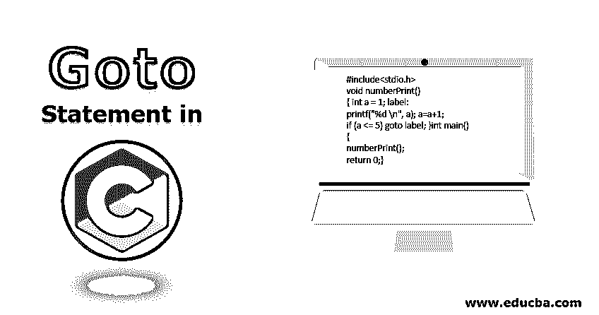

# C 语言中的 Goto 语句

> 原文：<https://www.educba.com/goto-statement-in-c/>




## C 语言中 Goto 语句的介绍

根据需求，我们有几种编程语言可以用来开发程序或应用。现在，语言经常使用高级语言和汇编语言，当涉及到各种需求时，它们有自己的重要性。这里我们将重点关注 C 语言的一个模块。c 语言可以定义为 Dennis Ritchie 开发的过程语言。它是在 1969 年至 1973 年间开发的。C 语言的主要目的是开发操作系统，而我们现在使用的 [UNIX 操作系统仅仅是用这种语言开发的。现在让我们继续研究 Goto 语句。在这个主题中，我们将学习 c 语言中的 Goto 语句。](https://www.educba.com/unix-operators/)

### Goto 语句是什么？

Goto 语句可以定义为帮助程序执行控制从一个块跳转到另一个块的跳转语句。主要介绍定义程序的控制流程。有时它也可以用来以某种特定的方式创建循环，但这不是它的目的。C 语言中有几个可用的选项，但是 Goto 语句通过定义程序将如何工作或者将如何执行而起到了至关重要的作用。它可以在程序中使用 goto 关键字和标签名来实现。

<small>网页开发、编程语言、软件测试&其他</small>

**语法:**

```
Goto labelname;
Lablename;
```

Goto 是用于在程序中实现控制跳转功能的关键字。goto 关键字后的 labelname 是一个任意的名称，它演示了程序遇到 jump 语句后控件必须跳转到的位置。下一行只有 labelname，为了将程序的控制权从 Goto 语句写入的位置转移到 labelname 写入的位置。不一定要在 Goto 语句之后才移动控件。也可以跳到定义 goto 语句的那一行之前。根据需要，我们也可以在一个程序中使用多个 goto 语句。

### goto 语句在 C 中是如何工作的？

goto 语句的工作非常简单，可以很容易地在用 c 编写的程序中引入控制跳转机制。为了使用 goto 语句，我们需要定义 goto 语句，这可以通过使用 goto 关键字后跟 labelname 来完成。一旦定义了 goto 语句，我们将需要在整个程序中的任何地方提到 labelname，当编译器看到 goto 语句时，控制必须跳转到这个地方。

#### c 语言中 Goto 语句的例子

让我们用一个例子来理解它实际上是如何工作的。

**程序**

```
#include<stdio.h>
void numberPrint()
{
int a = 1;
label:
printf("%d \n", a);
a=a+1;
if (a <= 5)
goto label;
}
int main()
{
numberPrint();
return 0;
}
```

**输出:**


上面的代码将给出 1 2 3 4 5 这样的输出。在 C 语言中，控件遵循从上到下[的方法，因此它向下移动，直到 goto 语句被看到。一旦编译器找到 goto 语句，它就将控制跳转到写有标签的第 6 行，直到 a 的值大于 5，如此反复。它工作在一个简单和排序的机制中，每当 goto 语句被见证时，只需跳转到标签名称被提及的程序的控制，这在定义 goto 语句时被使用。](https://www.educba.com/what-is-c/)

### goto 语句的优点和局限性

使用 C 语言编程的程序员可以利用 goto 语句，而使用高级语言的程序员则不能，因为高级语言中没有这个选项。因为它在 C 中可用，所以它具有一些有助于简化编程的巨大优势。goto 语句的用法非常简单，也非常便于理解。事情是这样的，只要提到你希望流程跳转到哪里，编译器就会为你实现。由于它的这个优点，它被程序员在开发任何程序时使用。

除了优点之外，它也有一些缺点或限制，因为这种功能在高级编程语言如 [Java 或 python](https://www.educba.com/java-vs-python/) 中是不可用的。虽然它使用起来简单方便，但是当它在一个程序中被多次使用时，就会使程序变得非常复杂。有一个循环的概念，可以让任何事情发生，而重复的任务是需要做的。goto 语句与 not 规则一起工作。只要提到它，它就能工作，这也是高级语言没有提供这种功能的主要原因。

### 结论

Goto 的语句可以认为是跳转语句，它使程序按照期望的方式流动，导致预期的结果。它有自己的优点和缺点。根据程序的规模和复杂性，它取决于它是否会以优势存在还是会导致它的局限性。它是在 C 语言中引入的，目的是让程序在需要构建高效操作系统的地方转移控制权。但是后来，人们发现这个语句的广泛使用导致了程序的复杂化。

当我们谈论用 C 语言编写小程序时，[使用 goto 语句](https://www.educba.com/goto-statement-in-c-plus-plus/)并使程序以你想要的方式工作是非常有帮助的，但是当涉及到开发有成百上千行的程序时，不建议[使用 goto 语句](https://www.educba.com/goto-statement-in-c-sharp/)。它最终会使程序变得过于复杂，其他开发人员将无法理解这一点。我们需要注意在哪里使用它，以确保它可以用来简化程序。

### 推荐文章

这是一个 C 语言中 goto 语句的指南，这里我们讨论了 Goto 语句在 C 语言中是如何工作的，并给出了例子、优点和局限性。您也可以阅读以下文章，了解更多信息——

1.  [C 编程中的模式](https://www.educba.com/patterns-in-c-programming/)
2.  [C 编程中的数组](https://www.educba.com/arrays-in-c-programming/)
3.  [C 程序中的回文](https://www.educba.com/palindrome-in-c-program/)


