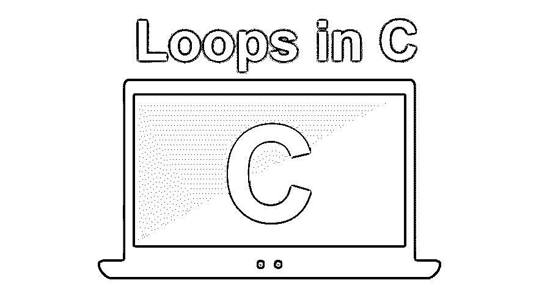
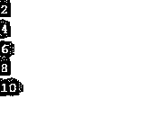
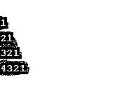
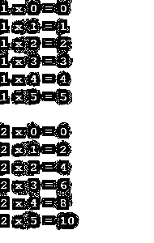
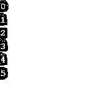

# C 语言中的循环

> 原文：<https://www.educba.com/loops-in-c/>




## C 语言中的循环介绍

C 编程语言中的循环是一个条件概念，用于连续执行一行或一块代码。在 C 编程中，有三个循环:For 循环、While 循环和 Do While 循环。C 中的循环也可以与其他控制语句结合使用，例如 Break 语句、Goto 语句和 control 语句。这些循环可以用在程序的任何地方，无论是入口控制单元还是出口控制单元。

### 不同类型的循环

C 语言中有 3 种不同类型的循环:

<small>网页开发、编程语言、软件测试&其他</small>

*   **While 循环**
*   **Do While 循环**
*   **为循环**

#### 1.While 循环

在这种情况下，在处理循环体之前先计算条件。如果条件为真，则只执行循环体。然后控制在完成一次循环后回到开始。循环中的语句将被再次执行，如果条件为真并被检查，这个过程将继续，直到条件变为假。如果条件为假，控制将退出循环。循环完成后，控件将立即转到循环后的语句，并且主体可以包含多个语句。如果只有一个语句，花括号就没那么重要了。如果 while 循环中的条件不为真，则不会执行循环语句。

**语法:**

```
while (condition) {
statements;
}
```

**举例:**

```
#include<stdio.h>
#include<conio.h>
int main()
{
int num=1;
while(num<=5)
{
printf("%d\n",num);
num++;
}
return 0;
}
```

**输出:**

它将打印从 1 到 5 的数字，如下所示。


#### 2.Do While 循环

在这个循环中，循环中的语句至少需要执行一次。之后，它检查条件。如果条件为真，它将再次执行循环；否则，它将退出。这就是所谓的退出控制循环。它类似于 while 循环，条件总是在循环体之后执行。while 循环仅在条件为真时执行，但有时该语句必须至少执行一次，因此不得不使用 [do-while 循环](https://www.educba.com/c-sharp-do-while-loop/)。while 和 do-while 循环的区别在于，在 while 循环中，while 是写在开头的，而 do-while 是在结尾提到条件，以分号(；).

**语法:**

```
 do {
statements
} while (expression);
```

**举例:**

```
#include<stdio.h>
#include<conio.h>
int main()
{
int num=1;
do
{
printf ("%d\n",2*num);
num++;
}
while(num<=5);
return 0;
}
```

**输出:**

上述程序的输出是:




#### 3.For 循环

它执行这组语句，直到满足特定条件。这就是所谓的开环。在 For 循环中，我们可以有多个初始化或递增/递减，用逗号操作符和一个条件分隔。For 循环用于首先评估初始化部分，检查条件的真或假。如果条件为真，则执行 for 循环语句。之后，它评估递增或递减条件，直到条件变为假，重复相同的步骤。当条件为假时，它将退出循环。

**语法:**

```
for (initial value; condition; incrementation or decrementation )
{
statements;
}
```

**举例:**

```
#include<stdio.h>
#include<conio.h>
int main()
{
int number;
for(number=1;number<=5;number++)
{
printf("%d\n",number);
}
return 0;
}
```

**输出:**


有嵌套的 For 循环，其中有外部 For 循环和内部循环。在[这个嵌套循环](https://www.educba.com/nested-loop-in-javascript/)中，内循环针对外循环迭代的给定条件重复多次。

[C++培训(4 门课程，5 个项目，4 次小测验)](https://www.educba.com/software-development/courses/c-course/?btnz=edu-blg-inline-banner1) [Java 培训(41 门课程，29 个项目，4 次小测验)](https://www.educba.com/software-development/courses/java-course/?btnz=edu-blg-inline-banner1)

**语法:**

```
for(initialization; condition; increment/decrement)
{
for(initialization; condition; increment/decrement)
{
statement ;
}
}
```

**举例:**

```
#include<stdio.h>
#include<conio.h>
void main( )
{
int i, j;
for(i = 1; i < 5; i++)
{
printf("\n");
for(j = i; j > 0; j--)
{
printf("%d", j);
}
}
}
```

**输出:**




**其他例子:**

```
#include <stdio.h>
#include<conio.h>
int main() {
int i, j;
int table = 2;
int max = 5;
for (i = 1; i <= table; i++) {
for (j = 0; j <= max; j++) {
printf("%d x %d = %d\n", i, j, i*j);
}
printf("\n");
}}
```

**输出:**




### 控制语句

一些循环控制语句[需要](https://www.educba.com/control-statements-in-c/)成为[在循环](https://www.educba.com/vb-dot-net-loops/)中用于不同的目的并达到最终结果。下面是使用的不同陈述:

#### break 语句

break 语句用于在针对特定条件执行特定语句后立即退出循环。

**语法:**

```
While (Condition)
{ Statement 1; statement 2;
If (Condition)
{ break;}
Statement 3; }
```

#### 连续语句

它通常根据条件跳过语句。它用于将控制直接发送到条件，并继续循环过程。对于特定的条件，它跳过当前的循环或语句，进入新的循环或条件。

**语法:**

```
While (Condition)
{ Statement 1; statement 2;
If (Condition)
{ continue;}
Statement 3; }
```

#### Goto 语句

它用于将协议转换为带标签的语句。

**举例:**

```
#include<stdio.h>
#include<conio.h>
int main()
{
int number;
number=0;
repeat:
printf ("%d\n",number);
number++;
if(number<=5)
goto repeat;
return 0;
}
```

**输出:**




### 结论–C 语言中的循环

以上是 C 编程语言中定义的循环。为了选择一个特定的循环来解决问题或编写程序，程序必须非常仔细地考虑客户的要求。该计划必须分析的情况和什么类型的检查是必需的，像预检查和后检查。在 C 或任何编程语言中，循环是关键概念之一。通常有两种类型，即入口控制回路和出口控制回路。循环或语句块执行几次，直到条件变为假。因此，最好正确地分析问题，并相应地选择循环，以获得更好的程序性能和内存使用。

### 推荐文章

这是一个 c 语言中循环的指南，这里我们讨论了循环的介绍以及不同类型的循环。您也可以看看以下文章，了解更多信息–

1.  [C++字符串函数](https://www.educba.com/c-plus-plus-string-functions/)
2.  [C++运算符](https://www.educba.com/c-plus-plus-operators/)
3.  [继续 C++中的语句](https://www.educba.com/continue-statement-in-c-plus-plus/)
4.  [C 语言中的 Goto 语句](https://www.educba.com/goto-statement-in-c/)


