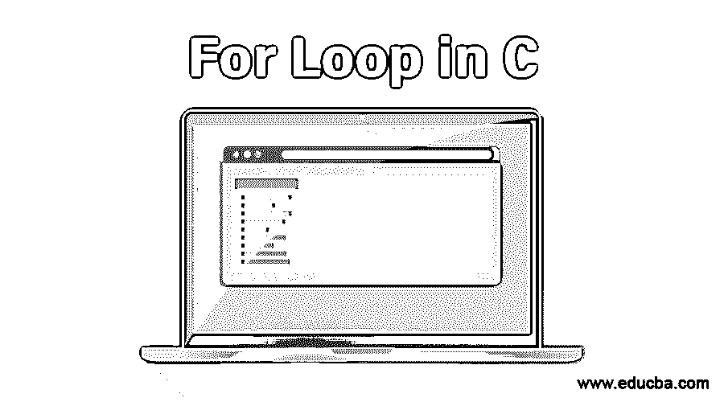
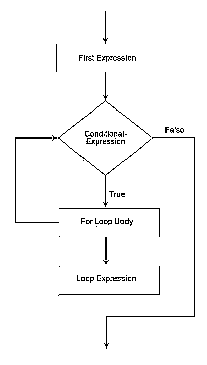
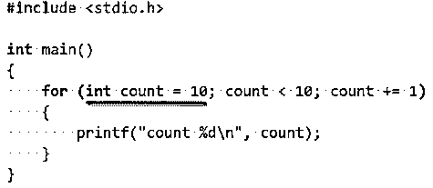
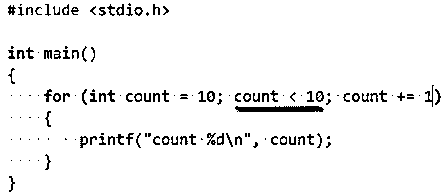
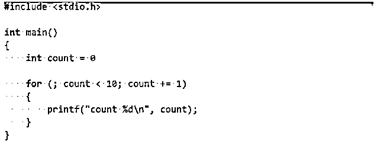
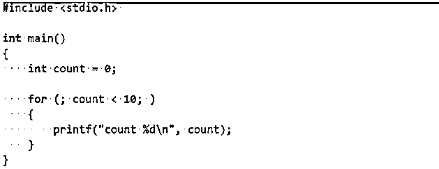
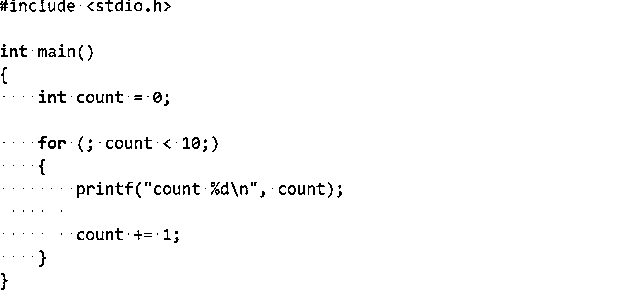
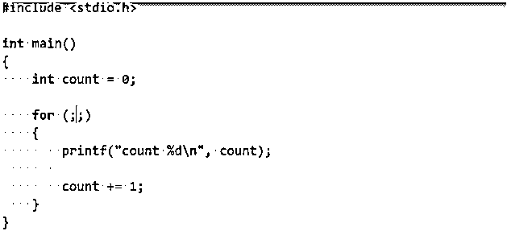
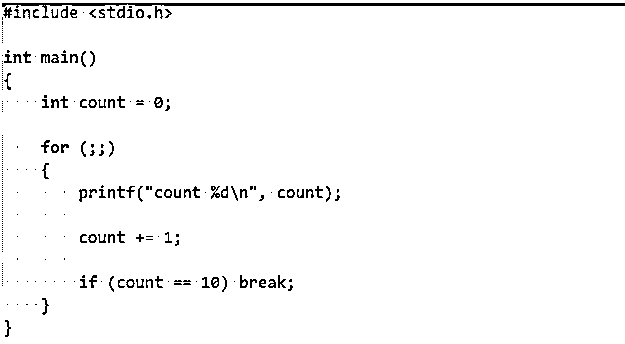

# C 语言中的 For 循环

> 原文：<https://www.educba.com/for-loop-in-c/>

## C 程序设计中的 for 循环介绍

虽然编写 C 程序，我们可能会经历多次执行类似或精确的指令组的目的，例如，在显示屏周围打印 1 到 100 的数字，这在不使用循环的情况下可能会非常乏味，并且会使程序绝对不可再分发，永远无法理解。这个问题通过使用循环得以解决。

循环被认为是一系列特定的语句，这些语句可以执行多次。将在循环中执行一组指令，直到达到终止循环的某些条件。

<small>网页开发、编程语言、软件测试&其他</small>

### 无限循环

无限循环可以是一系列可以永远执行的指令。每当没有提供终止条件或者终止条件可能永远不会满足时(就像 1==2 等等),就会发生这种类型的循环。)或者偶尔由于运行时间错误。在旧系统中，无限循环引发了整个系统变得不负责任；然而，在现代操作系统中，这些类型的循环通常可以通过最终用户来结束。

**一个循环主要包括两部分:**

*   控制声明
*   循环体

**1。控制声明**

控制声明检查特定的条件，之后，它用循环指示包含在主体中的正则语句。

**2。循环体**

循环体以一组指令为特征，这些指令将被执行，直到达到终止循环的某些条件。[循环被用于](https://www.educba.com/vb-dot-net-loops/)通过编程来重复特定的代码块。阅读本指南时，您将理解在 C 编程中为循环产生**。for 语句在括号内有三个表达式。**

**语法:**

for 循环中的语法是–

这些共同决定是否执行该语句。

首先要做的是计算第一个表达式。不管结果如何，都会对该条件表达式进行计算。这个表达定义了一些真理。如果计算结果为真或非零，则执行该语句。

执行完语句后，只有在执行了语句的情况下，才会计算循环表达式。在循环表达式之后，总是执行条件表达式来确定是否再次执行该语句。

### 流程图

### C 中 for 循环是如何工作的？

*   初始化声明只执行一次。
*   之后，可以检查条件表达式。如果测试表达式为假(0)，for 循环结束。但是，如果条件表达式为真(非零)，则执行循环的[主体内的代码，并更新更新表达式。](https://www.educba.com/for-loop-in-powershell/)
*   在测试表达式可能为假之前，重复这种技术。
*   如果迭代次数已知，循环的[通常是](https://www.educba.com/for-loop-in-unix/)。
*   了解更多关于条件表达式的信息(一旦测试表达式被检查为非零(真)和 0(假))

### 例子

最强大的迭代语句，但也可能是错误的来源。让我们先初始化循环变量。

如果结果为真，则评估循环条件。

执行循环体。

如果没有，则在执行完语句体后，执行将继续遵循 for 语句。

执行更新循环变量的表达式，并再次评估循环条件，以此类推，直到循环终止。当然，这个循环不会执行它的主体，因为计数从 10 开始，这不满足条件。

用 for 语句更容易一眼看出这类事情。所以让我们把初始化器改成 0，然后旋转一下，我们的计数从 0 到 9，就像预期的那样。

**输出:**

关于 **for** 语句的一个有趣的事情是，其中任何一个都可能被省略。例如，我们可以使用在别处声明的循环变量。这样就可以了，效果一样。

但是现在 count 变量在 for 语句之外是可见的，这又是一个潜在的错误源。你应该尽可能地保持一个有限的和局部的变量。尽管如此，如果你需要，这是合法的。也可以通过更新循环变量来省略表达式。

同样，这很好，但是令人惊讶的是，您甚至可以省略循环条件表达式本身。

在这种情况下，假设条件为真，循环将保持不变，因此无限循环，或者直到您以其他方式终止它。

这里，我们再次使用 break 语句。我们首先用 switch 语句介绍了[。](https://www.educba.com/switch-statement-in-c-sharp/)

它还可以用来中断循环语句，并使执行在循环之后开始。顺便说一下，这和 while 语句一样有效。这现在又相当于原来的 while 语句和原来的 for 语句，for 语句的三个部分整齐地排列在一起。

主要的区别是循环条件实际上并没有被预先检查，尽管我们从视觉上知道该条件至少会保持一次。然后执行主体，包括更新循环变量的语句和手动评估循环条件的 if 语句。

让我们试一试。果然，又是 0 到 9。

### 结论–对于 C 中的循环

*   主要语句由 C 编程语言[提供，用于选择和迭代。](https://www.educba.com/career-in-c-programming/)
*   我们认为[if 语句](https://www.educba.com/if-statement-in-python/)是选择或控制流最广泛使用的语句。
*   如果某个条件表达式为真，则执行相关的语句或复合语句。否则，在下一条语句(如果有)处继续执行。
*   For 语句以更简洁的语法为您提供了对迭代的更多控制。没有什么不能用 while 循环编写的，但是在很多情况下它更方便、更安全，因为你可以包含一个其他语句不能包含的声明，至少在 c 语言中是这样。
*   在不同的编程语言中，循环的重要性是巨大的；它们将使我们能够最大限度地减少程序中的行数，使我们的程序更容易理解，也更有效。

### 推荐文章

这是一个关于 C 语言中 for 循环的指南，在这里我们讨论了 for 循环的介绍以及如何在 C 语言中使用示例代码和输出。您还可以浏览我们推荐的其他文章——

1.  [Python 中的 For 循环](https://www.educba.com/for-loop-in-python/)
2.  [在 C 编程中循环的同时](https://www.educba.com/while-loop-in-c/)
3.  [PHP Do While 循环](https://www.educba.com/php-do-while-loop/)
4.  [C# While 循环](https://www.educba.com/c-sharp-while-loop/)

