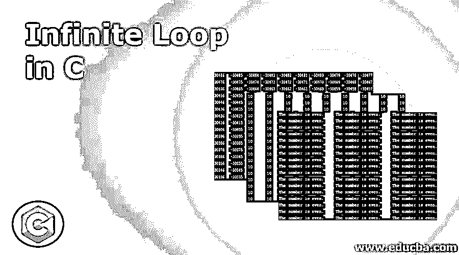
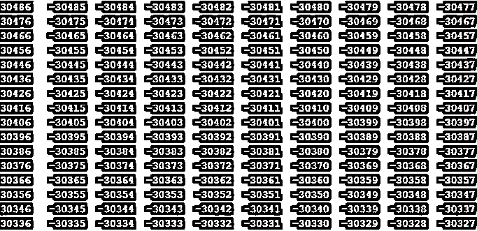
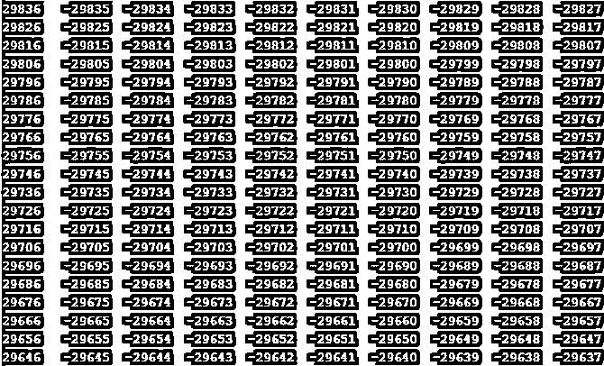
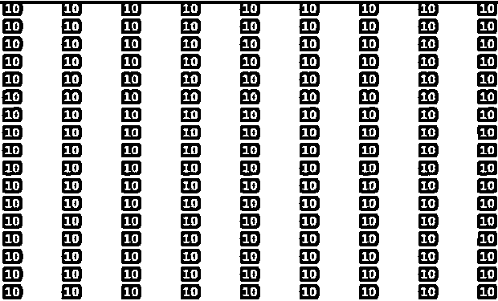
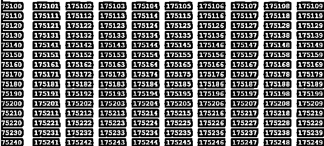
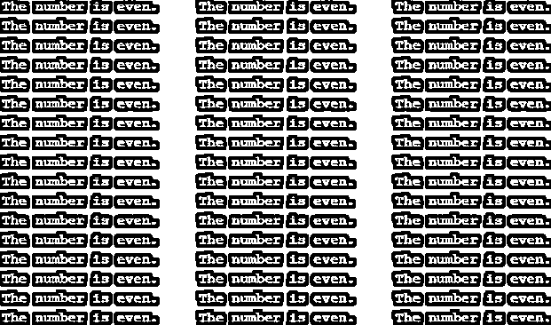
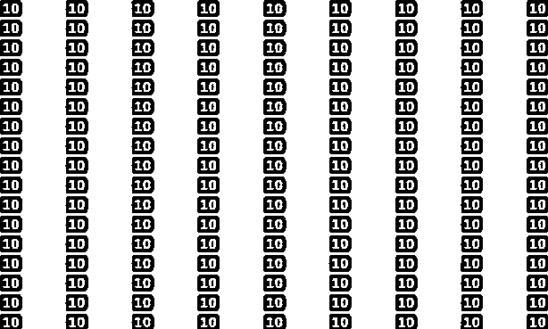

# C 语言中的无限循环

> 原文：<https://www.educba.com/infinite-loop-in-c/>




## C 语言中的无限循环介绍

无限重复且不会终止的循环称为无限循环。无限循环也称为无限循环或不定循环。无限循环大多数时候是由错误造成的，但这并不意味着无限循环是不需要的或没有用的。无限循环可以用在应用程序中，其中应用程序代码将无限期地保持运行，直到它停止(例如 web 服务器),或者其中用户输入将被接受并生成连续的输出，直到用户退出、操作系统进程、游戏等等。

### C 语言中无限循环的函数及实例

程序中的无限循环可以通过两种方式创建:

<small>网页开发、编程语言、软件测试&其他</small>

1.  非故意地
2.  有意地

代码中的错误、错误或指定永不为假的条件会无意中创建无限循环。并且有意地显式创建无限循环以实现应用程序中的某些要求。我们可以使用循环结构来有意或显式地创建无限循环，并重复或无限次运行循环中指定的代码。所以我们可以用下面的循环来创建一个无限循环

1.  for 循环
2.  while 循环
3.  do-while 循环
4.  转到语句
5.  c 宏

#### 1.For 循环

**语法:**

```
for( ; ; )
{
// some code which run infinite times
}
```

在上面的语法中，没有提供 for 循环的三个部分，即初始化、条件和递增/递减，这意味着没有起始值也没有结束条件。如此循环运行无限次。

接下来，我们编写 c 代码，通过下面的例子更清楚地理解无限 for 循环的工作原理。

**代码:**

```
#include <stdio.h>
void main()
{  int i = 10;
for( ; ;)
{
printf("%d\n",i);
}
}
```

**输出:**


在上面的代码中，for 循环无限次运行，并无限次打印 I 值 10。

接下来，我们编写 c 代码来说明这种错误会导致 for 循环中的无限循环

**代码:**

```
#include <stdio.h>
void main()
{  short int x;
for (x = 32765; x< 32768; x++)
{
printf("%d\t", x);
}
}
```

**输出:**




如上所述，因为短整型范围是-32768 到 32767，所以循环运行了无限次，所以当 I 是大于 32767 的增量时，它变为负值，因此条件总是为真。

#### 2.While 循环

**语法:**

```
while(1)
{
// some code which run infinite times
}
```

在上面的语法中，条件传递是 1(非零整数指定真条件)，这意味着条件总是真，并且运行无限次。

接下来，我们编写 c 代码，通过使用 while loop 创建无限循环，示例如下。

**代码:**

```
#include <stdio.h>
void main()
{  int i = 10;
while(1)
{
printf("%d\t",i);
i++;
}
}
```

**输出:**




就像上面的代码一样，while 循环运行了无限次，因为条件总是为真，I 值更新了无限次。

接下来，我们编写 c 代码来说明这种错误会导致 for 循环中的无限循环

**代码:**

```
#include <stdio.h>
void main()
{  int i = 10;
while(i<100)
{
printf("%d\t",i);
}
}
```

**输出:**




在上面的代码中，错误在于 I 值的更新丢失，这导致了一个无限循环。

**除此之外，可能导致无限循环的错误还有:**

*   如果分号放在错误的位置可能会导致无限循环。

**举例:**

```
while(cond);
{
//code
}
```

*   如果逻辑条件因失误而出错，我们使用赋值运算符(=)而不是关系运算符(= =)可能会导致无限循环。

**举例:**

```
while(inp='y')
{
//code
}
```

*   If 循环条件不匹配可能导致无限循环。

**举例:**

```
for(int i=0;i>=0;i++)
{
//code
}
```

#### 3.Do-While 循环

**语法:**

```
do
{
// some code which run infinite times
}  while(1);
```

接下来，我们编写 c 代码，使用 do-while 循环创建无限循环，示例如下。

**代码:**

```
#include <stdio.h>
void main()
{  int i = 10;
do
{
printf("%d\t",i);
i++;
}  while(i);
}
```

**输出:**




#### 4.Goto 语句

**语法:**

```
label:
// some code which run infinite times
goto label;
```

接下来，我们编写 c 代码，通过使用 goto 语句创建无限循环，示例如下。

**代码:**

```
#include <stdio.h>
void checkEven(int num)
{
if (num%2 == 0)
goto even_no;
else
goto odd_no;
even_no:
printf("The number is even.\t");
goto even_no;
odd_no:
printf("The number is odd.\t");
goto odd_no;
}
void main() {
int i = 10;
checkEven(i);
}
```

**输出:**




在上面的代码中，goto 语句变成了无限循环。

#### 5.宏指令

要创建无限循环，我们可以使用定义无限循环的宏。接下来，我们编写 c 代码，在下面的例子中使用宏来创建无限循环。

**代码:**

```
#include<stdio.h>
#define macro_name for( ; ; )
void main()
{
int i=10;
macro_name
{
printf("%d\t", i);
}
}
```

**输出:**




在上面的代码中，定义了宏，其值用于(；;).后来在一个主函数中，宏被它的名字所使用，每当宏的名字出现时，它就被它的值所代替。

### 结论

无限循环是指无限重复且不会终止的循环。正如我们在上面看到的，一个程序可以有意或无意地产生无限循环。我们已经看到了创建无限循环的各种方法，解决无限循环的方法是使用 break 语句。

### 推荐文章

这是一个关于 C 语言中无限循环的指南，在这里我们讨论 C 语言中嵌套循环的介绍，以及它的工作原理、例子和代码实现。您也可以浏览我们推荐的其他文章，了解更多信息——

1.  [C 中的质数(例题)](https://www.educba.com/prime-numbers-in-c/)
2.  [C 中如何反数？](https://www.educba.com/reverse-number-in-c/)
3.  [C 语言中反串介绍](https://www.educba.com/reverse-string-in-c/)
4.  [Java 中的质数|前三个例子](https://www.educba.com/prime-numbers-in-java/)


