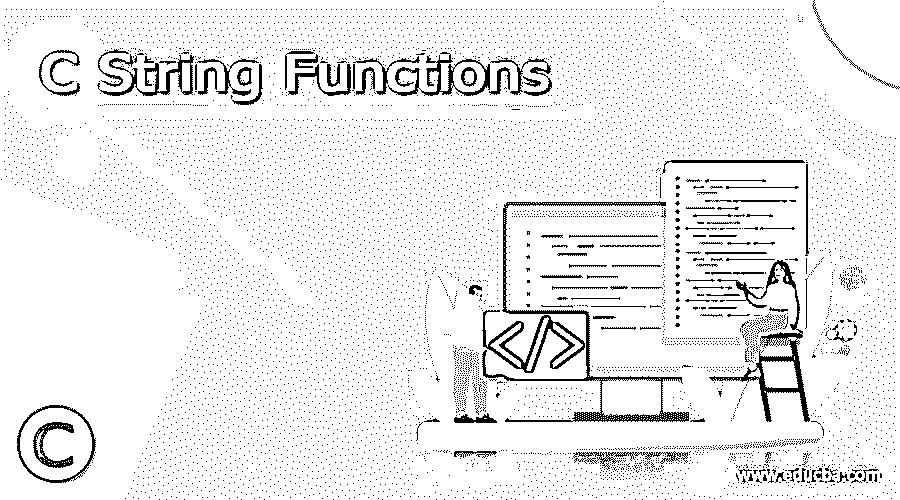

# c 字符串函数

> 原文：<https://www.educba.com/c-string-functions/>




## C 字符串函数简介

字符串函数构成了任何[编程语言](https://www.educba.com/what-is-a-programming-language/)的主干，因为它告诉你一种特定的语言如何处理字符串。处理字符串意味着您的编程语言应该足够高效，能够修改您拥有的字符串并执行所需的更改。有许多 C 字符串函数被创建来使你的字符串处理更容易，因为在那些情况下，你不需要编码，只需要调用它们并在你自己的代码中实现它们。

有两种函数，第一种是库函数，第二种是基于自定义的函数。在后一种情况下，你可以自由地创建你自己的函数或方法，并在你喜欢的时候在你的代码中使用它们。通常这些函数用空括号标识。在这篇 C 字符串函数的文章中，您将学习如何使用 C 函数以及示例[来操作字符串，例如 puts()、](https://www.educba.com/c-puts-function/) gets()、strlen()等。C 中的所有字符串函数都可以在标准库“string.h”中找到。

<small>网页开发、编程语言、软件测试&其他</small>

c 语言是为开发基于系统的应用程序而创建的，这些应用程序用于直接与硬件设备(如内核、驱动程序等)进行交互。基本上用于所有与系统相关的通信，因为它是一种低级系统友好的编程语言。C 编程语言被认为是所有编程语言的基础，通常也被称为过程编程语言、中级编程语言和结构化编程语言。它特定于一台机器，即它依赖于机器，运行起来相对较快。这并不容易理解，因为它需要基本的编程知识和心态。

### C 语言中字符串函数的例子

字符串函数很好用。这里我们将借助实例讨论如何在 C 语言编程中使用字符串函数

#### 1.Printf()

此函数用于打印此函数的双引号("")内的字符串。它也可以用来连接两个字符串。
**代号:**

```
#include<stdio.h>
int main()
{
printf("Name: Hardik");
}
```

#### 2.获取()

该函数用于从用户处获取输入字符串。

**代码:**

```
#include<stdio.h>
int main()
{
char name[30];
printf("Enter name: ");
gets(name);
}
```

#### 3.看跌期权()

这是基于 C 语言的函数，用于在控制台屏幕上显示字符串。这与 printf()函数的不同之处在于，puts()将字符串 s 和一个换行符写入 stdout，即它仅用于显示字符串，而 printf()用于显示 stdout 的各种输出。

**代码:**

```
#include<stdio.h>
int main()
{
char name[30];
printf("Enter name: ");
gets(name);
puts(name);
}
```

#### 4.茶

以下示例中的函数意味着字符串 s 被声明为字符数据类型，大小为 5。这属于字符串的声明和定义部分。

**代码:**

```
char s[5]
```

#### 5.扫描函数()

这是另一个在 C 语言中广泛使用的字符串函数。它用于读取字符，直到遇到空格、制表符或换行符。本质上，这是用来读取一个字符串。

**代码:**

```
#include <stdio.h>
int main()
{
char name[20];
printf("Enter name: ");
scanf("%s", name);
}
```

#### 6.strcpy(s1，s2)

这个函数用于将字符串 s2 的内容复制到主字符串 s1 中。

**代码:**

```
#include <stdio.h>
#include <string.h>
int main () {
char str1[12] = "Hello";
char str2[12] = "World";
char str3[12];
int  len ;
/* copy str1 into str3 */
strcpy(str3, str1);
}
```

#### 7\. strcat()

该函数用于将字符串 s2 的内容连接在字符串 s1 之后。

**代码:**

```
#include <stdio.h>
#include <string.h>
int main () {
char str1[12] = "Hello";
char str2[12] = "World";
char str3[12];
int  len ;
strcat( str1, str2);
}
```

#### 8.斯特伦()

顾名思义，这个函数用来计算字符串的长度。

**代码:**

```
#include <stdio.h>
#include <string.h>
int main () {
char str1[12] = "Hello";
char str2[12] = "World";
char str3[12];
int  len ;
len = strlen(str1);
printf("strlen(str1) :  %d\n", len );
}
```

#### 第九条线()

这个函数用于返回所提供的字符串的反转。

**代码:**

```
#include<stdio.h>
#include <string.h>
int main(){
char str[20];
printf("Enter string: ");
gets(str);
printf("String is: %s",str);
printf("\nReverse String is: %s",strrev(str));
}
```

#### 10\. strcmp()

此函数用于比较两个字符串，如果两个字符串相等，则返回 0。

**代码:**

```
#include<stdio.h>
#include <string.h>
int main(){
char str1[10],str2[10];
gets(str1);
gets(str2);
if(strcmp(str1,str2)==0)
printf("Strings :equal");
else
printf("Strings: not equal");
}
```

#### 11.斯特鲁普()

这个函数用来返回大写的字符。

**代码:**

```
#include<stdio.h>
#include <string.h>
int main(){
char str[20];
gets(str);
printf("String is: %s",str);
printf("\nUpper String is: %s",strupr(str));
}
```

#### 12\. Strlwr()

顾名思义，这个函数用来返回小写的字符串的字符。

**代码:**

```
#include<stdio.h>
#include <string.h>
int main(){
char str[20];
gets(str);
printf("String is: %s",str);
printf("\nUpper String is: %s",strlwr(str));
}
```

#### 13.sizeof()

此函数用于返回字符串的大小，即字符串能够容纳的字符数。

**代码:**

```
#include <stdio.h>
#include <string.h>
int main()
{
char str1[20] = "Hardik";
sizeof(str1)
}
```

#### 14.strchr()

这个函数搜索特定字符串中的字符。

**代码:**

```
#include <stdio.h>
#include <string.h>
int main () {
const char str[] = "http://www.google.com";
const char ch = '.';
char *ret;
ret = strchr(str, ch);
printf("String after |%c| is - |%s|\n", ch, ret);
}
```

上述代码片段的输出是:

**输出:**|后的字符串。| is-| . Google . com |

#### 15.strstr()

这个函数用于在一个已经存在的字符串中搜索一个给定的字符串。

**代码:**

```
#include <stdio.h>
#include <string.h>
int main()
{
char inputstr[70] = "String Function in C at EduCBA";
printf ("Output string is: %s", strstr(inputstr, 'Edu'));
}
```

上述代码片段的输出将是:

**输出** : EduCBA

C 编程语言中有许多预建的库函数，它还提供了创建自定义函数的选项。即使你不想创建一个函数，你也可以写一段符合你需求的代码，但是通过使用函数，你会让你的工作变得更加容易和方便。

### 推荐文章

这是一个 C 字符串函数的指南。这里我们借助实例讨论了如何在 C 语言编程中使用字符串函数。您也可以浏览我们推荐的其他文章，了解更多信息——

1.  [C 运算符](https://www.educba.com/c-operators/)
2.  [c++中的 strcmp()](https://www.educba.com/strcmp-in-c-plus-plus/)
3.  [C 语言中的 strcat()](https://www.educba.com/strcat-in-c/)
4.  [在 C++中反转字符串](https://www.educba.com/reverse-string-in-c-plus-plus/)


