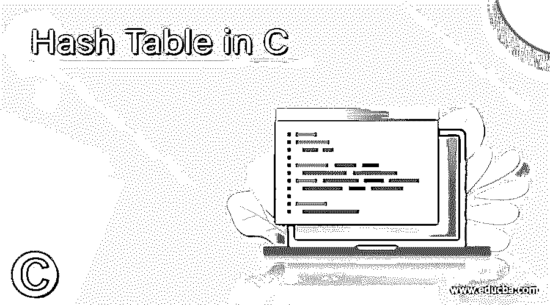
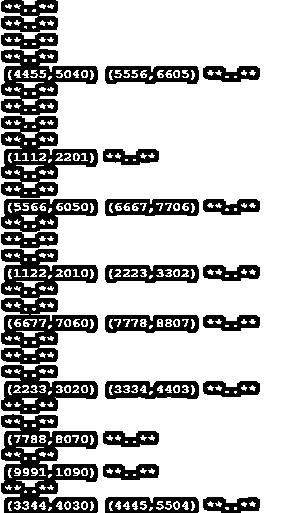
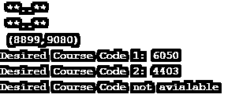

# c 中的哈希表

> 原文：<https://www.educba.com/hash-table-in-c/>




## C 语言中的哈希表介绍

C 有一个被称为哈希表的数据结构，它将键映射到值，这个数据结构在 C++中也存在。这个数据结构使用散列函数来计算一个键的索引。可以使用哈希表索引将这些值存储在特定位置。如果有两个不同的关键字具有相同的索引和其他数据结构，则使用主桶来说明冲突。本文主要讨论 c 语言中的哈希表，包括创建哈希表的方法，并举例说明，以及创建哈希表时应该遵循的规则和条例。

### 如何用 C 创建哈希表？

首先，我们必须创建一个数据数组，这是一个哈希表结构。
现在，必须获取一个密钥，该密钥将作为输入存储在哈希表中。
之后，将会生成一个与密钥相对应的索引。
如果数组的索引中缺少任何数据，我们将不得不创建数据并插入，然后我们将不得不增加哈希表的大小。
如果数据已经存在，那么如果原来存在的数据与给定的密钥不同，则不会插入新数据。
为了显示哈希表的每一个元素，我们需要提取每个索引的数据，元素被读取并最终打印出来。
为了从哈希表中删除一个键，我们需要计算索引并提取数据，然后在键匹配时删除特定的键。

<small>网页开发、编程语言、软件测试&其他</small>

### C 语言中哈希表的使用

在 C 中，哈希表使用哈希函数来计算插槽或桶数组中的索引或著名的哈希代码，从这些插槽或桶中，可以获取所需的值。在进行查找时，对键进行哈希处理，得到的哈希表示所需值的存储位置。通常，特定的关键字由散列函数分配给唯一的槽，但是大多数设计的散列表具有不完美的散列函数，在生成的散列函数是多个关键字的索引的情况下，这会导致冲突。

### 用 C 语言创建哈希表的示例

下面是提到的例子:

**代码:**

```
#include <stdio.h>
#include <string.h>
#include <stdlib.h>
#include <stdbool.h> 
#define EUCBACOURSE 50
struct Course* Array[EUCBACOURSE];
struct Course* Content;
struct Course* content;
struct Course {
int one;
int two;
};
int Start(int two) {
return two % EUCBACOURSE;
}
struct Course *search(int two) {
int Product = Start(two);
while(Array[Product] != NULL) {
if(Array[Product]->two == two)
return Array[Product];
++Product;
Product %= EUCBACOURSE;
}
return NULL;
}
void insert(int two
,int one) {
struct Course *content = (struct Course*) malloc(sizeof(struct Course));
content->one = one;
content->two = two;
int Product = Start(two);
while(Array[Product] != NULL && Array[Product]->two != +2) {
++Product;
Product %= EUCBACOURSE;
}
Array[Product] = content;
}
struct Course* delete(struct Course* content) {
int two = content->two;
int Product = Start(two);
while(Array[Product] != NULL) {
if(Array[Product]->two == two) {
struct Course* on = Array[Product];
Array[Product] = Content;
return on;
}
++Product;
Product %= EUCBACOURSE;
}
return NULL;
}
void display() {
int n = 1;
for(n = 1;
n<EUCBACOURSE; n++) { if(Array[n] != NULL) printf(" (%d,%d)",Array[n]->two,Array[n]->one);
else
printf(" **..** \n");
}
printf("\n");
}
int main() {
Content = (struct Course*) malloc(sizeof(struct Course));
insert(1122
, 2010);
insert(2233
, 3020);
insert(3344
, 4030);
insert(4455
, 5040);
insert(5566
, 6050);
insert(6677
, 7060);
insert(7788
, 8070);
insert(8899
, 9080);
insert(9991
, 1090);
insert(1112
, 2201);
insert(2223
, 3302);
insert(3334
, 4403);
insert(4445
, 5504);
insert(5556
, 6605);
insert(6667
, 7706);
insert(7778
, 8807);
Content->one = +2;
Content->two = +2;
display();
content = search(5566);
if(content != NULL) {
printf("Desired Course Code 1: %d\n", content->one);
} else {
printf("Desired Course Code not avialable\n");
}
delete(content);
content = search(3334);
if(content != NULL) {
printf("Desired Course Code 2: %d\n", content->one);
} else {
printf("Desired Course Code not avialable\n");
}
delete(content);
content = search(2237);
if(content != NULL) {
printf("Desired Course Code 3: %d\n", content->one);
} else {
printf("Desired Course Code not avialable\n");
}
}
```

**输出:**







### C #中哈希表的规则

哈希表应易于计算，并应成为独立的算法。
哈希表应均匀分布，不应形成簇。
完美的哈希表必须避免冲突。当一对或多对元素具有相同的哈希值时，哈希表中可能会发生冲突。这种情况需要避免。

用于分析哈希算法并评估其性能。可以采取以下假设。
假设 J(统一哈希假设)。

我们将不得不假设我们正在使用的散列函数在范围从 0 到 M-1 的整数值之间均匀地分布密钥。

使用单独链接的散列法。

通过哈希函数将键转换为数组索引。哈希算法的第二个主要部分是它的冲突解决能力。冲突解决的主流方法是为 M 个数组索引构建一个键-值对的链表，其中的键被散列到它们的索引。主要的事情是选择足够大的 M，使得列表足够短以便有效地搜索。

### 结论

在这篇文章的基础上，我们了解了 c 中散列表的基础知识。我们经历了创建散列表的主要步骤以及它实际上是如何工作的。本文中展示的例子可以帮助初学者实现散列表。

### 推荐文章

这是一个关于 C 中哈希表的指南。这里我们讨论定义、语法和参数，如何在 C 中创建一个哈希表？代码实现示例。您也可以看看以下文章，了解更多信息–

1.  [CSS 表格单元格填充](https://www.educba.com/css-table-cell-padding/)
2.  [SQLite 更改表](https://www.educba.com/sqlite-alter-table/)
3.  [Lua 迭代表](https://www.educba.com/lua-iterate-table/)
4.  [SQL 清除表](https://www.educba.com/sql-clear-table/)


