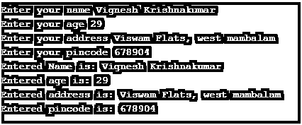
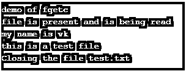
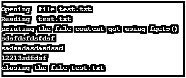

# C puts()函数

> 原文：<https://www.educba.com/c-puts-function/>


## C puts()函数介绍

在任何编程语言中，尝试屏幕上的输出都是至关重要的一部分。在 c 语言中，这是借助 puts 函数实现的。Puts 是一个内置函数，它将一行输出写到屏幕上。它返回写入控制台的字符数加 1，同时打印输出文本的新行，从而将光标移动到新行。它的返回类型是 int。如果执行成功，则返回非负值。如果执行出错，则返回 EOF。

**语法:**

<small>网页开发、编程语言、软件测试&其他</small>

puts 函数的语法如下

```
int puts(const char *str)
```

参数字符串是应该在控制台上打印的文本。

### 看跌期权示例

下面给出的代码和输出解释了输入的例子:

**代码:**

```
#include <stdio.h>
#include <string.h>
void main () {
char op1[30];
char op2[45];
strcpy(op1, "this is first line of puts example");
strcpy(op2, "this is second line of puts example");
puts(op1);
puts(op2);
}
```

**输出:**


### 获取 C #中的函数

gets 函数是一个内置函数，用于从控制台读取字符并将其存储在一个字符串中。它读取字符，直到找到新行或到达 EOF，无论哪一个先出现。

**语法:**

```
char *gets(char *str)
```

str 是存储读取字符的指针。

**代码:**

```
#include<stdio.h>
void main ()
{
char test[30];
printf("Enter your name");
gets(test);
printf("You entered %s",test);
printf("\n the above is an example of gets function");
}
```

**输出:**


### 买入和卖出的例子

下面给出的代码和输出解释了 puts 和 gets 中的示例:

**代码:**

```
#include <stdio.h>
#include <string.h>
int main()
{
char name[50];
printf("Enter your name ");
gets(name);
int age[50];
printf("Enter your age ");
gets(age);
char address[50];
printf("Enter your address ");
gets(address);
int pincode[50];
printf("Enter your pincode ");
gets(pincode);
printf("Entered Name is: ");
puts(name);
printf("Entered age is: ");
puts(age);
printf("Entered address is: ");
puts(address);
printf("Entered pincode is: ");
puts(pincode);
getch();
return 0;
}
```

**输出:**




### put 和 get 中的函数

以下几点用例子解释 sin puts 和 get 的函数:

#### 1\. Fgetc()

这是一个内置的[文件处理函数](https://www.educba.com/file-handling-in-java/)，用于读取文件。它一次读取文件中的一个字符，直到文件结束。该函数为成功执行返回一个非负值。

**语法:**

```
Int fgetc(FILE *fp)
```

fp 是指向文件位置的指针。

**代码:**

```
# include <stdio.h>
int main( )
{
FILE *testfile ;
char c ;
printf( "demo of fgetc" ) ;
testfile = fopen ( "c:\test.txt", "r" ) ;
if ( testfile == NULL )
{
printf ( "\nCould not open file test.txt" ) ;
return 1;
}
printf( "file is present and is being read" ) ;
while ( 1 )
{
c = fgetc ( testfile ) ;
if ( c == EOF )
break ;
printf ( "%c", c ) ;
}
printf("Closing the file test.txt") ;
fclose ( testfile ) ;
return 0;
}
```

**输出:**




#### 2.Fputc()

这是一个内置的[文件处理函数，将](https://www.educba.com/file-handling-in-c-sharp/)文本写入文件。它一次写一个字符。该函数为成功执行返回一个非负值。

**语法:**

```
int fputc(int char, FILE *fp)
```

其中 char 是要写入的字符，fp 是文件的位置。

**代码:**

```
#include <stdio.h>
int main()
{
char ch;
FILE *source;
FILE *destination;
if (source = fopen("c:\source.txt", "r"))
{
ch = getc(source);
destination = fopen("c:\dest.txt", "w+")
while (ch != EOF)
{
fputc(ch, destination);
ch = getc(source);
}
fclose(source);
fclose(destination);
return 0;
}
return 1;
}
```

**输出:**


#### 3.Fgets()

这个函数类似于 fgetc()，只是它逐行读取文件。

**语法:**

```
char *fgets(char *string, int n, FILE *fp)
```

*   fp 是必须从中读取文本的位置
*   *字符串是存储读取字符的位置

**代码:**

```
# include <stdio.h>
int main( )
{
FILE *sourcefile ;
char newdata[50] ;
printf( "Opening  file test.txt " ) ;
sourcefile = fopen( "c:\test.c", "r" ) ;
if ( sourcefile== NULL )
{
printf( "Could not open file test.txt" ) ;
return 1;
}
printf( "Reading  test.txt" ) ;
while( fgets ( newdata, 50, sourcefile ) != NULL )
printf("\nprinting the file content got using fgets()")
printf( "%s" , newdata ) ;
printf("Closing the file test.txt") ;
fclose(sourcefile) ;
return 0;
}
```

**输出:**




#### 4.Fputs()

这个函数类似于 fputc()，只是它逐行写入文件。

**语法:**

```
int fputs(const char *str, FILE *stream)
```

*   *字符串必须写入的流文件
*   Str 是要写入的字符串

**代码:**

```
#include<stdio.h>
#include<stdlib.h>
int main()
{
char input[50];
printf("\n user pls enter input");
scanf("%s",input);
FILE *destfile;
destfile = fopen("D:\test.txt", "w");
if(destfile == NULL)
{
printf("Error opening file\n");
exit(1);
}
printf("\n writing the received input to file");
while( gets(input) != NULL )
{
fputs(input, destfile);
}
printf("\n file is written, open and see");
fclose(destfile);
return 0;
}
```

**输出:**


### 之间的差异

*   **puts()和 fputs():** Puts()用于将文本写入控制台，而 fputs()用于将文本写入文件。Puts()会将输入中的空字符转换成新的一行，而 fputs()不会处理空字符并停止执行。
*   **gets()和 fgets():** Gets 从控制台或 stdin 读取输入，而 fgets 从文件读取输入。使用 Fgets 是安全的，因为在溢出的情况下它会抛出一个错误。当遇到新的一行时，Fgets 停止。Fgets 不检查越界异常。它还会一直读取，直到遇到新的一行。

**代码:**

```
#include<stdio.h>
int main()
{
char author[20];
printf("Enter your favorite author\n");
fgets(author,10,stdin);
printf("My favorite author is %s.\n",author);
FILE *destfile;
destfile = fopen("D:\existing.txt", "w+");
fputs("first line to be entered", destfile);
fputs("second line to be added", destfile);
fputs("thirdine to be added", destfile);
fclose(destfile);
return(0);
}
```

**输出:**


### 结论–C puts()函数

因此，本文详细介绍了 puts 函数及其语法和示例。还详细介绍了与之类似的函数，如 fputc()和 fputs()。同样，像 gets()、fgets()和 fgetc()这样的函数也通过适当的例子进行了讨论。还解释了函数之间的差异。要深入了解这些函数，建议创建示例程序，并从围绕它们的工作中获得乐趣。

### 推荐文章

这是一个 C puts()函数的指南。在这里，我们将详细讨论 puts 函数及其语法和示例，以及关于 fputc()和 fputs()函数。您也可以浏览我们的其他相关文章，了解更多信息——

1.  [C 语言中的算术运算符](https://www.educba.com/arithmetic-operators-in-c/)
2.  [c++中的单一继承](https://www.educba.com/single-inheritance-in-c-plus-plus/)
3.  [c++中的 strcmp()](https://www.educba.com/strcmp-in-c-plus-plus/)
4.  [c++中的 if else 语句](https://www.educba.com/if-else-statement-in-c-plus-plus/)


