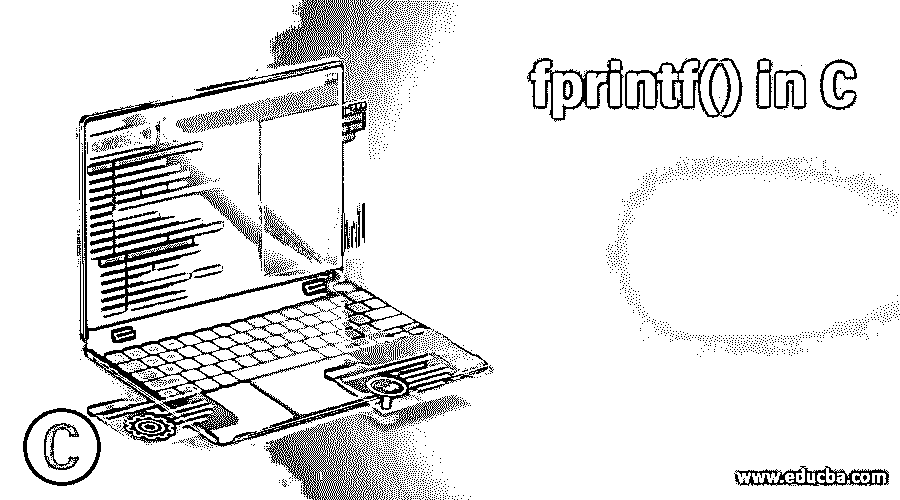
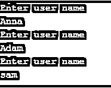
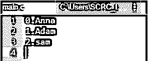
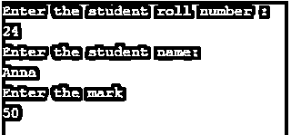
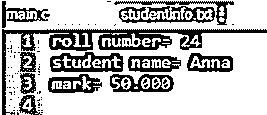
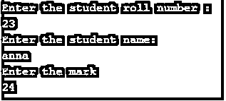
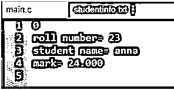

# C 语言中的 fprintf()

> 原文：<https://www.educba.com/fprintf-in-c/>




## C 语言中 fprintf()的介绍

在 C 编程语言中，库函数 fprintf(也称为格式打印函数)发送格式化为流的输出。尽管它打印了消息，但在 stdout 控制台上是不可能的。它几乎类似于普通的 printf()函数，只是它将数据写入文件。此外，fprintf()函数中还有一个额外的参数。它是一个文件指针，指向格式化输出将被写入的文件。如果成功，将返回写入文件的字符总数。如果失败，将返回一个 EOF。

### 语法和参数

下面是 C 编程语言中函数 fprintf()的语法。

<small>网页开发、编程语言、软件测试&其他</small>

```
int fprintf(FILE *stream, const char *format, ...)
```

**参数:**

*   流，它是找到流的文件对象的指针。
*   格式是由要写入流的文本组成的 C 字符串。还存在嵌入的格式标签，这些标签可以被随后添加的参数中提到的值替换，并被格式化。格式标签的原型是%[flags][width][。精度][长度]说明符。

**返回值:**

如果成功，将返回写入文件的字符总数。如果失败，将返回一个 EOF。

格式可以是:

**1。%d:** 将显示一个整数

示例:9

**2。%f:** 浮点数将以固定的十进制格式显示。

例如:9.000050

**3。%.1f:** 显示一个浮点数，小数点后有一个数字。

例如:9.0

**4。%e:** 浮点数将以指数形式显示。

例如:9.00045e+1

**5。%g:** 根据数字大小，浮点数将以固定的十进制格式或指数格式显示。

示例:9.4

**要求的表头格式:**

函数 fprintf 在 C 编程语言中所需的头格式为:

```
#include <stdio.h>
```

### fprintf()函数在 C 中是如何工作的？

*   首先，根据您的需求初始化变量。
*   使用文件指针以写模式打开指定位置的文本文件。
*   如果文件指针为空，则打印一条错误消息。
*   如果文件指针不为空，则根据需求执行命令。
*   打开文件，检查代码是否成功运行，输出是否在其中。

### C #中 fprintf()的示例

让我们看一些 fprintf()函数的示例程序。

#### 示例#1

在文件中打印名字的 c 程序

**代码:**

```
#include<stdio.h>
int main()
{
//initialize two integer variables i and n
int i, n=1;
//initialize one character variable
char s[100];
//open the text file in write mode
FILE *filepntr = fopen("C:\\Users\\SCRC_Laptop\\Documents\\C\\sample.txt", "w");
//if file pointer is null, print the statement
if (filepntr == NULL)
{
printf("Sorry. . The file you are trying to open donot exist . . .");
return 0;
}
//if file pointer is not null, execute the for loop
for (i=0; i<n; i++)
{
puts("Enter user name");
gets(s);
fprintf(filepntr,"%d.%s\n", i, s);
}
fclose(filepntr);
return 0;
}
```

**输出:**


首先，初始化字符变量 s 和两个整数变量 I 和 n，其中 n=1。然后，在指定位置以写模式打开文本文件。如果文件指针为空，打印“对不起。您试图打开的文件不存在。..".如果文件指针不为空，则执行 for 循环，检查 i


假设 n 的值改为 3。如下图所示，将会询问用户名三次。




文件中的数据如下所示。0，1，2 和 3 是 I 的值。




#### 实施例 2

在文件中打印学生详细信息的 c 程序。

**代码:**

```
#include <stdio.h>
int main()
{
//initialise a file pointer
FILE *filepntr;
//
int rollnum;
char studentname[30];
float mark;
//create a file if not already present
filepntr = fopen("studentinfo.txt", "w+");
if (filepntr == NULL)
{
printf("The file you are trying to open does not exist. . . \n");
return 0;
}
printf("Enter the student roll number : \n");
scanf("%d", &rollnum);
fprintf(filepntr, "roll number= %d\n", rollnum);
printf("Enter the student name: \n");
scanf("%s", studentname);
fprintf(filepntr, "student name= %s\n", studentname);
printf("Enter the mark\n");
scanf("%f", &mark);
fprintf(filepntr, "mark= %.3f\n", mark);
fclose(filepntr);  }
```

**输出:**




在这个程序中，首先初始化一个文件指针*filepntr。然后，初始化 rollnum，学名，mark。然后创建一个文件(如果不存在的话)。如果文件指针为空，则打印一条错误消息。完成后，输入用于输入学生编号、学生姓名和分数的代码。在执行代码时，用户将被要求输入这三个值。成功提交后，将在文件夹中创建一个文件。我们的文件指针中提到了创建的文件的文件名。

打开文件时，输入的详细信息将显示在文件中。




#### 实施例 3

c 程序打印一个文件中的学生信息，文件的值为 I。

```
#include <stdio.h>
int main()
{
FILE *filepntr;
int i, n=1;
int rollnum;
char studentname[30];
float mark;
filepntr = fopen("studentinfo.txt", "w+");
if (filepntr == NULL)
{
printf("The file you are trying to open does not exist. . . \n");
return 0;
}
for (i=0; i<n; i++)
{
fprintf(filepntr,"%d\n", i);
printf("Enter the student roll number : \n");
scanf("%d", &rollnum);
fprintf(filepntr, "roll number= %d\n", rollnum);
printf("Enter the student name: \n");
scanf("%s", studentname);
fprintf(filepntr, "student name= %s\n", studentname);
printf("Enter the mark\n");
scanf("%f", &mark);
fprintf(filepntr, "mark= %.3f\n", mark);
}
fclose(filepntr);
return 0;
}
```

**输出:**




这个程序打印索引值以及文件中学生的详细信息。




### 推荐文章

这是一个 C 语言中 fprintf()的指南。在这里，我们还讨论了 fprintf()函数的定义和如何在 C 语言中工作，以及不同的例子和它的代码实现。您也可以看看以下文章，了解更多信息–

1.  [C 语言中的标准错误](https://www.educba.com/stderr-in-c/)
2.  [C 语言中的常量指针](https://www.educba.com/const-pointer-in-c/)
3.  [C 语言中的模数运算符](https://www.educba.com/modulus-operator-in-c/)
4.  [C++ memcpy](https://www.educba.com/c-plus-plus-memcpy/)


