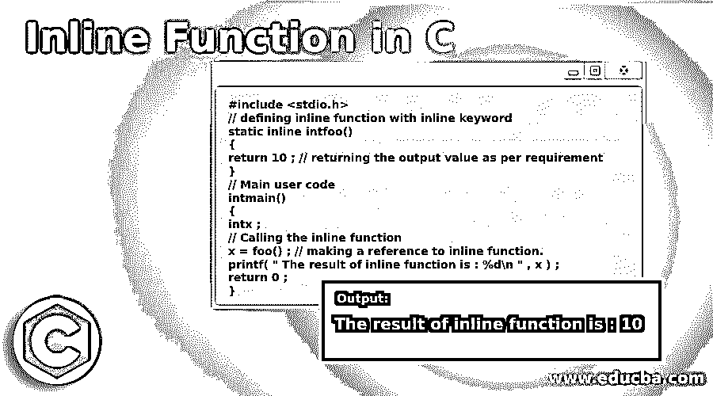

# C 语言中的内联函数

> 原文：<https://www.educba.com/inline-function-in-c/>




## C 语言中的内联函数介绍

C 编程中的内联函数在小型和复杂的代码中都扮演着重要的角色。它节省了大量的执行时间以及内存空间。为了定义内联函数，我们需要使用“inline”关键字。每当你在代码中需要一个函数时，我们所要做的就是在逻辑上定义一个内联函数，然后在代码中多次使用它，因为它将有助于提高代码的执行速度。它定义起来很小，一旦定义就可以反复使用。

**C 编程中定义内联函数的语法:**

<small>网页开发、编程语言、软件测试&其他</small>

```
inline  data_typefunction_name ( data_type argument1 , data_type argument2 )
{
return () ; // return as defined by the user.
}
```

在上面的语法中，inline 关键字是强制的，这样编译器在执行代码时会知道，在函数之后我们需要数据类型及其名称。在函数名下，我们可以根据代码的需求传递任意数量的参数。最后，根据函数定义，return 语句也是强制的，这取决于我们想要什么样的输出。

### C 语言中内联函数的例子

下面是提到的例子:

#### 示例#1

演示编程中内联函数的工作原理。

**代码:**

```
#include <stdio.h>
// defining inline function with inline keyword
static inline intfoo()
{
return 10 ; // returning the output value as per requirement
}
// Main user code
intmain()
{
intx ;
// Calling the inline function
x = foo() ; // making a reference to inline function.
printf( " The result of inline function is : %d\n " , x ) ;
return 0 ;
}
```

**输出:**


**说明:**

*   正如你在上面的代码中看到的，我们已经定义了一个名为“foo()”的整数数据类型的内联函数，当我们调用给定的内联函数时，它将返回值 10。
*   因此，在主代码中有一个名为“x”的整数变量，这样我们就可以通过引用调用内联函数。虽然我们也可以调用内联函数 foo()而不做任何引用，但是做一个引用来避免冲突是很好的。

#### 实施例 2

演示整数加法的内联函数。

**代码:**

```
#include <stdio.h>
// defining inline function with inline keywordfor addition
static inline intaddition(int a, int b)
{
return a + b ; // returning the output value as per requirement
}
// Main user code
intmain()
{
inta, b, x ;
printf( " Please enter the value of integer a : " ) ;
scanf( "%d", &a ) ;
printf( " Please enter the value of integer b : " ) ;
scanf( "%d" , &b ) ;
// Calling the inline function by reference
x = addition( a , b ) ;
printf( " The result of addition of the given integers is : %d\n " , x ) ;
return 0 ;
}
```

**输出:**


**说明:**

*   正如你在上面的代码中看到的，我们已经定义了一个名为“addition(int a，int b)”的整数数据类型的内联函数，当我们向该函数传递两个整数参数时，它将返回整数 a + b 的值。因此，在主代码中有一个名为“x”的整数变量，这样我们就可以通过引用调用内联函数。
*   虽然我们也可以调用内联函数 addition( int a，int b)而不做任何引用，但是做一个引用来避免冲突是很好的。之后，我们从用户那里获取输入值进行加法运算，然后在最后调用内联函数。

#### 实施例 3

演示整数减法的内联函数。

**代码:**

```
#include <stdio.h>
// defining inline function with inline keyword
static inline intsubtraction(int a, int b)
{
return a - b ; // returning the output value as per requirement
}
// Main user code
intmain()
{
inta, b, x ;
printf( " Please enter the value of integer a : " ) ;
scanf( "%d", &a ) ;
printf( " Please enter the value of integer b : " ) ;
scanf( "%d" , &b ) ;
// Calling the inline function
x = subtraction( a , b ) ; // making a reference to inline function.
printf( " The result of subtraction of the given integers is : %d\n " , x ) ;
return 0 ;
}
```

**输出:**


**说明:**

*   正如你在上面的代码中看到的，我们已经定义了一个名为“subtraction(int a，int b)”的整数数据类型的内联函数，当我们向该函数传递两个整数参数时，它将返回整数 a–b 的值。因此，在主代码中有一个名为“x”的整数变量，这样我们就可以通过引用调用内联函数。
*   虽然我们也可以调用内联函数 subtraction( int a，int b)而不做任何引用，但是做一个引用来避免冲突是很好的。之后，我们从用户那里获取输入值进行减法运算，然后在最后调用内联函数。

请注意，我们可以使用任何数学术语，如乘法、除法等。如果定义具有正确的逻辑和解释，一切都会正常工作。

### 结论

与有时会导致错误的宏相比，即使多次调用内联函数也没有风险。内联函数总是比带有宏函数代码更容易调试。内联的代码效率取决于代码的结构和组织。

### 推荐文章

这是一个 C 语言内联函数的指南。这里我们讨论 C 语言内联函数的介绍，以及实现内联函数的例子，以便更好地理解。您也可以看看以下文章，了解更多信息–

1.  [C 文字量](https://www.educba.com/c-literals/)
2.  [C 中的内存分配](https://www.educba.com/memory-allocation-in-c/)
3.  [C 中的常数](https://www.educba.com/constants-in-c/)
4.  [C 语言中的文件处理](https://www.educba.com/file-handling-in-c/)


