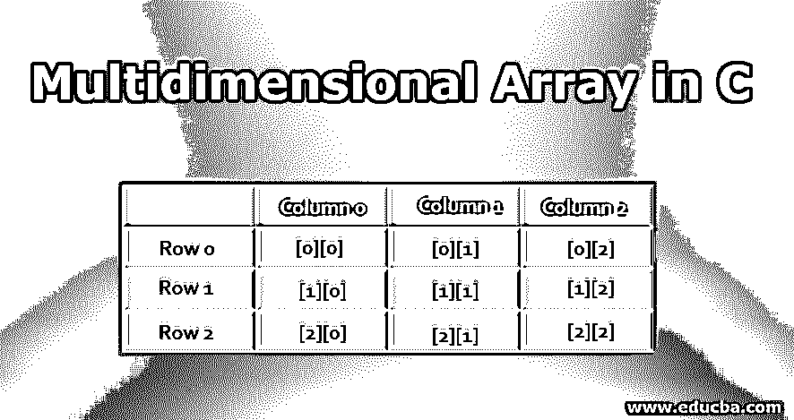
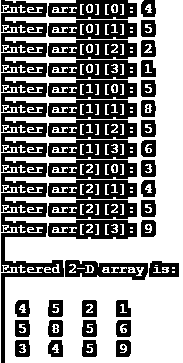
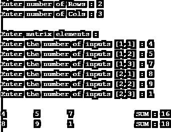
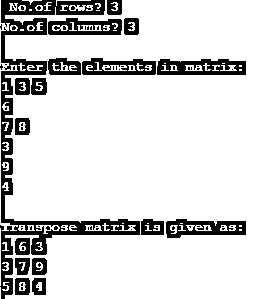
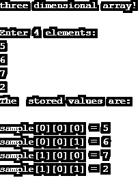
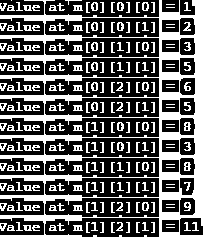
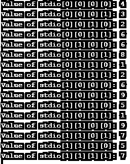

# C 中的多维数组

> 原文：<https://www.educba.com/multidimensional-array-in-c/>




## C 语言中的多维数组介绍

本文主要关注 c 语言中的多维数组,它主要用于计算机和研究分析。一般来说，一个阵列线性聚焦一条被称为一维的信息。一维存储的数据只有单一的信息，如学生的注册号码。在某些情况下，有必要以包含行和列的表格格式存储数据，或者处理复杂的数据。为了将它可视化，我们需要一种矩阵格式，我们称之为二维阵列，其中的排列需要图像、图形的像素。数据以表格形式存储。数组操作是通过使用整形、挤压等功能重新排列元素来执行的。

如何在 C 中声明多维数组？

<small>网页开发、编程语言、软件测试&其他</small>

**语法:**

多维数组的一般声明如下:

```
type name [ size] [size]……. N;
```

*   在这里，数据类型名称–它表示元素的类型(整数、浮点)。
*   数组名称–表示分配给维度数组的名称。
*   行大小–行元素的数量，例如。row-size = 8，则数组有 8 行。
*   列大小–列元素的数量。

### 如何在 C 中初始化多维数组？

[多维数组](https://www.educba.com/powershell-multidimensional-array/)的大小是通过乘以各个维度的大小来预测的。它们以两种方式存储值，如行主和列主。并且内存分配验证长度和秩属性。

在 C 中，多维数组有三种类型:

1.  二维数组
2.  三维阵列
3.  四维阵列

#### 1.二维数组

二维数组的结构是矩阵，使用行和列来实现，也称为数组的数组。内存分配以行为主和列为主两种方式进行。默认格式是主要行。当采用二维数组时，每个元素都被认为是一维数组或者是一维数组的集合。二维数组使用两个 for 循环或嵌套循环，其中外部循环从 0 执行到初始下标。

**语法:**

```
type array name [ no. of rows] [ no. of Columns];
```

**举例:**

```
int td [4][3];
```

这里 4 是行数，3 是列数。

**二维数组的初始化**

二维数组的初始化有多种方式，如下所示。

```
int m [3][2] = {{10,3} {4,2} {6,4} {5,4} {3,4}};
int di [2][4] = {10,5,8,12,45,13,11,61};
```

在这里，我们已经提到了行数和列数，在框中必须分配第二个索引，以使编译器了解行的结束和开始。下表显示了二维数组的内存分配。


元素的数量是通过操作行数和列数并分别乘以行数和列数来确定的。例如，数组包含的元素数量为 B [-2…4，-3.6]。它是由下限和上限计算出来的。

```
No. of rows= UB-LB +1
=4-(-2) +1 = 4+2+1= 7
No. of columns = UB-LB +1
= 6-(-3) + 1= 11
No. of elements = Rows * columns = 7 * 11 =77 elements
```

**实施**

这是使用行主和列主实现完成的

Row-Major:
地址操作的公式如下:

```
= B +W [ n(I-1) +[J-1]]
```

其中 b-是基地址，n-是 W 字节的列数。
栏目专业:

```
= B +W [ r(j-1) +[i-1]]
```

其中 r–是行数。

**二维数组的例子**

二维数组的例子有:

**例#1**

数组 A [-10.10，20…35]的每个元素需要 1 个字节的内存。并且该阵列适合地址 400 处的列 major，找到 A [0，30]的位置。

**解决方案**

```
BA =400, W=1
R = no. of rows -> 10-(-10) +1 = 21
I= -10; J= 20
Address A [0,30] = 400 + 1[(0-(-10) +21(30-20))]
=400 +(10+21*10)
=400 +(10+210) = 620
```

在二维数组中执行的一个常见操作是矩阵代数，其中 m * n 矩阵为 b。矩阵的数学概念的实现与编程中的相同。

下面的例子以矩阵格式存储一个元素并打印出来。

**代码:**

```
#include<stdio.h>
int main ()
{
int a[3][4], i, j;
for(i = 0; i < 3; i++)
{
for(j = 0; j < 4; j++)
{
printf("Enter arr[%d][%d]: ", i, j);
scanf("%d", &a[i][j]);
}
}
printf("\nEntered 2-D array is: \n\n");
for(i = 0; i < 3; i++)
{
for(j = 0; j < 4; j++)
{
printf("%3d ", a[i][j] );
}
printf("\n");
}
return 0;
}
```

**输出:**




**例 2**

执行两个矩阵求和的 c 程序。

**代码:**

```
#include <stdio.h>
int main()
{
int mat[20][20];
int i,j,r,c;
int s;
printf("Enter number of Rows :");
scanf("%d",&r);
printf("Enter number of Cols :");
scanf("%d",&c);
printf("\nEnter matrix elements :\n");
for(i=0;i< r;i++)
{ for(j=0;j< c;j++)
{
printf("Enter the number of inputs [%d,%d] : ",i+1,j+1);
scanf("%d",&mat[i][j]);
}
}
printf("\n");
for(i=0;i< r;i++)
{
s=0;
for(j=0;j< c;j++)
{
printf("%d\t",mat[i][j]);
s+=mat[i][j];
}
printf("\tSUM : %d",s);
printf("\n");
}
}
```

上面的程序计算两个矩阵 A[20，20] B[20，20]的和，前提是它们有两个相同的矩阵。通过 for 循环，需要两个输入矩阵和循环来接受矩阵。

**输出:**




**例 3**

矩阵的转置

交换行和列以形成一个新的矩阵，这被称为矩阵的转置。

示例:


然后转置给定，


用 C 程序实现矩阵转置

**代码:**

```
#include<stdio.h>
int main()
{
int T[5][5],i,j,a,b;
printf(" No.of rows?");
scanf("%d",&a);
printf("No.of columns?");
scanf("%d",&b);
printf("\nEnter the elements in matrix:\n");
for(i=0;i<b;++i)
for(j=0;j<a;++j)
scanf("%d",&T[i][j]);
printf("\nTranspose matrix is given as:\n");
for(i=0;i<b;++i)
{
for(j=0;j<a;++j)
printf("%d ",T[j][i]);
printf("\n");
}
return 0;
}
```

在上面的程序中，我们使用了两个 for 循环来读取一个矩阵并打印它的转置，嵌套的 for 循环用于显示输出。这里我们使用了 3* 3 矩阵。

**输出:**

**

** 

#### 2.三维阵列

它被称为数组元素的数组或矩阵的数组。这是一个很时髦的想法，但是一旦你开始实践这个逻辑，它会变得更容易实现。并且该 3-D 阵列需要多于 3 个维度，并且需要大容量的存储器来存储。

它可以声明为:

```
data_type array_name [table name] [ no. of row] [ no. of column]
int L[m][n] [p];
```

int L[3][4][2]；这里数组 L 可以容纳 24 个元素。所有这些都可以在编译过程中初始化，但是当未初始化时就会被放入一个垃圾值中。

初始化可以用与二维数组相同的方式完成。这是一个样本，

```
int L [2][3][4] = {{{2,2,1,3},{1,6,5,11},{22,11,13,5}},{{13,5,77,8},{6,8,2,4},{3,2,7,8}}};
```

**三维数组的例子**

以下是三维数组的一些示例:

**例#1**

下面是一个简单的用 [C 语言编程的例子，展示了](https://www.educba.com/career-in-c-programming/)三维数组。这是通过考虑 3d 元素的 3 个 for 循环使用 for 循环来完成的。

**代码:**

```
#include <stdio.h>
void main()
{
printf("three dimensional array!\n\n");
int i, j, k, s[2][1][2], siz;
siz=2*1*2;
printf("Enter %d elements: \n",siz);
for(i = 0; i < 2; ++i)
{
for (j = 0; j < 1; ++j)
{
for(k = 0; k < 2; ++k )
{
scanf("%d", &s[i][j][k]);
}
}
}
printf("The stored values are:\n\n");
for(i = 0; i < 2; i++)
{
for (j = 0; j < 1; j++)
{
for(k = 0; k < 2; k++)
{
printf("sample[%d][%d][%d] = %d\n", i, j, k, s[i][j][k]);
}
}
}
}
```

**输出:**




**例 2**

自动打印元素的三维数组的另一个例子。

**代码:**

```
#include<stdio.h>
int main()
{
int m[2][3][2] =
{
{ {1,2}, {3,5}, {6,5} },
{ {8,3}, {8,7}, {9,11} }
};
for (int i = 0; i <2; ++i)
{
for (int j = 0; j <3; ++j)
{
for (int k = 0; k <2; ++k)
printf("Value at m[%d][%d][%d] = %d\n", i, j, k, m[i][j][k]);
}
}
}
return 0;
}
```

**输出:**




#### 3.四维阵列

这是一个三维数组，很难管理维度。它被看作是一堆立方体，适用于空间矢量。

**四维数组的声明:**

键入数组名称[1][2][3][4] ……。[n]其中 1，2 表示维度，n 表示第 n 个维度。

**举例:**

```
int state [5][6][7][8];
```

**四维数组的例子**

实现四维数组的 c 程序。

**代码:**

```
#include <stdio.h>
int main()
{
int i, j, k, l, s;
int d[2][2][2][2];
s = 2;
d[0][0][0][0] = 4;
d[0][0][0][1] = 3;
d[0][0][1][0] = 2;
d[0][0][1][1] = 6;
d[0][1][0][0] = 6;
d[0][1][0][1] = 8;
d[0][1][1][0] = 1;
d[0][1][1][1] = 2;
d[1][0][0][0] = 6;
d[1][0][0][1] = 9;
d[1][0][1][0] = 5;
d[1][0][1][1] = 1;
d[1][1][0][0] = 9;
d[1][1][0][1] = 7;
d[1][1][1][0] = 5;
d[1][1][1][1] = 7;
for (i = 0; i < s; i++) {
for (j = 0; j < s; j++) {
for (k = 0; k < s; k++) {
for (l = 0; l < s; l++) {
printf("Value of stdio[%d][%d][%d][%d]: %d ", i, j, k, l, d[i][j][k][l]);
printf("\n");
}
}
}
}
return 0;
}
```

**输出:**




### 结论

最后，在本文中，我们讨论了 C 编程中的[多维数组](https://www.educba.com/multidimensional-array-in-python/)及其子类型。以及它们的声明和访问矩阵格式的元素。这些技术应用于二进制搜索和排序实现等概念中。在这里，索引起着关键的作用，因为它们指定了数组结构中的一个元素。

### 推荐文章

这是一个 C 语言中多维数组的指南。这里我们讨论如何用 C 语言初始化多维数组，并附有例子。你也可以看看下面的文章来了解更多-

1.  [最佳 C 编译器](https://www.educba.com/best-c-compilers/)
2.  [c#中的 2D 数组](https://www.educba.com/2d-arrays-in-c-sharp/)
3.  [C 语言中的二维数组](https://www.educba.com/2-d-arrays-in-c/)
4.  [C#多维数组](https://www.educba.com/c-sharp-multidimensional-arrays/)


