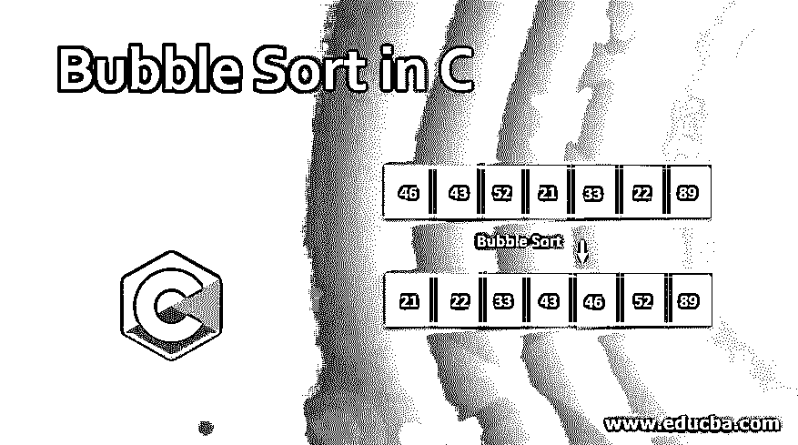

# C #中的冒泡排序

> 原文：<https://www.educba.com/bubble-sort-in-c/>




## C 语言中的冒泡排序介绍

在 C 语言中有不同的排序技术，如选择排序、冒泡排序、合并排序、快速排序、堆排序、插入排序等。排序是将元素、项目或数据按特定顺序排列的过程，以便于分析或可视化。在这篇文章中，让我们讨论一下冒泡排序。在 C 编程语言中，冒泡排序是一种简单的排序技术，如果元素没有按正确的顺序排列，则以升序或降序交换或排列元素，以交换相邻的元素，直到元素按正确的顺序排列。

### 冒泡排序工作

一般来说，冒泡排序也称为下沉排序，其中检查每个相邻的元素，如果没有正确的顺序，则进行交换，并且这种元素交换过程继续进行，直到没有要交换的项目或元素。让我们看看算法:

<small>网页开发、编程语言、软件测试&其他</small>

#### 算法

让我们考虑一系列元素。

第一步:在第一步中，它将从列表的第一个元素开始，并开始与下一个元素进行比较。

**步骤 2:** 对整个列表进行元素的检查和交换。为此，首先将第一个元素与相邻元素进行比较。这可以使用 for 循环来完成

对于列表中的所有元素

if list[索引 1 处的项目]> list[索引+ 1 的项目]

**步骤 3:** 比较完元素后，使用下面的 swap(列表[索引 1 处的项目]，列表[索引+ 1 的项目])按升序交换这些元素

**步骤 4:** 交换所有元素后，这些元素按升序排列。

### C #中的冒泡排序示例

让我们考虑下面使用冒泡排序对列表 46、43、52、21、33、22、89 进行排序的例子。

```
#include <stdio.h>
void swap_ele(int *p, int *q)
{
int temp = *p;
*p = *q;
*q = temp;
}
void bubble_Sort(int a[], int n)
{
int i, j;
for (i = 0; i < n-1; i++)
for (j = 0; j < n-i-1; j++)
if (a[j] > a[j+1])
swap_ele(&a[j], &a[j+1]);
}
void print_list(int a[], int size)
{
int i;
for (i=0; i < size; i++)
printf("%d ", a[i]);
printf("\n");
}
int main()
{
int a[] = {46, 43, 52, 21, 33, 22, 89};
int n = sizeof(a)/sizeof(a[0]);
bubble_Sort(a, n);
printf("Sorted list using bubble sort: \n");
print_list(a, n);
return 0;
}
```

**输出:**


在上面的代码中，我们编写了 3 个不同的函数，每个函数的工作方式都不同。首先，我们编写了一个交换数字的函数,“swap_ele”是这样一个函数，我们将两个变量作为参数传递，其中一个变量存储第一个元素，第二个变量存储第二个元素，在函数内部，我们使用“temp”变量来存储值并交换元素。

在第二个函数中，它是一个非常重要的函数，具有使用“swap_ele”函数进行冒泡排序的工作逻辑。在这个“bubble_Sort”函数中，我们声明了两个变量“I”和“j ”,其中如果 i = 0，则 j 循环指向列表的最大元素，并且在 i = 1 的情况下将“I”值递增 1 之后，则“j”循环指向列表的第二大元素，依此类推。然后使用“for”循环，我们可以遍历列表，然后使用“if”循环，我们比较存储在两个变量中的值，其中较小的元素交换到左侧，较大的值元素交换到列表的右侧，使用“swap_ele”函数。第三个功能是使用“for”循环打印排序后的列表，并按升序排列。最后，为了编译程序，我们需要编写 main 函数，在其中声明一个列表，并对该列表使用“bubble_sort”函数，使用“print_list”函数打印排序后的列表。

所以一般来说，冒泡排序非常简单，它将遍历整个列表，列表中最大的项将与列表中所有的项交换，这个最大的元素放在列表的最右边。因此，当最大的元素被放置在列表的右侧位置时，现在不考虑该元素，同时再次比较第二大元素，将第二大元素与除了最大元素之外的所有剩余元素进行比较，该第二大元素也被放置在列表的最右侧，就在最大元素之前，并且继续该过程，直到没有最大元素留下来交换，并且所有元素都以升序排序。类似地，这可以用于以降序对列表进行排序，其中包含冒泡排序逻辑的函数的“for”循环中的“if”循环将发生变化。

### 结论

冒泡排序是最简单的排序技术之一，也称为下沉排序。这种排序技术通常在引入排序概念时使用。冒泡排序是一种以升序或降序对列表或数组中的项目进行排序或排列的技术。该技术首先确定列表或数组中的最大元素，然后将其与其他项目进行比较，然后将其放在列表的最末端的八个项目中，并继续该过程，直到没有可交换的项目。

### 推荐文章

这是一个 c 语言中的冒泡排序的指南。这里我们讨论冒泡排序的工作原理，以及示例和算法步骤。您也可以看看以下文章，了解更多信息–

1.  [Python 中的冒泡排序](https://www.educba.com/bubble-sort-in-python/)
2.  [Java 中的冒泡排序](https://www.educba.com/bubble-sort-in-java/)
3.  [JavaScript 中的气泡排序](https://www.educba.com/bubble-sort-in-javascript/)
4.  [冒泡排序算法](https://www.educba.com/bubble-sort-algorithm/)


