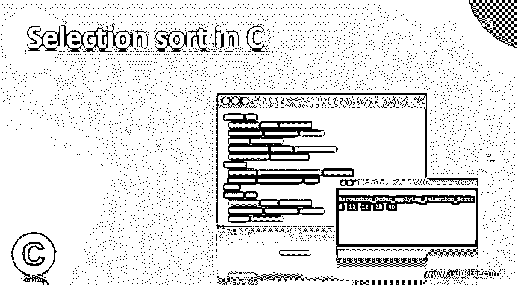

# C #中的选择排序

> 原文：<https://www.educba.com/selection-sort-in-c/>




## C 语言中选择排序的定义

C #中的选择排序是一个非常重要的算法，用于对数组中的元素集进行排序。排序算法以数组中存在元素的方式对一组元素执行排序，然后遍历以通过首先找到最小的元素来执行排序。一旦找到最小的元素，如果遍历时的下一个元素小于当前元素或下一个元素，则该元素将被交换。以类似的方式，它执行遍历，直到数组中的所有元素都排序完毕。

**语法:**

<small>网页开发、编程语言、软件测试&其他</small>

C 语言中没有表示选择排序的特定语法，但仍然有一些模式可以遵循，以实现和遍历选择排序，如下所示:

```
# include<stdio.h>
int main()
{
Declaration of array containing elements or numbers []
Print the elements
Get the elements within loop stored in array properly
Apply the logic for selection sorting to sort the algorithm
Apply the selection sorting algorithm in the iteration till all the elements get sorted.
}
```

### C #中选择排序是如何工作的？

C #中的选择排序的工作方式是算法负责对数组中的所有元素进行排序。选择排序算法通过对数组执行选择排序来对数组进行排序，直到它被排序为止。选择排序有一种机制，通过替换数组中找到的最小元素，从开始到结束遍历来搜索元素。

一旦在数组中找到最小的元素，它就会随着下一个元素而改变，并不断重复，直到所有的元素都以正确的方式排序。基本上，该算法在给定的阵列中保持两个子阵列，其中两个概率在迄今定义的两个子阵列的情况下出现。概率表示子数组可能已经保持排序，或者子数组的剩余部分保持未排序。

在每次迭代遍历中，执行选择排序算法，从未排序数组的范围中选取数组中存在的最小元素，然后替换到排序数组中。排序算法的工作方式是元素按升序排序，最小的元素放在最前面。此外，该示例将阐明在 C 语言中执行选择排序的过程。

选择排序的算法流程如下:

```
Selection_Sort (arr_0, size_0)
Repeat (size-1) times
Set the first unsorted element as smallest
For each elements in un_sorted format representation comes like
If element in arr_0 < current_element in arr_0
Set element as smallest
Swap the smallest element found with the new smallest element in un_sorted arr_0
End Selection_Sort
```

存在一些性能指标来获得有效的性能分析，并获得执行中的整个程序的复杂性。

程序中的整个循环执行具有它们自己的计算值的迭代，例如从第一次迭代开始直到最后一次迭代，其中第一次迭代具有(n-1)个比较，随后是第二次迭代循环，其中比较的数目为(n-2 ),第三次迭代循环具有比较值的数目为(n-3 ),等等，因此如果对于一个迭代循环存在 n 个元素，那么在重复迭代和排序之后最后一个元素为 1。

因此，在多次比较之后，执行的时间复杂度将几乎等于 O(n2)。

接下来是选择排序的时间复杂度相对于最坏时间复杂度计算的场景，其中复杂度为 n 的平方，用于升序或降序排序。

最好的情况也包括同样的情况，数组已经排序，那么在这种情况下，它出来的是 O 的 n 次方。

如果排序需要应用于一个数组中混乱的元素，那么在这种平均情况下，它也仅仅是 0 的 n 次方。

### 例子

这个程序演示了对一系列元素执行的选择排序算法，如下面的输出所示。

```
#include <stdio.h>
void swap_1 (int *r_0, int *z_9)
{
int tm_str = *r_0;
*r_0 = *z_9;
*z_9 = tm_str;
}
void selecn_Sort (int arr_0[], int sz)
{
for (int st = 0; st < sz - 1; st++)
{
int mn_indx = st;
for (int j = st + 1; j < sz; j++)
{
if (arr_0[j] < arr_0[mn_indx])
mn_indx = j;
}
swap_1(&arr_0[mn_indx], &arr_0[st]);
}
}
void print_arr (int arr_1[], int sz_1)
{
for (int k = 0; k < sz_1; ++k) {
printf("%d ", arr_1[k]);
}
printf("\n");
}
int main()
{
int data_0[] = {18, 40, 25, 05, 12};
int sz = sizeof(data_0) / sizeof(data_0[0]);
selecn_Sort(data_0, sz);
printf("Asccending_Order_applying_Selection_Sort:\n");
print_arr(data_0, sz);
}
```

**输出:**


**说明:**

首先，系统要求输入数组中的元素，一旦存储，就应用选择排序算法。然后编写一个名为 void swap_1 的函数，以便将这两个元素从它们各自的位置交换。然后用实现和交换元素所需的逻辑编写选择排序算法。

按降序执行排序，并通过选择每个循环中的最小元素来更改是小于还是大于。将最小的元素放在适当的位置，因为它将在以后的某个时间点被引用。然后使用指向数组并打印相应数据的函数。最终的驱动函数是调用代码执行并继续执行以给出最终的输出。

### 结论

选择排序是 C 语言中一个非常重要的排序算法。它通常在开发人员根据需求实现时使用。它所具有的时间复杂度用于需要频繁排序的逻辑实现的验证。它通过在每次迭代中执行比较，从整个数组序列中找到最小的元素。

### 推荐文章

这是一个 C 语言中选择排序的指南，在这里我们讨论选择排序的定义、语法以及在 C？举例说明。您也可以看看以下文章，了解更多信息–

1.  [排序字符串 C++](https://www.educba.com/sort-string-c/)
2.  [在 JavaScript 中排序字符串](https://www.educba.com/sort-string-in-javascript/)
3.  [Python 中的排序字符串](https://www.educba.com/sort-string-in-python/)
4.  [排序字符串 PHP](https://www.educba.com/sort-string-php/)


