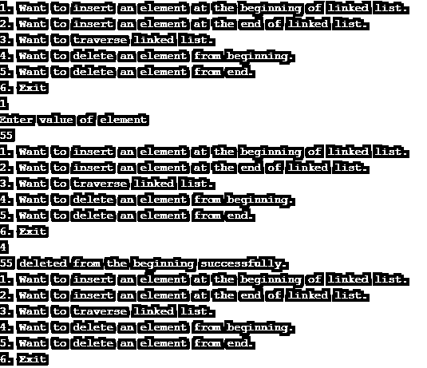

# C 中的链表

> 原文：<https://www.educba.com/linked-list-in-c/>


## C 语言中的链表介绍

顾名思义，链表意味着将列表链接在一起，或者我们可以说链表是通过链接相互连接的数据结构序列。链表使用指针在数据结构中实现。它是一种线性数据结构，数据存储在不同的位置，并使用指针进行链接。链表节点有两个部分，一个是数据部分，另一个是地址部分，它在从特定位置插入和删除元素时有很多优点，不会浪费任何时间，因为它通过改变大小来动态地节省内存空间。

**语法**

<small>网页开发、编程语言、软件测试&其他</small>

让我们看看在代码中表示链表的语法:

```
struct node {
int data ;
struct node *next ;
} ;
```

在上面的链表语法中，struct 是必须使用的关键字，因为在 struct 的帮助下，我们可以创建自定义的数据结构，因为它是一个节点，所以使用 node 关键字，所以我们创建一个数据结构，在 node 中，我们有两个部分，一个是整数数据部分，而另一个是指向链表中下一个节点的指针。

基本上，链表节点有两个部分:

*   **数据部分:**包含用户的数据
*   **指针部分:**它会一直指向代码中链表的下一个成员。

### C 中链表是如何工作的？

现在我们将通过 C 代码讨论链表的工作，并做简要说明。下面是演示链表工作的 C 代码:

**代码:**

```
#include <stdio.h>
#include <stdlib.h>
struct node {
int data ;
struct node *next ;
};
struct node *start = NULL ;
void insert_begin(int) ;
void insert_end(int) ;
void traverse() ;
void delete_begin() ;
void delete_end() ;
int count = 0 ;
int main () {
int x, data ;
for (;;) {
printf("1\. Want to insert an element at the beginning of linked list.\n") ;
printf("2\. Want to insert an element at the end of linked list.\n") ;
printf("3\. Want to traverse linked list.\n") ;
printf("4\. Want to delete an element from beginning.\n") ;
printf("5\. Want to delete an element from end.\n") ;
printf("6\. Exit\n") ;
scanf("%d", &x) ;
if (x == 1) {
printf("Enter value of element\n") ;
scanf("%d", &data) ;
insert_begin(data) ;
}
else if (x == 2) {
printf("Enter value of element\n") ;
scanf("%d", &data) ;
insert_end(data) ;
}
else if (x == 3)
traverse() ;
else if (x == 4)
delete_begin() ;
else if (x == 5)
delete_end() ;
else if (x == 6)
break ;
else
printf("Please enter valid input.\n") ;
}
return 0 ;
}
void insert_begin(int i) {
struct node *t ;
t = (struct node*)malloc(sizeof(struct node)) ;
t -> data = i;
count++ ;
if (start == NULL) {
start = t ;
start->next = NULL ;
return ;
}
t->next = start ;
start = t ;
}
void insert_end(int i) {
struct node *t, *temp ;
t = (struct node*)malloc(sizeof(struct node));
t -> data = i;
count++ ;
if (start == NULL) {
start = t ;
start->next = NULL ;
return ;
}
temp = start ;
while (temp->next != NULL)
temp = temp->next ;
temp->next = t ;
t->next   = NULL ;
}
void traverse() {
struct node *t ;
t = start ;
if (t == NULL) {
printf("Linked list is empty.\n") ;
return ;
}
printf("There are %d elements in linked list.\n", count) ;
while (t->next != NULL) {
printf("%d\n", t->data) ;
t = t->next ;
}
printf("%d\n", t->data); // Print last node
}
void delete_begin() {
struct node *t ;
int n ;
if (start == NULL) {
printf("Linked list is empty.\n") ;
return ;
}
n = start->data ;
t = start->next ;
free(start) ;
start = t ;
count-- ;
printf("%d deleted from the beginning successfully.\n", n) ;
}
void delete_end() {
struct node *t, *u ;
int n;
if (start == NULL) {
printf("Linked list is empty.\n") ;
return ;
}
count-- ;
if (start->next == NULL) {
n = start->data ;
free(start) ;
start = NULL ;
printf("%d deleted from end successfully.\n", n) ;
return ;
}
t = start ;
while (t->next != NULL) {
u = t ;
t = t->next ;
}
n = t->data ;
u->next = NULL ;
free(t);
printf( "%d deleted from end successfully.\n ", n) ;
}
```

**输出:**




**说明:**

在上面的代码中，我们创建了一个节点，还创建了节点的地址部分。我们添加了 link 的 5 个主要功能，帮助我们在代码中执行各种可能的操作。所以我们在链表的开头和结尾都声明了插入、删除操作。声明了另一个函数来遍历链接在一起的列表。

在主类中，我们已经声明了两个整型数据类型的变量，分别为“I”和“data”。在开始时声明了所有的功能之后，我们将实现一个 if-else 循环，这样我们就可以在提到的功能之间切换。对于所有 5 个功能，我们通过算法在代码中实现逻辑。

为了在开始时插入列表，我们创建了一个节点 t，并在其数据部分将其命名为 x。因此，如果 start 为空，则 start 将被放入节点 t 数据部分，而地址部分将指向下一个为空的部分。该过程将在开头插入元素。同样，我们在代码中定义了链表开头和结尾的插入和删除逻辑。

### 结论

内存利用率在复杂和简单的代码中都扮演着重要的角色。因此，在链表的帮助下，内存利用可以很容易和有效地完成。当我们不知道列表的大小时最有用。它可以相应地增长和收缩。

### 推荐文章

这是一个 C 语言中链表的指南。这里我们讨论 C 语言中链表的介绍，语法，链表是如何工作的，以及一个实现的例子。您也可以浏览我们的其他相关文章，了解更多信息——

1.  [LinkedIn 网站](https://www.educba.com/linkedin-website/)
2.  [LinkedIn 个人资料页面](https://www.educba.com/linkedin-profile-page/)
3.  Java 中的链接列表
4.  [JavaScript 中的 linked list](https://www.educba.com/linkedlist-in-javascript/)


