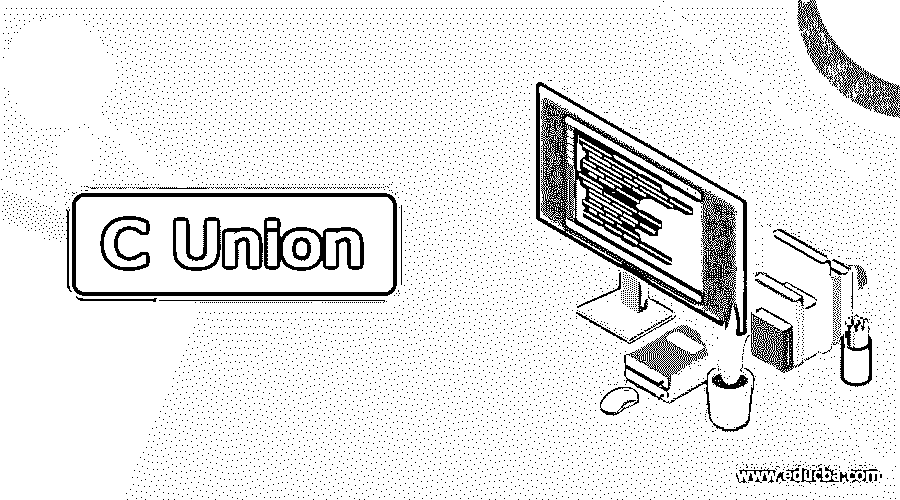

# 工会

> 原文：<https://www.educba.com/c-union/>




## C Union 简介

Union 是 c 中用户定义的数据类型，它允许将不同数据类型的不同数据元素存储在同一个内存位置。它提供了一种有效利用内存的方法，因为在任何给定时间只能访问一个联合成员。因此，在任何时候，并集的大小都等于其最大元素的大小。虽然一个联合就像一个结构，但主要的区别是在一个结构中，一个独立的内存被分配给该结构的每个成员，而在联合中，它是一个共享内存，其大小相当于最大成员的大小。

**语法:**

<small>网页开发、编程语言、软件测试&其他</small>

联合可以定义如下。

```
union UnionName
{
UMember1;
UMember2;
UMember3;
} UnionReference;
```

可以使用引用“UnionReference”来访问 C Union 成员。联合是一个关键词。

**内存分配中的结构和联合示例:**

让我们演示一下 struct 和 union 在内存分配上的区别。

**代码:**

```
#include <stdio.h>
struct samp_structure
{
char name1[30];
int e_id;
float e_slry;
char name2[60];
}s;
union s_union
{
char name1[30];
int e_id;
float saly;
}u;
int main()
{
printf("size of structure :%ld bytes \n", sizeof(s));
printf("size of union : %ld bytes\n", sizeof(u));
return 0;
}
```

**输出:**


### C 联合的示例

让我们在下面提到的例子的帮助下看看实现:

#### 示例#1

这是定义 C 联合并访问其成员的示例。

**代码:**

```
#include <stdio.h>
#include <string.h>
union test {
int tint;
float tf;
char tstr[20];
};
int main( ) {
union test t;
t.tint = 100;
printf( "record.i : %d\n", t.tint);
t.tf= 200.5;
printf( "record.f : %f\n", t.tf);
strcpy( t.tstr, "Test");
printf( "record.str : %s\n", t.tstr);
return 0;
}
```

**输出**:


#### 实施例 2

下面是与上面相同的代码，只是打印语句被重新安排了。

**代码:**

```
#include <stdio.h>
#include <string.h>
union test {
int tint;
float tf;
char tstr[20];
};
int main( ) {
union test t;
t.tint = 100;
t.tf = 200.5;
strcpy( t.tstr, "Test");
printf( "record.i : %d\n", t.tint);
printf( "record.f : %f\n", t.tf);
printf( "record.str : %s\n", t.tstr);
return 0;
}
```

**输出:**


如果仔细观察输出，可以看到垃圾值被分配给了 int 和 float，因为字符串最终被分配了内存，也就是说，由于成员在联合中共享内存，其值当前被存储的成员将可以访问内存。

#### 实施例 3

匿名联合是没有命名的联合，因此它们可以在任何嵌套结构或联合中使用[。匿名联合的成员可以在它们的定义范围内被直接访问。类似地，匿名结构可以用在匿名联合中。](https://www.educba.com/nested-structure-in-c/)

**匿名联合的语法和结构如下:**

```
// Anonymous union example
union
{
char anoUChar;
int anoUNum;
};
// Anonymous structure example
struct
{
char anoSChar;
int anoSNum;
};
```

**结构中的匿名结构联合示例:**

```
#include<stdio.h>
struct testscope
{
// Anonymous union
union
{
char testChar;
int testNum;
int testNum2;
};
};
int main()
{
struct testscope ts;
ts.testNum = 65;
// Note that members of union are accessed directly
printf("testchar = %c, testnum = %d,testnum2 = %d", ts.testChar, ts.testNum,ts.testNum2);
return 0;
}
```

**输出:**


testchar 被赋值为‘A ’,因为 union 存储器中最近的值是 65，它被赋值给 testNum，因此相应的 ASCII 字符被打印出来。

**Note:** The members of the union are accessed directly.

**联合中的匿名结构示例:**

```
#include<stdio.h>
union testscope
{
// Anonymous union
struct
{
char testChar;
int testNum;
int testNum2;
};
};
int main()
{
union testscope ts;
ts.testNum = 65;
ts.testChar='V';
//Note: The members of struct are accessed directly
printf("testchar = %c, testnum = %d,testnum2 = %d", ts.testChar, ts.testNum,ts.testNum2);
return 0;
}
```

**输出:**


### 结论

因此，联合有助于有效地管理内存。联合的缺点是只有最后输入到联合中的值才可用。当不需要同时访问联合成员时，应该使用它。

### 推荐文章

这是一本关于 C 联合的指南。在这里，我们讨论 c 联合的介绍、语法和不同的代码实现示例。你也可以看看下面的文章来了解更多-

1.  [C 关键词](https://www.educba.com/c-keywords/)
2.  [C 编程中的数组](https://www.educba.com/arrays-in-c-programming/)
3.  [c++中的回文程序](https://www.educba.com/palindrome-program-in-c-plus-plus/)
4.  [C 存储类](https://www.educba.com/c-storage-classes/)


