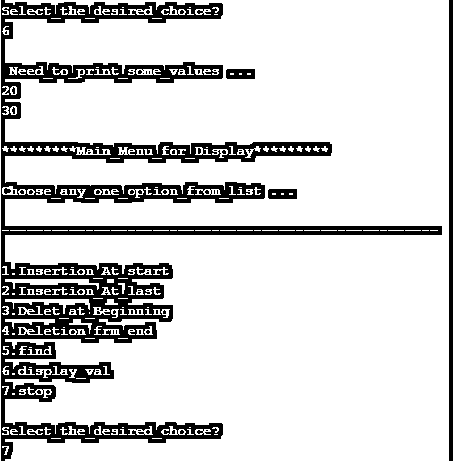

# C 语言中的循环双向链表

> 原文：<https://www.educba.com/circular-doubly-linked-list-in-c/>


## C 语言中循环双向链表的定义

循环双向链表在 C 或任何编程语言中都是一种非常有用的数据结构。循环双向链表是一种由一个指针指向前一个节点的节点和一个指向定义数组中前一个节点的下一个节点组成的链表。循环双向链表被认为是一种复杂的数据结构，它在实现的链表中处理大量的指针和地址管理。它在定义的列表中不包含空指针。

### 句法

循环双向链表没有特定的语法，但是仍然需要执行创建数据结构的一些初始步骤，并且一旦创建，可以对该链表执行许多操作，如下所示:

<small>网页开发、编程语言、软件测试&其他</small>

```
#include <stdio.h>
Struct node_1
{
Struct node *prvs;
int some_data;
Struct node *nxt;
}
```

遵循场景:

–开始时插入
–结束时插入
–从开始时移除
–从结束时移除

关闭数据结构并执行进一步的操作。

### C 中循环双向链表是如何工作的？

由于循环双向链表是一个双向链表，其中指针以某种方式指向彼此，并且不存在 null 的概念，因此指针概念在内部工作。这是一种被认为是复杂的链表，因为前一个节点和指向前一个节点的下一个节点。因此，可以断定最后一个节点包含整个列表的前一个或第一个节点的地址。

列表中出现的第一个节点包含指针在其前一个节点中的最后一个节点的地址。由于循环双向链表需要三种结构，因此，它需要更多的空间和更昂贵的操作，特别是在它的基础部分。在双向链表的情况下，搜索变得非常容易和有效，因为用指针操作很容易。但是有时开发人员并不喜欢这种数据结构，因为对整个链表应用的基本操作代价很高。

循环双向链表在内存管理中起着重要作用的另一个因素，因为它为单元格中的每个元素提供了适当的内存。头作为一个变量包含列表的第一个元素的地址。然后，这个第一个元素是列表的开始节点，下一个节点包含第二个元素，依此类推，直到指向第一个节点的最后一个指针再次证明该节点是指向第一个节点的最后一个节点，因为它不包含任何空元素概念。有各种操作作为循环双向链表的一部分来执行，如在开头插入、在结尾插入、从开头删除、在结尾删除。

### 例子

让我们讨论 c 语言中循环双向链表的例子。

#### 示例#1

这个例子展示了一个循环双向链表的实现，操作包括在开始插入，在最后插入，在开始删除，在最后删除，进一步展示了操作。

**代码:**

```
#include<stdio.h>
#include<stdlib.h>
struct nd_0
{
struct nd_0 *prv_1;
struct nd_0 *nxt_1;
int dta;
};
struct nd_0 *head;
void insrtion_begnng();
void insrtion_lst();
void delnt_begnng();
void deln_lst();
void show();
void srch();
void main ()
{
int choce =0;
while(choce != 8)
{
printf("\n*********Main_Menu_for_Display*********\n");
printf("\nChoose_any_one_option_from_list ...\n");
printf("\n----------------------------------------------------\n"); printf("\n1.Insertion_At_start\n2.Insertion_At_last\n3.Delet_at_Beginning\n4.Deletion_frm_end\n5.find\n6.display_val\n7.stop\n");
printf("\nSelect_the_desired_choice?\n");
scanf("\n%d",&choce);
switch(choce)
{
case 1:
insrtion_begnng();
break;
case 2:
insrtion_lst();
break;
case 3:
delnt_begnng();
break;
case 4:
deln_lst();
break;
case 5:
srch();
break;
case 6:
show();
break;
case 7:
exit(0);
break;
default:
printf("Select_entry_of_your_choicce..");
}
}
}
void insrtion_begnng()
{
struct nd_0 *ptr_0,*temp_1;
int item_0;
ptr_0 = (struct nd_0 *)malloc(sizeof(struct nd_0));
if(ptr_0 == NULL)
{
printf("\nList_Overflow");
}
else
{
printf("\nEnter desired_element");
scanf("%d",&item_0);
ptr_0->dta=item_0;
if(head==NULL)
{
head = ptr_0;
ptr_0 -> nxt_1 = head;
ptr_0 -> prv_1 = head;
}
else
{
temp_1 = head;
while(temp_1 -> nxt_1 != head)
{
temp_1 = temp_1 -> nxt_1;
}
temp_1 -> nxt_1 = ptr_0;
ptr_0 -> prv_1 = temp_1;
head -> prv_1 = ptr_0;
ptr_0 -> nxt_1 = head;
head = ptr_0;
}
printf("\nInserted_Node..\n");
}
}
void insrtion_lst()
{
struct nd_0 *ptr_0,*temp_1;
int itm_0;
ptr_0 = (struct nd_0 *) malloc(sizeof(struct nd_0));
if(ptr_0 == NULL)
{
printf("\niList_overflow");
}
else
{
printf("\nEnter desired_val");
scanf("%d",&itm_0);
ptr_0->dta=itm_0;
if(head == NULL)
{
head = ptr_0;
ptr_0 -> nxt_1 = head;
ptr_0 -> prv_1 = head;
}
else
{
temp_1 = head;
while(temp_1->nxt_1 !=head)
{
temp_1 = temp_1->nxt_1;
}
temp_1->nxt_1 = ptr_0;
ptr_0 ->prv_1=temp_1;
head -> prv_1 = ptr_0;
ptr_0 -> nxt_1 = head;
}
}
printf("\nnode_insertd_at_lst\n");
}
void delnt_begnng()
{
struct nd_0 *temp_1;
if(head == NULL)
{
printf("\n List_UNDERFLOW");
}
else if(head->nxt_1 == head)
{
head = NULL;
free(head);
printf("\ndelete_node_at_beginning\n");
}
else
{
temp_1 = head;
while(temp_1 -> nxt_1 != head)
{
temp_1 = temp_1 -> nxt_1;
}
temp_1 -> nxt_1 = head -> nxt_1;
head -> nxt_1 -> prv_1 = temp_1;
free(head);
head = temp_1 -> nxt_1;
}
}
void deln_lst()
{
struct nd_0 *ptr_1;
if(head == NULL)
{
printf("\n List_Underflow");
}
else if(head->nxt_1 == head)
{
head = NULL;
free(head);
printf("\nDeleted_Node\n");
}
else
{
ptr_1 = head;
if(ptr_1->nxt_1 != head)
{
ptr_1 = ptr_1 -> nxt_1;
}
ptr_1 -> prv_1 -> nxt_1 = head;
head -> prv_1 = ptr_1 -> prv_1;
free(ptr_1);
printf("\nDeleted_Node\n");
}
}
void show()
{
struct nd_0 *ptr_0;
ptr_0=head;
if(head == NULL)
{
printf("\nnot_to_print_anything;;");
}
else
{
printf("\n Need_to_print_some_values ... \n");
while(ptr_0 -> nxt_1 != head)
{
printf("%d\n", ptr_0 -> dta);
ptr_0 = ptr_0 -> nxt_1;
}
printf("%d\n", ptr_0 -> dta);
}
}
void srch()
{
struct nd_0 *ptr_0;
int itm,i_0=0,flag=1;
ptr_0 = head;
if(ptr_0 == NULL)
{
printf("\nBlank_all_elements.\n");
}
else
{
printf("\nSearch_for_items?\n");
scanf("%d",&itm);
if(head ->dta == itm)
{
printf("found_location_item %d",i_0+1);
flag=0;
}
else
{
while (ptr_0->nxt_1 != head)
{
if(ptr_0->dta == itm)
{
printf("element_at_location %d ",i_0+1);
flag=0;
break;
}
else
{
flag=1;
}
i_0++;
ptr_0 = ptr_0 -> nxt_1;
}
}
if(flag != 0)
{
printf("Element_Not_found\n");
}
}
}
```

**输出:**





### 结论

循环双向链表是链表的一种，是数据结构的一部分，在内存管理方面有很多优点。它轻松支持复杂的指针概念。可以对这个包含一行中的元素的数据结构执行许多操作和运算。

### 推荐文章

这是一个关于 C 中循环双向链表的指南。在这里我们讨论循环双向链表的定义、语法和参数，如何在 C 中工作？代码实现示例。您也可以看看以下文章，了解更多信息–

1.  [C#链表](https://www.educba.com/c-sharp-linkedlist/)
2.  [C 语言中的链表](https://www.educba.com/linked-list-in-c/)
3.  Java 中的链接列表
4.  [Java 中的反向链表](https://www.educba.com/reverse-linked-list-in-java/)


