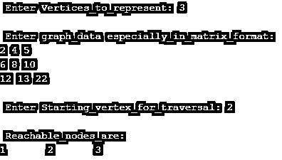

# C 语言中的 BFS 算法

> 原文：<https://www.educba.com/bfs-algorithm-in-c/>


## C 语言中的 BFS 算法介绍

BFS 是一种遍历算法，主要应用于从一个节点移动到另一个节点的图形上，用于各种操作和使用。使用 BFS 算法对每个节点的访问使得整个算法被视为一个高效且有用的算法。使用 BFS 算法从图中的一个节点遍历到另一个节点有一定的方法，即首先遇到选定的节点，然后横向到达下一个节点或直接移动到该节点。在这个主题中，我们将学习 c 语言中的 BFS 算法

### 句法

BFS 没有特定的语法，但是遵循一些算法步骤从根遍历到基。因此，要使用的算法如下:

<small>网页开发、编程语言、软件测试&其他</small>

定义如下所示的结构:

```
Struct node {
char lbl;
boolean vlue;
}
```

*   后面是要定义的变量
*   然后用定义的矩阵形成变量
*   计算每个节点。
*   显示所有顶点
*   检查相邻的顶点
*   检查最终部署和
*   构建 BFS 遍历的逻辑。
*   运行主要功能
*   推动整个计划

更多信息将在示例部分中说明，在示例部分中，实现将利用上述算法并进行适当的表示。

### BFS 算法在 C 中是如何工作的？

如前所述，BFS 是一种遍历算法，用于在带有顶点的图上执行的许多遍历和搜索活动。存在一个工作范例，用于从一个节点到另一个节点的具有详细信息的遍历，规则如下:

*   广度优先搜索(BFS)是一种用于遍历的算法，也被认为是一种具有数据结构的搜索树。
*   作为初始节点或任何任意节点的节点，实际的遍历将从那里开始，然后向前移动；它将用于探索邻居处的其余其他节点，在移动到深度级别的下一个节点之前，该节点将用于该节点的当前深度。
*   BFS 的工作方式与 DFS 算法完全相反，DFS 算法也用于相同的目的，即使用一些规则和规定来遍历图的顶点，这些规则和规定代替节点，甚至邻接节点也适用于回溯和扩展其中的其他节点。
*   BFS 已经被开发和实现了，但是当它被 C . Y Lee 用作遍历算法以通过导线路由找到最短路径时，才得到了最终的认可。
*   BFS 是一种非递归实现，类似于深度优先搜索的非递归实现，但不同之处在于它使用队列，而不是堆栈，并且还检查最近浏览的顶点是要检查的实际顶点还是已经浏览过的顶点。必须记住，不应该重复遍历同一个顶点；然后，只有从队列中出列是可能的。
*   我假设对于 G0 是任何树，那么在该树中，来自 BFS 算法的队列替换被用于 DFS 产出的堆栈。
*   队列由节点和顶点组成，节点和顶点存储有标签，用于从目的节点进行跟踪和回溯。
*   BFS 搜索的最终结果不过是一个广度优先的优化树，将有几乎所有的信息供随时参考。
*   当使用 BFS 算法时，有时会谈到图的完整性，该算法是广度优先搜索的输入，该搜索被假设为表示相邻列表或相关内容的有限图，它也可以是相邻矩阵。
*   这些算法主要用于人工智能领域，整个输入和训练集以树的形式设计，并使用 BFS 算法进行预测和遍历。
*   BFS 算法是唯一被认为是有限且完全的算法之一，它使得无限图隐含地表示出一些有用且相关的目标，而不像 DFS 算法那样完备性和相关信息不达标。
*   BFS 算法具有时间复杂度测量的模式，根据该实现，该模式得出为 O(V+E ),其中 V 表示树中存在的顶点的数量，E 表示树中存在的边的数量。只有在遍历时覆盖了所有节点，这种复杂性才被认为是有限的。
*   BFS 用于解决许多存在的图论问题，如垃圾收集复制、二分图测试、二叉树的串行化或反串行化，这允许以高效和有效的方式进行树的大量重建。

### C 语言中 BFS 算法的例子

这个程序演示了 BFS 算法在 C 语言中的实现，该算法通过调整邻居节点和相邻节点进行操作，用于各种图形遍历方式，如下面的输出所示。

```
#include<stdio.h>
#include<conio.h>
int a_0[30][20],q_1[30],visited_nodes[30],n_8,i_0,j_1,f_5=0,r_2=-1;
void bfs_logic(int v_8) {
for (i_0=1;i_0<=n_8;i_0++)
if(a_0[v_8][i_0] && !visited_nodes[i_0])
q_1[++r_2]=i_0;
if(f_5<=r_2) {
visited_nodes[q_1[f_5]]=1;
bfs_logic(q_1[f_5++]);
}
}
void main() {
int v_8;
printf("\n Enter Vertices_to_represent:");
scanf("%d",&n_8);
for (i_0=1;i_0<=n_8;i_0++) {
q_1[i_0]=0;
visited_nodes[i_0]=0;
}
printf("\n Enter graph_data especially_in_matrix_format:\n");
for (i_0=1;i_0<=n_8;i_0++)
for (j_1=1;j_1<=n_8;j_1++)
scanf("%d",&a_0[i_0][j_1]);
printf("\n Enter Starting_vertex_for_traversal:");
scanf("%d",&v_8);
bfs_logic(v_8);
printf("\n Reachable_nodes_are:\n");
for (i_0=1;i_0<=n_8;i_0++)
if(visited_nodes[i_0])
printf("%d\t",i_0); else
printf("\n Bfs not_possible_if_not_proper.");
getch();
}
```

**输出:**




**解释**:程序期望输入树中将要出现的顶点数。然后，如图所示，以从根到基本可到达节点的矩阵格式，用表示为顶点的邻接节点来形成树。

### 结论

BFS 算法非常有用，并且正在被探索，因为它现在随着人工智能的繁荣而变得非常流行。它甚至在图论中也起着关键的作用，在图论中，实现了具有大量顶点和节点的树以供遍历。BFS 使实现的树成为有限的，这也有助于提供相关的和必需的信息。

### 推荐文章

这是一个 C 语言中 BFS 算法的指南。这里我们讨论了 BFS 算法在 C 语言中是如何工作的，并给出了例子和输出。您也可以看看以下文章，了解更多信息–

1.  [BFS 算法](https://www.educba.com/bfs-algorithm/)
2.  [C 编程中的模式](https://www.educba.com/patterns-in-c-programming/)
3.  [C 编程中的数组](https://www.educba.com/arrays-in-c-programming/)
4.  [c++中的套接字编程](https://www.educba.com/socket-programming-in-c-plus-plus/)


