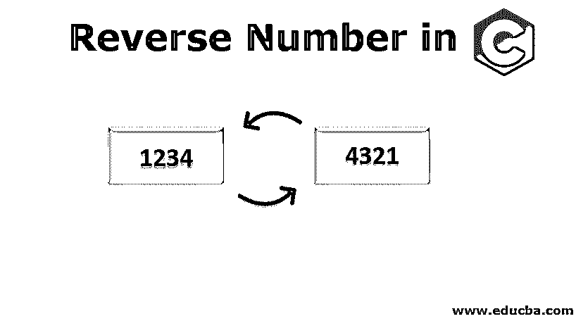

# C 语言中的反数

> 原文：<https://www.educba.com/reverse-number-in-c/>




## C 语言中逆数的介绍

[编程语言](https://www.educba.com/what-is-a-programming-language/)很多，C 语言是所有编程语言的基础语言而闻名。它允许用户使用内置函数执行各种操作。除了内置之外，它还允许我们创建定制的函数来开发新的逻辑。在这篇文章中，我们将看到如何在 C 语言中反转一个数字。C 中的反数是指将给定的数字打印回正面。例如，给定的数是 123，那么这个数的倒数就是 321。让我们看看如何在 C 程序中构建这个逻辑。

### C 语言中的逆数逻辑

为了反转 C 中的数字，我们使用了模数(%)。反向编号的逻辑如下:

<small>网页开发、编程语言、软件测试&其他</small>

1.  首先，初始化一个反向数为 0。
2.  然后，将 reverse 乘以 10。
3.  将给定的数除以 10，求模数。
4.  添加模数和倒数。
5.  打印第四步的结果。
6.  将给定的数除以 10
7.  重复步骤 2 到 6，直到输出。

### 如何在 C 中求一个数的逆序？

在这一节中，我们将借助例子来看看如何使用各种方法来反转一个数字。

#### 示例 1:使用 While 循环反转数字

首先，我们必须了解 While 循环的工作原理。而循环会根据代码中 While 一词后面提到的条件执行几次。如果这个条件为真，那么它将执行 While 循环括号内的代码。如果条件为假，那么它将跳转到 While 循环之后的代码，而不执行 While 循环的代码。让我们看看如何使用 While 循环来查找反向数字。

**代码:**

```
#include<stdio.h>
#include<conio.h>
int main()
{
int number, reverse_number = 0;
printf("Enter a number to reverse value:"); // allow user to enter a number
scanf("%d", &number); // takes value from user
while (number != 0)
{
reverse_number = reverse_number * 10;
reverse_number = reverse_number + number % 10;
number = number / 10;
}
printf("Reverse of entered number is: %d", reverse_number); //print reverse value
return 0;
}
```

**输出:**
**


T8】**

#### 示例 2:使用递归反转数字

**代码:**

```
#include<stdio.h>
#include<conio.h>
int reverse(int);
int main()
{
int number, reverse_number = 0;
printf("Enter a number to reverse value:"); // allow user to enter a number
scanf("%d", &number); // takes value from user
reverse_number = reverse(number);
printf("Reverse of entered number is: %d", reverse_number); // print reverse value
return 0;
}
reverse(int number)
{
static reverse_number = 0;
if (number == 0)
return 0;
reverse_number = reverse_number * 10;
reverse_number = reverse_number + number % 10;
reverse(number/10);
return reverse_number;
}
```

**输出:**

#### 


#### 示例 3:使用 For 循环反转数字

首先，我们将理解下面给出的 For 循环的工作原理:

在 For 循环中，首先我们为代码初始化和声明变量。在条件被评估之后。这个初始化步骤在代码中只执行一次。如果条件为真，那么它将执行 For 循环块内的代码。如果条件为假，那么它将跳转到 For 循环之后的代码，而不执行 For 循环的代码。在 For 循环之后，将执行 increment 语句。之后，将再次检查条件。如果条件为真，循环将被执行，循环将重复自身，即循环体、增量语句和条件。当条件为假时，循环结束。让我们看看如何使用 For 循环找到一个倒数。

**代码:**

```
#include<stdio.h>
#include<conio.h>
int main()
{
int number, remainder_number, reverse_number= 0, i;
printf("Enter a number to reverse value:"); // allow user to enter a number
scanf("%d", &number); // takes value from user
for(i = number; i >0; )
{
remainder_number= i % 10;
reverse_number = remainder_number + reverse_number * 10;
i = i/ 10;
}
printf("Reverse of entered number is: %d", reverse_number); //print reverse value
return 0;
}
```

**输出:**


#### 示例 4:使用 Do-while 循环反转数字

do-while 循环类似于 while 循环，但是在 do-while 循环中，循环至少执行一次。

在 Do While 循环中，条件出现在循环的末尾，因此 Do 循环中的语句在检查条件是真还是假之前执行。如果条件为真，循环将返回到 do，循环中的语句将再次执行。这个过程一次又一次地重复，当给定的条件变为假时终止。让我们来看看如何使用 Do While 循环找到反向数[。](https://www.educba.com/do-while-loop-in-javascript/)

**代码:**

```
#include<stdio.h>
#include<conio.h>
int main()
{
int number, reverse_number = 0;
printf("Enter a number to reverse value:"); // allow user to enter a number
scanf("%d", &number); // takes value from user
do
{
reverse_number = reverse_number * 10;
reverse_number = reverse_number + number % 10;
number = number / 10;
}while(number != 0);
printf("Reverse of entered number is: %d", reverse_number); //print reverse value
return 0;
}
```

**输出:**


### 结论

在本文中，我们已经通过一些例子和详细的例子看到了如何在 C 语言中反转一个数字。我希望这篇文章能帮助你理解 C 语言中的阶乘运算，你会发现这篇文章很有帮助。

### 推荐文章

这是一个在 C 语言中反转数字的指南。这里我们讨论如何在 C 语言中反转一个数字，以及逻辑和代码实现的例子。您也可以浏览我们推荐的其他文章，了解更多信息——

1.  [C 语言中的数字模式](https://www.educba.com/number-patterns-in-c/)
2.  [C 中的随机数发生器](https://www.educba.com/random-number-generator-in-c/)
3.  [C 语言中的变量](https://www.educba.com/variables-in-c/)
4.  [Java 中的数字模式](https://www.educba.com/number-patterns-in-java/)


