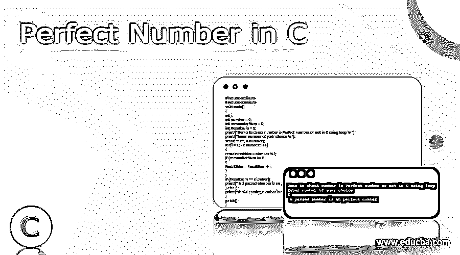

# C 语言中的完全数

> 原文：<https://www.educba.com/perfect-number-in-c/>




## C 完全数的定义

一般来说，我们有完全数，这个数的和等于它的除的和，但这个数不能被包含。它是一个正整数，我们可以用任何语言写逻辑，给出一个完美的数字，或者我们也可以检查这个数字是否完美。它应该是一个正整数，但也要记住，这个数应该能被我们正在使用的所有数整除，之后，总和应该等于我们要检查的数。如果任何一条规则被打破，那么这些数字就不能归入完全数范畴。在 C 语言中，我们可以编写这个程序来检查传递的数是否是一个完全数，我们也可以从我们拥有的一系列数中进行检查。用数学术语来说，它的定义总是一样的，但是我们可以用任何我们想要的方式来实现这个逻辑。

### 完全数背后的逻辑

正如我们已经讨论过的，一般来说，完全数是这个数的所有约数之和，但我们不能包括这个数本身。如果总和与数字相同，那么我们可以说它是一个完全数。但如果我们谈论逻辑，那么在 C 或任何其他编程语言中都是一样的，但问题是我们只需编写正确的逻辑，以便检查数字是否是完全数。在本节教程中，我们将看到如何检查数字是否完美，为了简单起见，我们将看到一个简单的例子来更好地理解它，见下文；

<small>网页开发、编程语言、软件测试&其他</small>

1)假设要检查的数字是 6:用户提供了一个数字“6”，现在我们必须思考和计算我们可以用哪些其他数字除“6”并得到余数“0”。如果余数是零，那么我们可以说“6”可以被这个数整除，我们可以把这个数考虑进去，通过使用更多的其他数来得到总和。

以‘6’为例。我们先从数字 1 开始，这样它就会被 1 整除。
2)现在 2，也会除以数字 6。
3)现在 3 它也会这样做。
4)然后，如果总和还没有达到，我们还可以检查其他值。但是在我们的例子中，通过使用 1、2 和 3 已经是 6 了。所以我们可以说 6 是一个完美的数字。
我们也有许多不是完全数的数字，让我们看看数字 4 本身；它只能被 1 和 2 整除，除了 1+2 =3 的和，没有别的数，这意味着它不是一个完全数，因为除法的和本身与我们要检查的数不匹配。所以通过使用 C 语言，我们可以写一个简单的程序来测试这个数是否是一个完美的数。在本教程的下一节，我们将会看到用 C 语言编写程序时需要遵循的步骤，这个程序将会为我们检查数字，并使初学者易于理解。

### 如何在 C 中检查完全数？

现在我们已经知道什么是完全数，我们现在只需要关注我们需要采取的步骤，以便让我们的程序工作，并检查这个数是否是完全数。在 C 语言中，我们可以通过使用循环来做到这一点，我们还需要检查数字是否可以被整除，在更多的条件下，让我们试着更仔细地看看用 C 语言创建程序所需的步骤如下:为了得到这里的结果，我们将使用 for 循环。这个 for 循环的迭代次数将小于这个数，因为我们不需要考虑这个数本身，只需要考虑小于这个数并且应该是正数的值。
2)在循环中，我们将通过取其模来计算余数。在 C 语言中，我们可以通过下面这段代码来做到这一点，参考见下文；
例如:
余数= number _ to _ check % loop _ value(I)；
正如你所看到的，我们正试图用 for 循环的‘I’值除我们传递的数，我们也正试图将这个值存储在我们的临时变量中，这个变量就是余数。
3)如果余数的值为“0 ”,则意味着该数除以给定的传递数。
4)如果那样的话我们就可以转移到另一个值上去。在 if 块中，我们必须不断检查可除数的总和，为此我们可以创建一个临时变量来计算总和并准备好结果。
6)最后，我们必须检查总和是否等于我们作为完全数传递的数字，如果值匹配，则我们将返回 true。如果两个数字不匹配，则意味着传递的给定数字不是完全数。7)返回结果并退出。

### 例子

用 c 语言实现完全数的简单例子。

**代码:**

```
#include<stdio.h>
#include<conio.h>
void main()
{
int i;
int number = 0;
int remainderNum = 0;
int ResultSum = 0;
printf("Demo to check number is Perfect number or not in C using loop \n");
printf("Enter number of your choice \n");
scanf("%d", &number);
for(i = 1; i < number; i++)
{
remainderNum = number % i;
if (remainderNum == 0)
{
ResultSum = ResultSum + i;
}
}
if (ResultSum == number){
printf(" %d passed number is an perfect number ", number);
} else {
printf("\n %d passing number is not perfect number", number);
}
getch();
}
```

**输出:**


### 结论

通过使用它，我们可以检查一个数是否是一个完全数。完全数的定义总是一样的，唯一的区别是编写逻辑和实现语言。

### 推荐文章

这是一个 C 语言中完全数的指南。这里我们讨论完全数的定义，语法，如何在 C 语言中检查完全数？代码实现示例。您也可以看看以下文章，了解更多信息–

1.  [DB2 行号](https://www.educba.com/db2-row_number/)
2.  [SQL 行号](https://www.educba.com/sql-row_number/)
3.  [JavaScript 号](https://www.educba.com/javascript-number/)
4.  [DB2 行号](https://www.educba.com/db2-row_number/)


