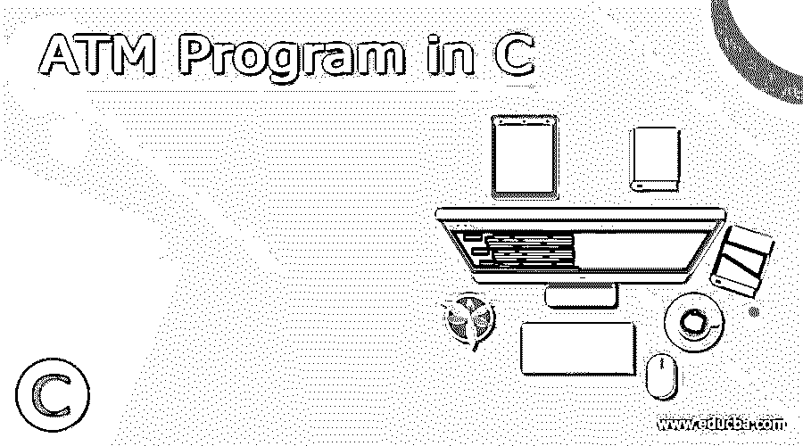
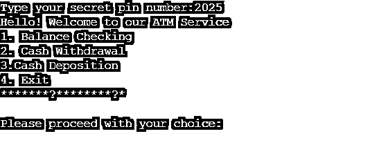
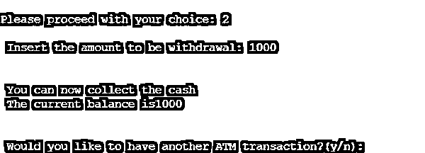

# C 语言中的 ATM 程序

> 原文：<https://www.educba.com/atm-program-in-c/>




## C 语言中 ATM 程序的定义

C 语言的 ATM 程序是用 C 编程语言编写的，这使得阅读和理解所使用的指令变得容易。这个使用 ATM 机的程序是建立在单独处理一个账户的概念上的。

它可以被定义为用户能够理解的 ATM 交易过程的实际上简单的代码结构。为了实现这个项目，我们可能必须使用函数，但同时为了便于编码，我们可能必须切换原因语句。

<small>网页开发、编程语言、软件测试&其他</small>

从这个 C 语言的 ATM 程序中，我们甚至可以使用小程序来检查总余额，存款金额，并明确地从帐户中提取金额，因为这不是时间所能承受的。

**语法:**

C 程序执行具有三种编码语法形式的 ATM 交易:

1.账户余额检查
2。ATM 取现
3。现金存款

进程语法结构包括以下过程:

*   最初，我们需要调整或设置 ATM pin 以及金额，包括一些随机数。
*   将 ATM pin 作为输入。
*   如果提供的输入 pin 与调整后的 pin 相同，那么之后我们可以执行附加操作。
*   我们将实现 switch 语句来执行诸如检查余额、提取现金金额、存放现金等操作。
*   此外，使用 while 循环来恢复或终止该过程。

### ATM 程序如何在 C 中工作？

ATM 程序逻辑上遵循三个正确交易的过程，包括提现、存款和检查余额。这三个程序段是使用 C 语言中的 switch cases 来执行的，带有初始化的变量和带有条件的函数。只有满足这些条件，才能准确地提供结果。

例如，使用 C 语言中的 ATM 程序，如果银行帐户中的余额足够，则只进行取款过程，否则进行另一笔交易或通过选项检查余额。此外，当用户向账户中存入一定金额，然后执行代码部分时，ATM 程序将显示账户中的新余额。在第三种技术中，当用户通过 ATM 交易执行任何取款或存款操作时，用户可以检查他/她的账户余额。

这个使用 C 语言的自动柜员机程序为自动柜员机的运行执行一些策略功能，如下所述:

*   这个 C 程序代码能够显示 ATM 交易。
*   为了登录 ATM 机，它持有 pin 验证系统。
*   使用这个 ATM 程序，用户还可以查看账户中的余额。
*   这个用 C 语言编写的 ATM 程序甚至可以帮助提取现金。
*   我们也可以用这个 ATM 机程序进行现金存款。
*   当一笔交易完成时，ATM 机启用允许多笔交易特征的开关盒，否则用户可以退出，这由程序来完成以终止。

### 例子

让我们通过以下过程来查看 C 语言中 ATM 程序的实例:

我们将用 C 语言编写 ATM 交易过程的代码，使用特定的库和函数初始化，

```
#include <stdio.h> // Defines standard input-output functions that are pre-defined
unsigned long amount=2000, deposition, withdrawal;
int pin, choice, k; // Defining few required variables in the transaction
char transaction ='y';
void main()
{
while (pin != 2025) // Using while loop to check for the condition on a pin number matching
{
printf("Type your secret pin number:");
scanf("%d", &pin);
if (pin != 2025) // Checking if the pin number types by the user is matched with the database record or not
printf("Please insert your valid password:\n");
}
do
{
printf("Hello! Welcome to our ATM Service\n");
printf("1\. Balance Checking\n");
printf("2\. Cash Withdrawal\n");
printf("3.Cash Deposition\n");
printf("4\. Exit\n");
printf("*******?********?*\n\n");
printf("Please proceed with your choice: ");
scanf("%d", &choice);
switch (choice)
{
case 1:
printf("\n The account balance in Rs : %lu ", amount);
break;
case 2:
printf("\n Insert the amount to be withdrawal: ");
scanf("%lu", &withdrawal);
if (withdrawal % 100 != 0)
{
printf("\n You are requested to insert the amount in multiples of 100");
}
else if (withdrawal >(amount - 500))
{
printf("\n You are having an insufficient balance");
}
else
{
amount = amount - withdrawal;
printf("\n\n You can now collect the cash"); // after having a sufficient amount in the account the ATM machine will provide the cash amount.
printf("\n The current balance is%lu", amount);
}
break;
case 3:
printf("\n Insert the amount to be deposited");
scanf("%lu", &deposition);
amount = amount + deposition;
printf("The balance is %lu", amount); // Displays the new current balance after the cash deposition in the user’s account
break;
case 4:
printf("\n We are thankful to you for USING our ATM services!");
break;
default:
printf("\n You have made an invalid choice"); // Defines that the user have done something wrong with the ATM service options
}
printf("\n\n\n Would you like to have another ATM transaction?(y/n): \n");
fflush(stdin);
scanf("%c", &transaction);
if (transaction == 'n'|| transaction == 'N')
k = 1;
} while (!k);
printf("\n\n Thank you so much for your time to choose The our ATM services!");
// the ATM program terminates with a thank you note.
}
```

当我们编译并运行代码时，我们将看到如下结果，要求输入 4 位 pin 码:

**输出:**


如果您输入了错误的 pin 码，将会得到如下输出:


在此之后，输入 pin 并点击“输入”,我们将进入 ATM 交易选项，如下图所示:




在 C 编译器中执行上述代码时，我们可以通过选择提供的正确选项来获得所需的结果。如下所示:





这个 ATM 程序应该正确地部署在银行系统中，以获得准确的结果并执行真正的 ATM 交易，最初我们可以检查该程序是否有效地工作。

### 结论

C 语言编程对于初学编程的人来说是完美的，因此在继续之前，掌握一些 C 语言编程的基本代码是非常必要的。

为了用 C 语言创建一个 ATM 机程序，我们需要实现现有的每一个 ATM 系统的四个基本概念，包括提现、存款、账户余额检查和另一个交易或终止的功能。

### 推荐文章

这是一个 C 语言的 ATM 程序指南。这里我们讨论 C 语言中 ATM 程序的定义，语法，如何工作？，代码实现示例。您也可以看看以下文章，了解更多信息–

1.  [C 语言中的线性搜索](https://www.educba.com/linear-search-in-c/)
2.  [C 语言中的循环链表](https://www.educba.com/circular-linked-lists-in-c/)
3.  [C 中的循环队列](https://www.educba.com/circular-queue-in-c/)
4.  [二分搜索法在 C](https://www.educba.com/binary-search-in-c/)


